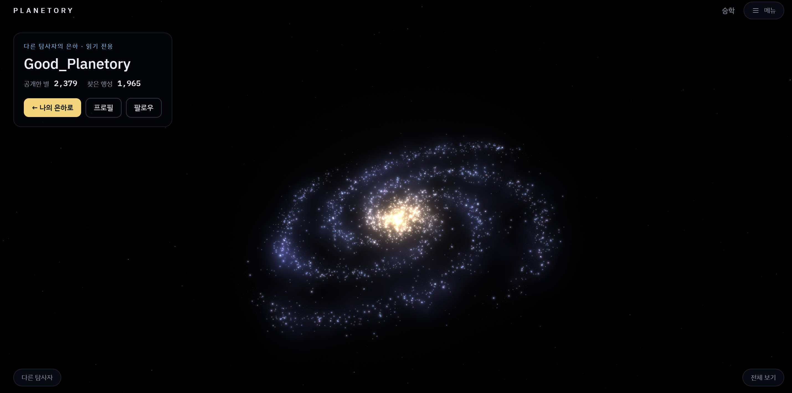
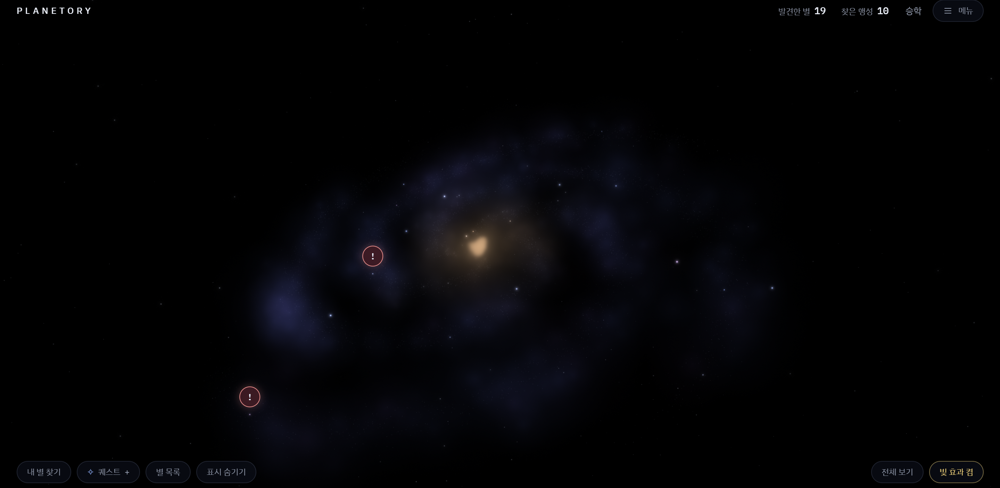
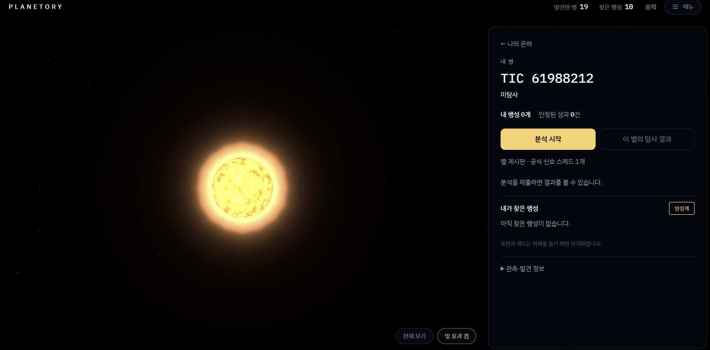
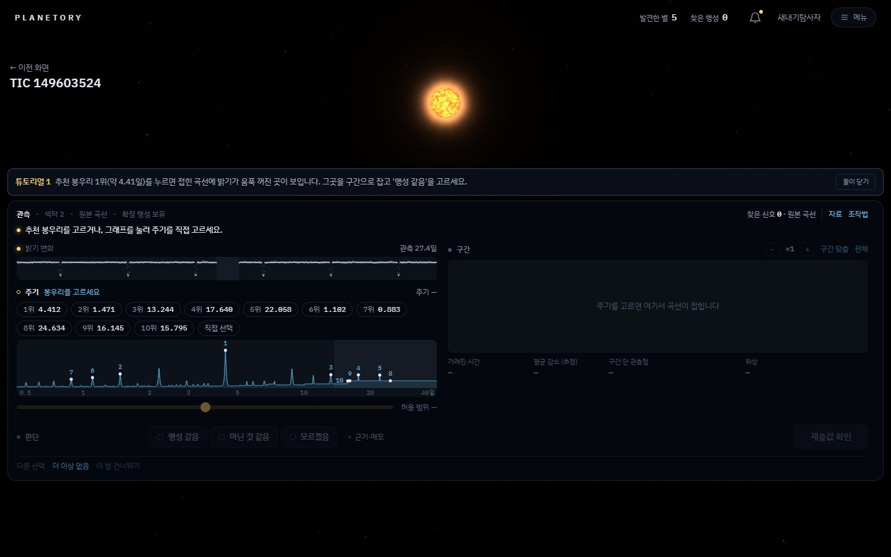
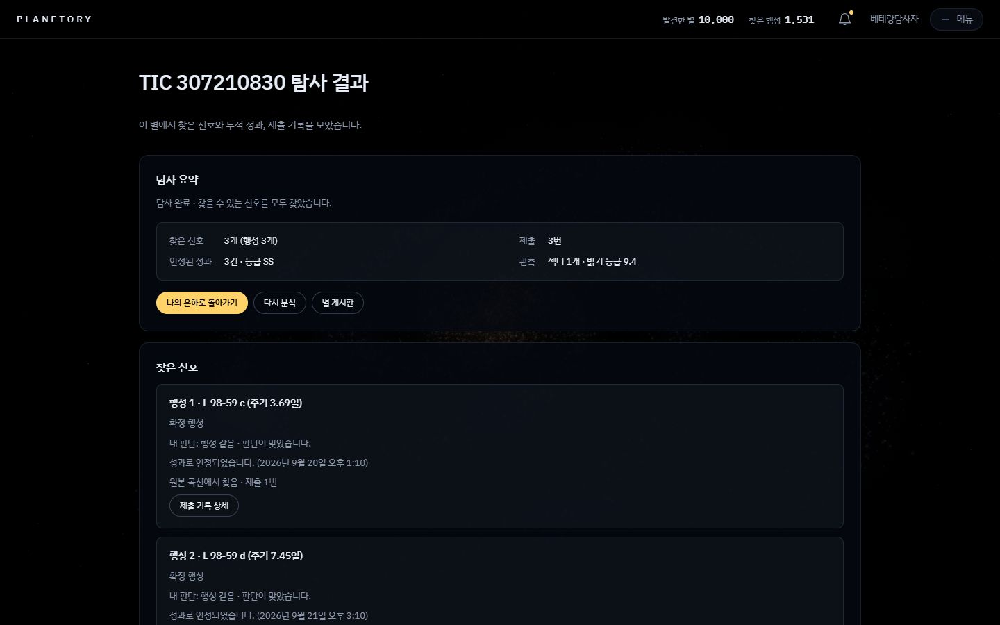
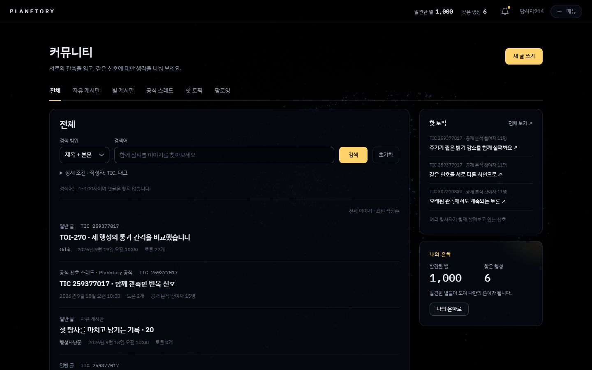
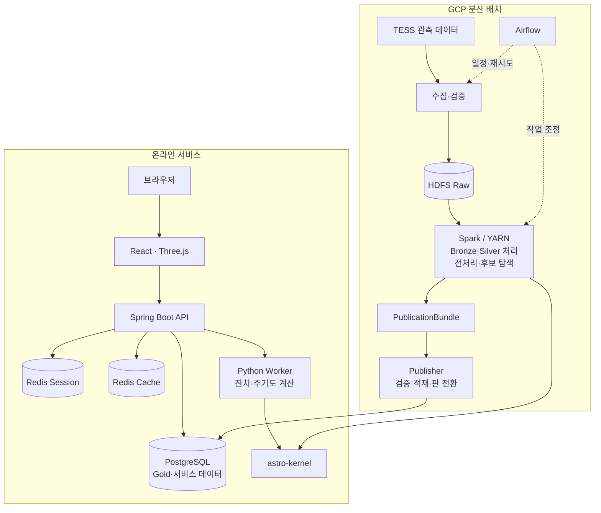

<div align="center">

# Planetory

**별의 빛에서 행성의 흔적을 찾는 나만의 우주 탐사**

TESS 관측 데이터로 외계행성 후보 신호를 탐색하고,<br />
분석 기록을 은하에 쌓아 다른 탐사자와 공유하는 웹 서비스

<p>
  
  
  
  
</p>

[주요 기능](#주요-기능) · [시연 영상](#시연-영상) · [빠른 시작](#빠른-시작) · [프로젝트 문서](docs/README.md)

</div>



<p align="center"><em>탐사 기록이 별과 행성으로 쌓이는 3D 은하</em></p>

## 목차

- [프로젝트 소개](#프로젝트-소개)
- [주요 기능](#주요-기능)
- [서비스 화면](#서비스-화면)
- [시연 영상](#시연-영상)
- [탐사 흐름](#탐사-흐름)
- [시스템 구성](#시스템-구성)
- [기술 스택](#기술-스택)
- [빠른 시작](#빠른-시작)
- [저장소 구조](#저장소-구조)
- [팀 구성](#팀-구성)
- [문서와 데이터 출처](#문서와-데이터-출처)

## 프로젝트 소개

Planetory는 **천문 관측 데이터 분석을 직접 참여할 수 있는 탐사 경험으로 연결**한다. 사용자는 자신의 은하에서 별을 선택하고, 별의 밝기가 시간에 따라 어떻게 달라지는지 살펴보며 외계행성 후보 신호를 찾는다.

행성이 별 앞을 지나면 관측되는 밝기가 잠시 줄어들 수 있다. Planetory는 이 밝기 변화와 반복 주기를 비교할 수 있는 분석 도구를 제공한다. 사용자가 주기와 밝기 감소 구간, 판단을 제출하면 결과가 분석 기록과 탐사 진행도에 반영된다.

프로젝트는 세 가지 경험을 중심으로 구성한다.

- **직접 분석하기**: 광도곡선과 주기도를 읽고 후보 신호를 판단한다.
- **나만의 은하 만들기**: 탐사 진행과 성과를 별·행성, 항성계 이동으로 표현한다.
- **함께 탐사하기**: 분석 기록을 공개하고 별 게시판과 다른 탐사자의 은하에서 의견을 나눈다.

> 서비스의 후보 매칭과 AI 점수는 탐사를 돕는 정보이며, 새로운 외계행성의 과학적 확정을 의미하지 않는다. 은하 배치와 별·행성의 표면 및 궤도는 이해를 돕기 위한 시각화다.

## 주요 기능

| 기능 | 설명 |
| --- | --- |
| **3D 은하 탐색** | 나의 은하에서 별을 찾고, 별과 행성을 선택해 항성계와 상세 정보로 이동한다. |
| **후보 신호 분석** | 광도곡선, 주기도, 주기로 겹쳐 본 곡선을 비교하며 반복 주기와 밝기 감소 구간을 선택한다. |
| **잔차 탐색** | 이미 찾은 신호를 제거한 곡선과 주기도를 다시 계산해 남아 있는 신호를 탐색한다. |
| **튜토리얼과 챌린지** | 단계별 안내로 분석 방법을 익히고 탐사 대상에 도전한다. |
| **분석 기록과 결과** | 제출 당시의 분석 기록을 보관하고, 결과를 다시 확인하거나 선택한 기록을 공개한다. |
| **별 중심 커뮤니티** | 별 게시판·공식 신호 스레드·자유 글에서 분석 기록을 첨부하고 댓글과 반응을 나눈다. |
| **공개 은하와 팔로우** | 다른 탐사자의 공개 은하를 방문하고 회원·별을 팔로우하며 소식을 확인한다. |
| **계정과 내 정보** | SSAFY OAuth2·Google OIDC 로그인, 프로필·공개 범위 설정, 개인 탐사 통계를 제공한다. |

알림과 전체 통계 화면의 제공 여부는 프론트엔드 기능 플래그에 따라 달라진다. 세부 범위는 [요구사항](docs/requirements/README.md)과 [프론트엔드 안내](apps/frontend/README.md)를 따른다.

## 서비스 화면

### 나의 은하

탐사할 별과 진행 상황을 한 공간에서 확인한다. 별 찾기, 퀘스트, 별 목록과 카메라 이동을 통해 원하는 탐사 대상으로 접근한다.



### 별과 항성계

별을 선택하면 항성계로 이동한다. 별의 식별자와 탐사 상태, 나의 행성·성과를 확인하고 분석을 시작한다.



### 다른 탐사자의 은하

공개된 탐사 기록을 은하에서 살펴보고 프로필과 팔로우로 탐사자를 연결한다. 상단 대표 화면은 다른 탐사자의 공개 은하를 보여준다.

<details>
<summary><strong>분석과 커뮤니티 화면 더 보기</strong></summary>

#### 후보 신호 분석



#### 분석 결과



#### 별 게시판과 커뮤니티



</details>

화면 자료는 시연 당시의 상태를 보여준다. 표시된 별·행성 수는 서비스 성능이나 실제 신규 외계행성 발견 수를 나타내는 지표가 아니다.

## 시연 영상

은하 탐색과 별 선택, 통과 원리 설명, 행성 발견 연출을 담은 약 55초 시연 영상이다.

https://github.com/user-attachments/assets/9e0b9c5c-0c3e-45c3-b447-023615b13440

## 탐사 흐름

| 단계 | 사용자가 하는 일 | 확인하는 정보 |
| --- | --- | --- |
| **1. 별 선택** | 은하 또는 퀘스트에서 탐사할 별을 선택한다. | 별 정보와 현재 탐사 상태 |
| **2. 밝기 변화 확인** | 시간에 따른 밝기 변화를 살펴본다. | 광도곡선의 밝기 감소와 관측 구간 |
| **3. 반복 주기 탐색** | 주기도의 봉우리를 비교하고 주기를 선택한다. | 반복 신호의 주기와 강도 |
| **4. 구간과 판단 선택** | 선택한 주기로 곡선을 겹쳐 보고 밝기 감소 구간을 지정한다. | 반복되는 감소 형태와 제출값 |
| **5. 분석 제출** | 선택한 값과 판단을 검토한 뒤 제출한다. | 후보 매칭 결과와 분석 기록 |
| **6. 탐사 이어가기** | 찾은 신호를 제거해 다른 후보를 탐색하거나 은하로 돌아간다. | 잔차 곡선·주기도와 탐사 진행도 |

<details>
<summary><strong>분석 용어 간단히 보기</strong></summary>

- **광도곡선(Light Curve)**: 시간에 따라 별의 밝기가 어떻게 변하는지 나타내는 곡선이다.
- **주기도(Periodogram)**: 여러 주기에서 반복 신호가 얼마나 강하게 나타나는지 비교하는 그래프다.
- **위상 접기(Phase Folding)**: 선택한 주기를 기준으로 관측값을 겹쳐 반복되는 모양을 확인하는 방법이다.
- **통과 신호(Transit)**: 행성이 별 앞을 지나면서 관측 밝기가 감소하는 신호다. 다른 현상도 비슷한 모양을 만들 수 있어 추가 검증이 필요하다.
- **잔차(Residual)**: 선택한 신호의 모델을 제거한 뒤 남은 데이터다.
- **BLS(Box Least Squares)**: 상자 모양의 밝기 감소를 반복 주기별로 비교해 통과 후보를 찾는 분석 방법이다.

</details>

## 시스템 구성

대용량 원천 데이터의 **분산 배치 처리**와 사용자의 **온라인 탐사 요청**을 분리한다. 배치에서 준비한 데이터를 PostgreSQL에 게시하고, 온라인 서비스는 이 데이터를 조회해 화면과 분석 결과를 제공한다.



### 설계에서 중요하게 다룬 점

- **배치와 온라인 응답 분리**: Backend와 Worker는 서비스 DB의 배열을 사용한다. 사용자 요청마다 HDFS를 조회하지 않는다.
- **검증된 데이터 판 게시**: Publisher가 검증된 Gold를 적재하고 현재 판을 하나의 DB 트랜잭션으로 전환한다. 조회와 분석은 데이터 판을 기준으로 연결한다.
- **계산 로직 공유**: 배치와 온라인 계산이 `libs/astro-kernel`을 재사용해 전처리·후보·잔차 계산의 기준을 함께 관리한다.
- **세션과 계산 캐시 분리**: 로그인 세션용 Redis와 계산 상태·결과·잠금용 Redis를 별도 인스턴스로 구성한다.
- **분석 기록 보존**: 제출 당시의 데이터 판과 입력을 기록해 결과를 다시 확인할 수 있게 한다.

세부 계약과 배포 상태는 [시스템 아키텍처](docs/architecture/system-architecture.md), [온라인 계산 구조](docs/architecture/online-derived-compute.md), [Gold 게시 계약](contracts/gold/README.md), [서비스 배포 상태](docs/project/service-deploy-status.md)에서 확인한다.

## 기술 스택

| 영역 | 기술 | 역할 |
| --- | --- | --- |
| 프론트엔드 | React 19 · TypeScript · Vite 8 · Three.js | 사용자 화면, 3D 은하·항성계, 분석 인터랙션 |
| 백엔드 | Java 21 · Spring Boot 4 · Spring Security · JPA · JdbcClient | 인증, 탐사·제출, 회원·커뮤니티 API |
| 데이터베이스 | PostgreSQL 18 · Flyway | Gold와 서비스 데이터 저장, 스키마 관리 |
| 세션·캐시 | Redis 7.4 | 로그인 세션, 온라인 계산 상태·결과·잠금 |
| 온라인 계산 | Python 3.12 · NumPy · Astropy · SciPy | 잔차 곡선과 주기도 계산 |
| 분산 데이터 처리 | Hadoop 3.5 · HDFS · YARN · Spark 3.5 | 원천 보관, 전처리, 후보 신호 탐색 |
| 배치 제어 | Airflow 3.2 | 수집·처리·게시 작업 조정 |
| 실행·배포 | Docker · Docker Compose · Nginx · GitLab CI | 서비스 실행, 이미지 빌드와 배포 |
| 검증 | JUnit · Testcontainers · Playwright · pytest | API·DB·브라우저·수치 계산 검증 |

정확한 의존성 버전과 실행 설정은 각 앱의 설정 파일과 담당 README를 따른다.

## 빠른 시작

### 화면과 탐사 흐름 체험

백엔드와 클라우드 없이 **합성 데이터와 개발용 로그인**으로 화면을 실행한다.

필요한 환경은 Node.js 22.12 이상, 그래픽 가속이 활성화된 Chrome, 너비 1024px 이상의 화면이다.

```powershell
git clone https://github.com/baekseunghak/planetory.git
cd planetory/apps/frontend
npm ci
npm run dev:cinema
```

브라우저에서 [화면 체험](http://127.0.0.1:58390)을 연다. 로그인 화면부터 보려면 [개발용 로그인 진입](http://127.0.0.1:58390/api/dev-cinema/session?as=anonymous)을 사용한다. 이 모드의 로그인은 실제 OAuth 인증을 수행하지 않는다.

별을 선택해 `분석 시작`을 누르면 광도곡선 확인, 주기 선택, 구간 지정, 판단 제출까지 체험할 수 있다. 세부 시나리오는 [시네마틱 화면 안내](apps/frontend/src/cinema/README.md)와 [시연 가이드](apps/frontend/src/cinema/DEMO.md)를 참고한다.

### 실제 로컬 서비스 연동

실제 인증·DB·계산 Worker를 연결하려면 Docker, Java 21과 각 서비스 설정이 필요하다. 아래 문서의 순서로 준비한다.

| 순서 | 준비 항목 | 상세 안내 |
| --- | --- | --- |
| 1 | PostgreSQL·Redis 준비와 백엔드 최초 기동(Flyway 적용) | [백엔드 개발 환경](apps/backend/docs/development-setup.md) |
| 2 | 튜토리얼·탐사에 필요한 로컬 Gold 데이터 준비 | [로컬 시드](experiments/distributed-pipeline/local-seed/README.md) |
| 3 | SSAFY·Google 인증 제공자 설정 | [OAuth 설정](apps/backend/docs/oauth-setup.md) |
| 4 | 백엔드와 프론트엔드 실행·연동 | [백엔드](apps/backend/README.md) · [프론트엔드](apps/frontend/README.md) |
| 5 | 잔차·주기도 계산 Worker 연결 | [온라인 계산 Worker](apps/derived-compute/README.md) |

클라우드 분산 배치 구축과 운영 절차는 [분산 시스템](distributed-system/README.md)과 [포팅 매뉴얼](exec/README.md)을 참고한다.

## 저장소 구조

```text
planetory/
├── apps/
│   ├── frontend/          # 웹 화면·3D 은하·분석 인터랙션
│   ├── backend/           # 인증·탐사·회원·커뮤니티 API
│   └── derived-compute/   # 온라인 잔차·주기도 계산 Worker
├── distributed-system/   # 수집·HDFS·Spark·Airflow·Publisher
├── libs/
│   └── astro-kernel/     # 배치·온라인 공용 천문 계산 커널
├── contracts/            # 데이터 전달·게시 계약
├── infra/                # 실행·배포·분산 인프라 설정
├── experiments/          # 수치 검증·벤치마크·PoC
├── docs/                 # 요구사항·아키텍처·개발·운영 문서
└── exec/                 # 포팅·시연·제출 자료
```

## 팀 구성

SSAFY 프로젝트의 담당 영역은 다음과 같다. 기획 당시 책임 분배의 세부 내용은 [팀 역할 문서](docs/project/team-role-allocation.md)에 정리한다.

| 담당자 | 담당 영역 |
| --- | --- |
| 김동혁 | 데이터 플랫폼·DevOps |
| 윤성용 | 천문 데이터 처리·AI |
| 강재민 | 탐사 코어 백엔드 |
| 백승학 | 서비스 백엔드 |
| 백지웅 | 분석 프론트엔드 |
| 하서진 | 지도·서비스 프론트엔드 |

## 문서와 데이터 출처

### 프로젝트 문서

| 문서 | 내용 |
| --- | --- |
| [문서 지도](docs/README.md) | 프로젝트 전체 문서의 시작점 |
| [요구사항](docs/requirements/README.md) | 서비스 범위와 탐사·성과 규칙 |
| [아키텍처](docs/architecture/README.md) | 시스템·DB·온라인 계산 구조 |
| [Gold 계약](contracts/gold/README.md) | 배치 결과와 서비스 사이의 데이터 계약 |
| [공용 계산 커널](libs/astro-kernel/README.md) | 전처리·후보 탐색·잔차 계산 |
| [포팅·시연 자료](exec/README.md) | 실행 환경과 시연 시나리오 |
| [기여 안내](CONTRIBUTING.md) | 저장소 작업 절차와 개발 규칙 |

### 관측 데이터와 외부 정보

- [NASA TESS](https://science.nasa.gov/mission/tess/): 관측 임무 소개
- [MAST TESS](https://archive.stsci.edu/missions-and-data/tess): TESS 관측 데이터와 제품
- [NASA Exoplanet Archive](https://exoplanetarchive.ipac.caltech.edu/): 외계행성·후보와 별의 외부 참조 정보

사용하는 데이터 범위와 시간·단위·라벨 처리 기준은 [서비스 데이터 범위](docs/data/tess-service-scope-v1.md)와 [외부 데이터 계약](docs/data/tess-external-catalog-contract.md)에 정리한다.
