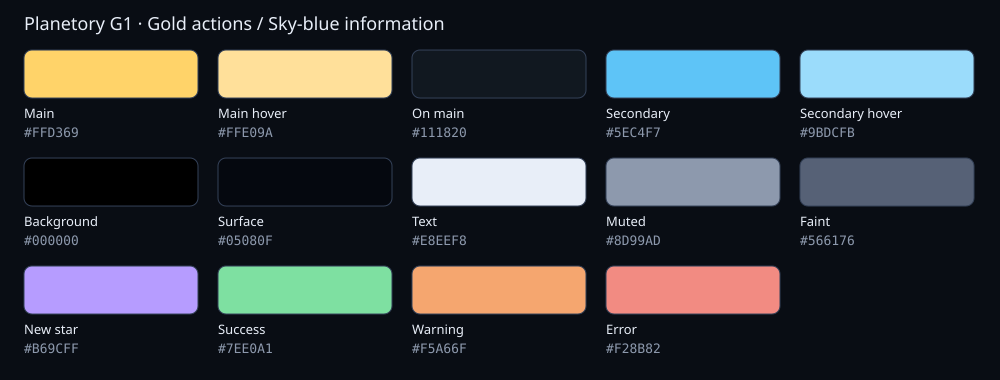

# 시네마 색상 가이드

상태: 로컬 검토안. 기준 develop: 09975ed7. 사용자 요청으로 G1 조합을 미리보기에 적용한다. Jira 신규 키는 미지정이며 커밋·운영 채택 전 확정한다. 상위 문서: [시네마 구조](../README.md).

## 현재 조합 G1: 금색 행동 + 하늘색 정보

| 요청할 이름 | 값 | 토큰 / 역할 |
| --- | --- | --- |
| 메인 강조 | #FFD369 | --pc-accent: 주요 행동, 현재 선택, 포커스 |
| 메인 hover | #FFE09A | --pc-accent-hover |
| 메인 위 글자 | #111820 | --pc-accent-ink |
| 서브 강조 | #5EC4F7 | --pc-secondary: 추천, 안내, 정보 링크 |
| 서브 hover | #9BDCFB | --pc-secondary-hover |
| 배경 / 표면 | #000000 / #05080F | --pc-bg / --pc-bg-raised |
| 기본 / 보조 / 약한 글자 | #E8EEF8 / #8D99AD / #566176 | --pc-ink / --pc-ink-dim / --pc-ink-faint |
| 새 별 | #B69CFF | --pc-new-star |
| 성공 / 주의 / 오류 | #7EE0A1 / #F5A66F / #F28B82 | --pc-good / --pc-warn / --pc-bad |

메인·서브의 옅은 배경은 각 RGB의 15%를 쓴다. 패널은 rgba(5,8,15,0.9), 일반 페이지는 0.86~0.94를 유지한다. 튜토리얼 파랑과 챌린지 빨강, 실제 별의 렌더링 색은 별도 의미색이다.

## 변경 요청 예시

- “메인 강조만 #E9C46A로 바꿔줘. 서브는 유지해.”
- “G1 조합으로 적용해줘.” → 이 표의 금색·하늘색과 파생색을 적용한다.
- “메인은 금색, 서브는 민트 계열로 시안을 만들어줘.” → 정확한 HEX가 없으므로 후보 값을 먼저 명시하고 미리보기를 만든다.
- “보조 글자만 밝게 해줘. 배경과 강조색은 유지해.”
- “선택 영역의 금색 배경을 더 약하게 해줘.” → 색상은 유지하고 선택 배경 불투명도를 조절한다.
- “분석 화면에만 적용해줘.” → 공통 토큰 전체를 바꾸지 않고 해당 화면으로 범위를 제한한다.

요청에는 가능하면 역할, 색상 또는 HEX, 적용 범위를 적는다. ‘더 따뜻하게/차분하게’도 가능하며 선택한 실제 값을 결과에 기록한다. 색조합 이름을 새로 정하면 이 문서에 구성값을 추가한다. 색 변경은 커밋·푸시·배포 요청을 뜻하지 않는다.

## 적용 규칙

1. 금색은 현재 선택·주요 실행, 하늘색은 안내·정보를 나타낸다. 봉우리 버튼 글자는 중립색이며 선택된 버튼만 금색 테두리로 구분한다(금색 채움 없음). 초안 안내 막대·불러오기/지우기 버튼과 단계 안내 문구는 하늘색이다. 일반 보조 버튼은 중립색이다.
2. 새 분석 화면의 주기도·평균 곡선은 정보색이며, 선택선·구간·핸들·판단·제출은 메인색이다.
3. 새 별은 보라색을 유지한다. 오류·성공·튜토리얼·챌린지는 강조색 변경에 묶지 않는다. 주의색은 메인과 혼동되지 않게 함께 검토한다.
4. 기본색 변경 시 hover, RGB, soft, 강조 위 글자, 포커스, 선택/비활성 구분을 함께 확인한다. 선택은 색 외에 테두리·채움·상태 속성으로도 표현한다.
5. CSS 정본은 [tokens.css](tokens.css)이다. Canvas의 [draw.ts](../analysis-new/draw.ts)와 3D의 [system-layer.ts](../scene/system-layer.ts)는 CSS 변수를 직접 쓰지 않아 해당 역할의 팔레트도 동기화한다. 아이콘과 LightCurve의 기본값도 확인한다.
6. 1440px·1024px 데스크톱, 추천→선택, 빈 결과·로딩·오류·비활성, 새 별 보라색을 검증한다. 미리보기는 합성 API이며 실제 API 인수가 아니다.

## 검증 기록

이번 실행의 결과는 채팅 완료 보고에 기록한다. 과거 테스트를 현재 결과로 간주하지 않는다.
