# Planetory 서비스 DB ERD v1.2

- 작성일: 2026-09-09 (v0.1 2026-09-04, v0.2·v0.3 2026-09-09, v1.0 2026-09-09, v1.1 2026-09-11, v1.2 2026-09-14)
- 기준 문서: 요구사항 명세서 v1.2(상태표 v1.2 변경안·용어 사전 v1.0·와이어프레임 v1.2), 시스템 아키텍처(불변 규칙 4·5, 데이터 소유권 표). **아키텍처 불변 규칙 5는 이 판의 Gold 저장 방식 변경에 맞춰 수정이 필요하다(서비스 백엔드 정합화 요청 R3).**
- 범위: **EC2 PostgreSQL**에 두는 서비스 데이터. **곡선·주기도·통과 모델 본문도 PostgreSQL 배열 열에 저장한다(v0.3 결정).** Gold 파일 계층은 두지 않고, 배치가 릴리스 전환 때 배열을 적재한다. GCP HDFS(Raw/Bronze/Silver)는 범위 밖.
- 표기: 회원 FK는 역할과 관계없이 `user_id`(두 번째 회원 참조만 역할 이름). 테이블은 snake_case 복수형, PK는 `id BIGINT IDENTITY`(별은 `tic_id`), 시각은 `TIMESTAMPTZ`, 열거형은 `TEXT + CHECK`.
- 상태: **v1.2는 별 자리 저장 계약 변경 검토안.** 추가 좌표 열과 모든 계정의 초기 은하 좌표 생성은 관련 백엔드 리뷰 후 적용한다. 현재 보존할 운영 좌표 데이터는 없다. 나머지 구조와 제약은 기존 백엔드 개발 기준선이며 임계값·대상 데이터 등 수치는 5장 미결에서 실측 후 채운다. `확인 필요`는 이 문서의 임시값, `DEC-nn`은 명세서 미결 항목.

## 0. 변경 요약

### v1.1 → v1.2 (2026-09-14, `S15P21C206-33`)

은하 배치 결과를 직접 보존하는 `world_x`, `world_y`, `layout_version`을 `star_unlocks`에 추가한다. `world_x`·`world_y`는 서비스 월드 좌표 단위의 유한 값이고, `depth_z`는 -1.0 이상 1.0 이하의 단위 없는 정규화 깊이다. 현재 보존할 운영 좌표 데이터가 없으므로 모든 계정은 현행 은하 배치로 초기 좌표를 생성하고 종전 방사형 좌표를 유지·이관하지 않는다. 기존 `generation`·`angle_deg`·`radius_jitter`는 nullable 폐기 예정 열이며 신규 좌표 계산과 API 응답의 근거로 삼지 않는다. [별지도 표현 계약](../development/sky-presentation-contract.md) 1절을 따르며 이 문서 수정만으로 DB에 적용되지 않는다.

### v1.0 → v1.1 (2026-09-11, 팀 결정·정합화)

| 항목 | 변경 |
|---|---|
| `challenge_rounds.description` | 열 추가. 명세서 6장 ChallengeRound의 "소개 문구"와 HOME-07·CHL-01의 "한 줄 설명"이 v1.0 ERD에 빠져 있었다 |
| `users` 닉네임 유일성 | 영문 대소문자를 무시한 중복 검사를 위해 `UNIQUE (lower(nickname))` 함수 인덱스. 서비스 API SB-D14 |
| `posts` 검색 인덱스 | `pg_trgm` 확장과 `title`·`body`의 GIN(gin_trgm_ops) 인덱스 추가. COM-03 P0 상향(명세서 v1.1 안건 13)에 따른 제목·본문 부분 일치 검색용. 정합화 요청 R9 |
| 4장 결정 5 | "판 자체는 직전 것만 짧게 보존" → 이전 판은 보존하지 않고 판 행만 제출 참조용으로 남긴다는 v0.3 결정 C와 일치하도록 정정. 정합화 요청 R1 |
| 4장 결정 6 | 축약 스냅샷 용량 ≈1.8KB → ≈1.2KB(float32 150개 배열 2개). 정합화 요청 R2 |
| 별 지도 좌표 | `star_unlocks`의 자리(generation·angle_deg·radius_jitter·depth_z)는 카메라 회전·기울기와 무관한 월드 좌표라는 점을 명시(명세서 v1.1 HOME-01, NFR-20a·d). 열 변경 없음 |

### v0.3 → v1.0 (기준선 확정, MR !16 검토 반영)

명세서 v1.0과 함께 백엔드 개발의 기준선으로 삼는다.

| 항목 | 변경 |
|---|---|
| 세그먼트 revision | `light_curve_segments`에 `binning_revision` 추가, `UNIQUE(tic_id, sector, binning_revision)`. 재비닝은 덮어쓰기가 아니라 새 revision 행 |
| Bundle manifest | 포함 섹터 목록 → **참조할 세그먼트 id 집합**. 어느 판이 어떤 revision을 쓰는지 특정된다 |
| 시각 복원식 | `start_btjd + bin_minutes × i` → `start_btjd + (bin_minutes / 1440.0) × i`. BTJD가 일 단위라 분을 환산해야 한다 |
| star_unlocks | `seq` 열 추가. `UNIQUE(trigger_achievement_id, seq)`가 참조하던 열이 없었고, `stars_per_achievement`가 2 이상이면 중복 방지가 성립하지 않았다 |
| planet_count | "행성 같음으로 **공개한** 미확정" → "**판단한** 미확정". 공개 조건은 HOME-05·결정 22에 없다 |
| evidence_checks | P0 4종 → **3종**(oddeven, secondary, ushape). 품질 플래그는 배치 전처리에서만 쓰고 화면에 전달하지 않는다(명세서 v1.0 POL-13) |
| discoverable | 사용자에게 제공되는 것과 같은 조건(비닝 간격·모델·격자)으로 판정하고 revision이 바뀌면 재계산한다는 기준을 명시(DAT-07) |
| 용량 표기 | "판 2개 보존" → "전환 중 staging+current 2벌". 이전 판을 남기지 않고 세그먼트는 revision이 같으면 판 사이에 공유 |
| tutorial_skip_after | 개발 3 · 운영 0=끔으로 환경 표기 정정 |

### v0.2 → v0.3 (Gold 본문을 DB 배열로)

곡선·주기도·통과 모델을 EC2 Gold 파일이 아니라 PostgreSQL 배열 열(`real[]`)에 저장한다. 조회 API가 파일 경로를 돌려주는 대신 배열을 읽어 내려주고, 릴리스 교체는 파일 전송·링크 전환이 아니라 행 적재와 status 전환이 된다.

| 항목 | 변경 |
|---|---|
| light_curves 분리 | 삭제하고 `light_curve_segments`(별·섹터 단위 곡선, 불변)와 `periodograms`(판 단위)로 나눔. 곡선이 판마다 복제되지 않는다 |
| 저장하지 않는 배열 | 시각은 `start_btjd + (bin_minutes / 1440.0) × i`로 계산(BTJD는 일 단위), 주기 격자는 전 별 공통이라 manifest 규칙으로 생성. 실제로 저장하는 배열은 `flux`와 `power`뿐 |
| 비닝 | 곡선은 섹터 안에서 **10분 고정 간격**, 주기도 격자는 5,000점. 규칙은 manifest |
| candidates | `transit_model_ref`(Gold 파일) → `transit_model` JSONB(모델 파라미터). 잔차 계산은 파라미터로 모델을 생성해 나눈다 |
| publication_bundles | `gold_path` 삭제. manifest는 배열 checksum·계산 버전·주기 격자 규칙만 |
| derived_curve_cache 삭제 | 잔차·주기도 캐시는 Redis로. 상태·결과 모두 Redis, 테이블 없음 |
| analysis_snapshots | PostgreSQL 유지. `data BYTEA` → `folded_flux`·`folded_err` real[], 위상은 계산 |
| pipeline_runs 삭제 | 서비스가 읽지 않고 Airflow와 겹침 |
| 판 갱신 방식 | 새 판이 나오면 진행 중인 세션도 최신 판으로 올린다. 이전 판을 남기지 않으므로 화면과 판정이 항상 같은 판이다(결정 C). status에서 previous·expires_at 제거 |
| operation_settings 추가 | 명세서 v0.13의 OperationSetting. 규칙 버전을 PK로 두고 설정 값을 JSONB 한 묶음으로. submissions.rule_version이 참조 |
| 확정한 것 | 판 단위는 별마다, 비닝 10분, 곡선은 섹터 세그먼트, 밝기 오차는 스칼라, 주기 범위 열 추가, 캐시 Redis, 스냅샷 PostgreSQL |
| 아키텍처 문서 | 불변 규칙 5(곡선 본문은 EC2 Gold 파일)와 데이터 소유권 표 수정 필요 |
| 용량 | 별당 약 70KB(2섹터 기준, 전환 중 staging+current 2벌). 별 20만 개에 약 14GB. 이전 판을 남기지 않고 세그먼트는 revision이 같으면 판 사이에 공유한다. 실측 후 조정(미결 11) |

### v0.1 → v0.2 변경 요약

| 결정 | ERD 반영 |
|---|---|
| 1 등급 = 성과 수 문자, 별 열림 = 성과 1건당 1개 | user_star_progress에서 유형별 등급 열 제거, achievement_count 저장(등급 문자는 계산). star_unlocks.unlock_reason에 achievement, trigger_achievement_id 추가. trigger_grade·completion 삭제 |
| 2 완료 보상 없음 | user_star_progress.discovery_granted 삭제 |
| 3 무신호 별 제외 | completion_reason에서 empty_star 삭제, tutorial_stars.intent empty → multi_fp, fp_success = 실제 FP 판단 성공만 |
| 4 공식 신호 스레드·공개 분석 | posts.kind(user/system_thread)+candidate_id, published_analyses·post_source_links 신설. posts.fixed_block·source_submission_id 삭제(분석글 폐지). 미확정 성과 근거 = recognized_analysis_id |
| 5 번들 보존·재현 | submissions에 절대값(phase·epoch·duration·fold_reference_time·계산 버전) 저장, analysis_snapshots 신설(접힌 곡선 축약), publication_bundles.status에 expired, derived_curve_cache 상태 6단계·결과 참조 2개, submissions.retry_of_submission_id |
| 6 운영 v1 제외 | reports·audit_events·expert_reports 없음. hidden 상태값만 유지 |
| 7 통계 | seq 열 없음(id 순). 채점형 통계는 submissions만으로 계산, 전체 통계는 materialized view |
| 8·9 | 재도전 복원은 snapshot_params JSON + submissions 조인. 미세 조정 범위는 manifest 규칙 + API 계산 |
| v0.11 | light_curves.fold_reference_time_btjd·mask_path, 근거 체크 4종 + centroid_data_status |

## 1. 한눈에 보기

여섯 묶음, 총 33개 테이블 + materialized view 1개.

| 묶음 | 테이블 | 역할 |
|---|---|---|
| A 회원 | users, user_settings, follows | 계정·설정·팔로우(P1) |
| B 별·공개 데이터 카탈로그 | stars, observation_datasets, publication_bundles, light_curve_segments, periodograms, candidates, candidate_aliases, external_signal_references, candidate_dispositions, candidate_status_history, ai_executions, ai_evaluations | 배치가 적재한 Gold 릴리스의 본문(배열)과 메타데이터. 서비스는 읽기만 |
| C 분석·제출 | submissions, analysis_histories, analysis_snapshots | 제출·불변 히스토리·접힌 곡선 스냅샷 |
| D 성과·진행·발견 | user_candidate_achievements, user_star_progress, star_unlocks | 성과(별 열림의 원인)·별 진행·별 지도 자리 |
| E 커뮤니티 | posts, comments, post_reactions, post_history_attachments, comment_history_attachments, published_analyses, post_source_links | 일반 글·공식 신호 스레드·공개 분석·출처 링크 |
| F 운영·챌린지·알림·통계 | operation_settings, tutorial_stars, challenge_rounds, notifications, stats_snapshots, (mv) global_stats | 운영 설정·파생 데이터 |

## 2. ERD

전체 그림은 아래 두 파일로도 볼 수 있다. 관계만 보려면 개요, 열까지 보려면 전체를 연다.

- [관계 개요](../images/database-erd-overview.svg)
- [전체 (열 포함)](../images/database-erd.svg)

관계선은 FK 방향이다. 속성은 핵심만 적었고 전체 열은 3장에 있다. 우선순위: P1 = user_settings·follows·notifications·stats_snapshots, 나머지는 P0. (ER 다이어그램의 classDef 색 지정은 mermaid 11.4까지 파싱 오류를 내므로 넣지 않았다.)

```mermaid
erDiagram
    users ||--o| user_settings : has
    users ||--o{ follows : follows
    users ||--o{ submissions : submits
    users ||--o{ analysis_histories : owns
    users ||--o{ user_candidate_achievements : earns
    users ||--o{ user_star_progress : tracks
    users ||--o{ star_unlocks : discovers
    users o|--o{ posts : writes
    users ||--o{ comments : writes
    users ||--o{ post_reactions : reacts
    users ||--o{ published_analyses : publishes
    users ||--o{ notifications : receives

    stars ||--o{ observation_datasets : observed_in
    stars ||--o{ publication_bundles : published_as
    stars ||--o{ light_curve_segments : segments
    publication_bundles ||--o| periodograms : periodogram
    stars ||--o{ candidates : has
    publication_bundles ||--o{ candidates : last_updated_by
    candidates ||--o{ candidate_aliases : aliases
    candidates ||--o{ external_signal_references : matched_to
    candidates ||--o| candidate_dispositions : classified
    candidates ||--o{ candidate_status_history : changes
    candidates ||--o{ ai_evaluations : scored
    ai_executions ||--o{ ai_evaluations : produces

    stars ||--o{ submissions : target
    publication_bundles ||--o{ submissions : fixed_bundle
    candidates o|--o{ submissions : matched
    submissions o|--o{ submissions : retry_of
    submissions ||--|| analysis_histories : creates
    analysis_histories ||--o| analysis_snapshots : folded_snapshot

    candidates ||--o{ user_candidate_achievements : achievement_of
    submissions ||--o{ user_candidate_achievements : recognized_by
    published_analyses o|--o{ user_candidate_achievements : unconfirmed_basis
    user_candidate_achievements ||--o{ star_unlocks : opens
    stars ||--o{ user_star_progress : progress_of
    stars ||--o{ star_unlocks : unlocked
    star_unlocks }o--o| stars : triggered_by

    stars o|--o{ posts : star_board
    candidates o|--o| posts : system_thread
    posts ||--o{ comments : replies
    posts ||--o{ post_reactions : reactions
    posts ||--o{ published_analyses : lists
    candidates ||--o{ published_analyses : signal
    analysis_histories ||--o| published_analyses : published_record
    posts ||--o{ post_history_attachments : attaches
    analysis_histories ||--o{ post_history_attachments : attached
    comments ||--o{ comment_history_attachments : attaches
    analysis_histories ||--o{ comment_history_attachments : attached
    posts o|--o{ post_source_links : from_post
    comments o|--o{ post_source_links : from_comment

    operation_settings ||--o{ submissions : judged_by
    stars ||--o{ tutorial_stars : tutorial
    stars ||--o{ challenge_rounds : target

    users["users · 회원"] {
        bigint id PK "고유 번호"
        text provider "로그인 제공자 · ssafy/google"
        text provider_user_id "제공자 쪽 회원 ID"
        text nickname UK "닉네임(상시 변경)"
        text role "member/operator"
        text status "active/withdrawn"
        timestamptz created_at "생성 시각"
        timestamptz withdrawn_at "탈퇴 시각"
    }
    user_settings["user_settings · 회원 설정"] {
        bigint user_id PK, FK "회원"
        boolean star_list_public "내 별 목록 공개"
        jsonb notification_prefs "알림 종류별 설정"
        boolean onboarding_done "첫 방문 안내 완료"
    }
    follows["follows · 팔로우(P1)"] {
        bigint id PK "고유 번호"
        bigint user_id FK "팔로우한 회원"
        text target_type "user/star"
        bigint target_id "대상 회원 또는 별"
        timestamptz created_at "생성 시각"
    }
    stars["stars · 별"] {
        bigint tic_id PK "별(TIC)"
        numeric teff_k "표면 온도(K)"
        numeric radius_rsun "반지름(태양=1)"
        numeric tmag "TESS 밝기 등급"
        smallint confirmed_count "후보표의 확정 행성 수"
        text service_status "hidden/published"
    }
    observation_datasets["observation_datasets · 관측 회차"] {
        bigint id PK "고유 번호"
        bigint tic_id FK "별"
        smallint sector "섹터"
        numeric start_btjd "시작(BTJD)"
        numeric end_btjd "끝(BTJD)"
        text cadence "촬영 간격"
        text source_version "원천 버전"
    }
    publication_bundles["publication_bundles · 공개 데이터 판"] {
        bigint id PK "고유 번호"
        bigint tic_id FK "별"
        text bundle_version "판 버전"
        text status "staging/current/archived"
        jsonb manifest "세그먼트 id 집합·checksum·계산 버전·격자 규칙"
        double fold_reference_time_btjd "위상 접기 기준 시각"
        numeric base_days "관측 기간(일)"
        timestamptz published_at "공개 시각"
    }
    light_curve_segments["light_curve_segments · 섹터별 곡선(revision 단위 불변)"] {
        bigint id PK "고유 번호"
        bigint tic_id FK "별"
        smallint sector "섹터"
        text binning_revision "원천·전처리·비닝 설정 버전"
        double start_btjd "첫 점 시각"
        numeric bin_minutes "비닝 간격(분)"
        integer n_points "점 수"
        real_array flux "정규화 밝기 배열"
        numeric flux_scatter "점간 산포(오차 대표값)"
        jsonb gaps "빈 구간 인덱스"
    }
    periodograms["periodograms · 판별 주기도"] {
        bigint bundle_id PK, FK "공개 데이터 판"
        numeric period_min_days "주기 축 시작"
        numeric period_max_days "주기 축 끝"
        integer n_periods "격자 점 수"
        real_array power "세기 배열"
    }
    candidates["candidates · 후보(신호)"] {
        bigint id PK "고유 번호 · 판이 바뀌어도 유지"
        bigint tic_id FK "별"
        text status "active/retired"
        bigint updated_bundle_id FK "마지막 갱신 판"
        smallint removal_step "배치 제거 순번"
        numeric period_days "주기(일)"
        numeric epoch_btjd "중심 시각"
        numeric duration_hours "지속시간"
        numeric depth_ppm "깊이"
        numeric bls_power "BLS 세기"
        jsonb transit_model "통과 모델 파라미터"
        boolean discoverable "현재 데이터로 찾을 수 있는지"
        boolean is_confirmed "외부 확정 여부"
    }
    candidate_aliases["candidate_aliases · 배수 별칭"] {
        bigint id PK "고유 번호"
        bigint candidate_id FK "후보"
        numeric multiplier "배수"
        numeric alias_period_days "별칭 주기"
    }
    external_signal_references["external_signal_references · 외부 카탈로그"] {
        bigint id PK "고유 번호"
        bigint candidate_id FK "후보(NULL 가능)"
        text source "tce/toi/archive/exofop"
        text external_id "원천 ID"
        text disposition "원천 판정"
        numeric period_days "주기"
        date fetched_on "조회일"
    }
    candidate_dispositions["candidate_dispositions · 통합 분류"] {
        bigint candidate_id PK, FK "후보"
        text disposition "confirmed/fp/pc/none"
        text answer_class "graded/analysis"
        text planet_truth "planet/not_planet/null"
        text rule_version "규칙 버전"
        timestamptz applied_at "적용 시각"
    }
    ai_evaluations["ai_evaluations · AI 평가"] {
        bigint id PK "고유 번호"
        bigint candidate_id FK "후보"
        bigint execution_id FK "실행"
        numeric score "점수"
        text verdict "rejected/hold/approved"
        text threshold_version "임계값 버전"
    }
    submissions["submissions · 제출"] {
        bigint id PK "고유 번호 · 동률 순서"
        bigint user_id FK "회원"
        bigint tic_id FK "별"
        bigint bundle_id FK "판정 당시 판"
        uuid request_id UK "멱등 요청 ID"
        text submission_kind "candidate/no_candidate/skipped"
        smallint curve_step "곡선 단계"
        bigint_array removed_candidate_ids "뺀 후보(정렬)"
        numeric submitted_period "제출 주기"
        int source_peak_grid_index "선택 봉우리 · 직접 선택은 NULL"
        numeric source_peak_suggested_duration_hours "검증에 쓴 제안값"
        numeric duration_limit_hours "적용한 선택 폭 상한"
        numeric matched_period "정정 대표 주기"
        numeric harmonic_multiplier "배율"
        numeric phase_start "위상 시작"
        numeric phase_end "위상 끝"
        double fold_reference_time_btjd "그때 기준 시각"
        numeric epoch_btjd "서버 파생 epoch"
        numeric duration_hours "서버 파생 지속시간"
        text user_judgment "LIKELY/UNLIKELY/UNSURE"
        jsonb evidence_checks "근거 3종"
        text match_result "판정 결과"
        bigint matched_candidate_id FK "일치 후보"
        text achievement_result "성과 결과"
        bigint retry_of_submission_id FK "재도전 원 제출"
        boolean answer_viewed "상세 열람"
        timestamptz created_at "접수 시각"
    }
    analysis_histories["analysis_histories · 분석 히스토리(불변)"] {
        bigint id PK "고유 번호"
        bigint submission_id UK, FK "제출"
        bigint user_id FK "회원"
        bigint tic_id FK "별"
        jsonb snapshot_params "재현 파라미터"
        jsonb versions "데이터·계산 버전"
        timestamptz created_at "생성 시각"
    }
    analysis_snapshots["analysis_snapshots · 접힌 곡선 축약"] {
        bigint history_id PK, FK "히스토리"
        smallint bins "구간 수(150)"
        real_array folded_flux "구간별 밝기 중앙값"
        real_array folded_err "구간별 오차"
        timestamptz created_at "생성 시각"
    }
    user_candidate_achievements["user_candidate_achievements · 성과(별 열림 원인)"] {
        bigint id PK "고유 번호"
        bigint user_id FK "회원"
        bigint candidate_id FK "후보"
        text achievement_type "confirmed/unconfirmed/fp"
        bigint recognized_submission_id FK "근거 제출"
        bigint recognized_analysis_id FK "근거 공개 분석(미확정)"
        timestamptz recognized_at "인정 시각"
        timestamptz relabeled_at "라벨 갱신 표식"
    }
    user_star_progress["user_star_progress · 회원 별 진행"] {
        bigint id PK "고유 번호"
        bigint user_id FK "회원"
        bigint tic_id FK "별"
        smallint planet_count "찾은 행성 수(색·궤도)"
        smallint achievement_count "성과 수(등급 문자)"
        boolean fp_success "FP 판단 성공 있음"
        text progress_stage "unexplored/in_progress/completed"
        smallint current_curve_step "현재 곡선 단계"
        text completion_reason "all_found/undiscoverable_only/skipped"
        boolean reopen_pending "재개 대기"
        timestamptz completed_at "완료 시각"
    }
    star_unlocks["star_unlocks · 별 발견·자리"] {
        bigint id PK "고유 번호"
        bigint user_id FK "회원"
        bigint tic_id FK "별"
        text unlock_reason "tutorial/achievement/challenge"
        bigint trigger_tic_id FK "발견을 일으킨 별"
        bigint trigger_achievement_id FK "원인 성과"
        smallint seq "한 성과가 연 별 중 순번"
        numeric world_x "은하 월드 X"
        numeric world_y "은하 월드 Y"
        numeric depth_z "월드 깊이"
        text layout_version "배치 버전"
        smallint generation "이전 배치 세대(선택)"
        numeric angle_deg "이전 배치 각도(선택)"
        numeric radius_jitter "이전 배치 지터(선택)"
        timestamptz unlocked_at "발견 시각"
    }
    posts["posts · 일반 글 / 공식 신호 스레드"] {
        bigint id PK "고유 번호"
        text kind "user/system_thread"
        bigint user_id FK "작성자(system_thread는 NULL)"
        bigint candidate_id FK "공식 스레드의 신호"
        text board "star/free"
        bigint tic_id FK "별(free는 NULL)"
        text tag "대표 태그"
        text title "제목"
        text body "본문"
        text status "visible/hidden/deleted"
        timestamptz created_at "생성 시각"
    }
    comments["comments · 답글"] {
        bigint id PK "고유 번호"
        bigint post_id FK "원글·스레드"
        bigint user_id FK "회원"
        text body "본문"
        text status "visible/hidden/deleted"
        timestamptz created_at "생성 시각"
    }
    post_reactions["post_reactions · 동의·비동의"] {
        bigint id PK "고유 번호"
        bigint post_id FK "일반 글만"
        bigint user_id FK "회원"
        text reaction "agree/disagree"
        timestamptz updated_at "수정 시각"
    }
    published_analyses["published_analyses · 공개 분석"] {
        bigint id PK "고유 번호"
        bigint post_id FK "공식 스레드"
        bigint user_id FK "작성자"
        bigint candidate_id FK "신호"
        bigint history_id UK, FK "본인 히스토리"
        timestamptz published_at "공개 시각"
        timestamptz unpublished_at "본인 취소"
        timestamptz hidden_at "운영 숨김(DB 설정)"
    }
    post_source_links["post_source_links · 출처 링크 카드"] {
        bigint id PK "고유 번호"
        bigint post_id FK "글(둘 중 하나)"
        bigint comment_id FK "답글(둘 중 하나)"
        text target_type "thread/analysis"
        bigint target_id "대상 ID"
        timestamptz created_at "생성 시각"
    }
    post_history_attachments["post_history_attachments · 글 첨부"] {
        bigint id PK "고유 번호"
        bigint post_id FK "글"
        bigint history_id FK "히스토리"
    }
    comment_history_attachments["comment_history_attachments · 답글 첨부"] {
        bigint id PK "고유 번호"
        bigint comment_id FK "답글"
        bigint history_id FK "히스토리"
    }
    tutorial_stars["tutorial_stars · 튜토리얼 설정"] {
        smallint seq PK "순번 1~5"
        bigint tic_id FK "별"
        text intent "deep_confirmed/shallow_confirmed/fp/deep_fp/multi_fp"
        boolean active "사용 중"
    }
    challenge_rounds["challenge_rounds · 주간 챌린지"] {
        bigint id PK "고유 번호"
        integer round_no UK "회차"
        date starts_on "시작일"
        date ends_on "종료일"
        bigint target_tic_id FK "대상 별"
        text description "한 줄 설명"
        text status "planned/active/closed"
    }
    notifications["notifications · 알림"] {
        bigint id PK "고유 번호"
        bigint user_id FK "회원"
        text type "종류"
        jsonb payload "내용"
        timestamptz read_at "읽은 시각"
        timestamptz created_at "생성 시각"
    }
    stats_snapshots["stats_snapshots · 통계 일일 집계"] {
        bigint id PK "고유 번호"
        date snapshot_date "집계일"
        text scope "global/round"
        jsonb metrics "지표"
    }
    operation_settings["operation_settings · 운영 설정(버전별)"] {
        text rule_version PK "규칙 버전"
        jsonb values "설정 값 묶음"
        timestamptz applied_at "적용 시각"
        text note "변경 사유"
    }
    ai_executions["ai_executions · AI 실행"] {
        bigint id PK "고유 번호"
        text model_version "모델 버전"
        text checkpoint "체크포인트"
        text status "상태"
        timestamptz started_at "시작"
    }
    candidate_status_history["candidate_status_history · 후보 변경 이력"] {
        bigint id PK "고유 번호"
        bigint candidate_id FK "후보"
        bigint bundle_id FK "판"
        text field "항목"
        text old_value "이전"
        text new_value "이후"
        timestamptz changed_at "변경 시각"
    }

```

## 3. 테이블 정의

### A. 회원

**users** (ACC-01·02·05, DEC-11): provider·provider_user_id UNIQUE, nickname UNIQUE + `UNIQUE (lower(nickname))` 함수 인덱스(영문 대소문자 무시 중복 검사, 서비스 API SB-D14. 상시 변경, 게시글에 복사 저장 안 함), role member/operator(운영 화면은 없지만 DB 직접 조작 권한 구분용), status active/withdrawn.

**user_settings** (MY-04, HOME-09, DEC-34) — 1:1: star_list_public DEFAULT true, notification_prefs JSONB `{"achievement":true,"reopen":true,"challenge":true,"follow":false}`, onboarding_done.

**follows** (COM-16, P1): user_id = 팔로우한 회원, target_type user/star, target_id. UNIQUE(user_id, target_type, target_id). 다형 참조라 FK 없음.

### B. 별·공개 데이터 카탈로그 (Gold 메타데이터)

배치가 Gold 릴리스 전환 때 적재하고 서비스 API는 읽기만 한다. 릴리스 교체는 publication_bundles.status를 current로 바꾸는 트랜잭션 하나로 끝낸다.

**stars**: tic_id PK, teff_k·radius_rsun·tmag(표시 항목은 팀 공유 후 확정 `확인 필요`), confirmed_count(후보표의 확정 후보 수, 화면은 0 여부만), service_status hidden/published. **자체 BLS 채택 신호가 0개인 별은 배치가 적재하지 않는다(결정 3).**

**observation_datasets**: tic_id, sector, start_btjd, end_btjd, cadence, time_system, source_version. UNIQUE(tic_id, sector, source_version).

**publication_bundles** (DAT-11, POL-03, 결정 5)

| 열 | 비고 |
|---|---|
| tic_id, bundle_version | |
| status | staging / current / archived. `UNIQUE(tic_id) WHERE status='current'`. 새 판이 current가 되면 이전 판은 곧바로 archived가 되고 그 판의 periodograms 행을 지운다. 이전 판을 남겨 두지 않는다(v0.3 결정 C) |
| manifest JSONB | **참조할 light_curve_segments id 집합**(섹터 목록이 아니라 revision까지 특정한다), 배열 checksum, residual_model_version, periodogram_config_version, **곡선 비닝 규칙(기본 10분)**, 주기 격자 범위·간격 규칙, 미세 조정 허용 폭(결정 9), 곡선 단계 규칙 |
| fold_reference_time_btjd, base_days | Bundle 공통 위상 접기 기준 시각과 관측 기간. 기준 시각은 포함된 모든 세그먼트에서 품질 필터를 통과하고 중복을 제거한 유한 원본 관측 시각 전체의 중앙값이며, 짝수 표본은 가운데 두 값의 평균을 쓴다. 유효 입력이 없으면 공개를 실패시킨다. `publication_bundles`에 한 번 저장하고 `light_curve_segments`에는 저장하지 않으며, 섹터가 늘면 새 판에서 다시 산정한다 |
| published_at | archived 전환 시 그 판의 periodograms 행과 Redis 캐시를 정리한다. 곡선 세그먼트는 판에 묶이지 않으므로 지우지 않는다. 판 행 자체는 제출이 참조하므로 남긴다(수백 바이트) |

**light_curve_segments** (EXP-01·03·06, DAT-11, v0.3)

곡선을 **별·섹터 단위**로 담는다. 한 섹터의 관측은 끝나면 다시 바뀌지 않으므로 이 행은 불변이고, 새 섹터가 오면 INSERT만 한다. 판(bundle)에 묶지 않아서 판을 여러 개 보존해도 곡선은 한 벌이다.

| 열 | 비고 |
|---|---|
| tic_id, sector, binning_revision | UNIQUE(tic_id, sector, binning_revision). observation_datasets와 같은 섹터 단위이고, 원천·전처리·비닝 설정이 바뀌면 기존 행을 덮어쓰지 않고 새 revision 행을 만든다 |
| start_btjd DOUBLE PRECISION, bin_minutes, n_points | **시각 배열은 저장하지 않는다.** i번째 점의 시각 = `start_btjd + (bin_minutes / 1440.0) × i` (BTJD는 일 단위이므로 분을 일로 환산한다). `start_btjd`는 첫 bin의 시작 시각이다. 섹터 안에서 균등 격자이므로 계산으로 충분하다 |
| flux `real[]` | 품질 필터 후 10분 간격으로 비닝한 밝기. 길이 = n_points |
| flux_scatter | 그 섹터의 점간 산포 하나. 점마다의 오차 배열 대신 대표값 하나만 둔다. 비닝하면 점마다의 오차가 거의 같아지므로 충분하다 |
| gaps JSONB | 그 섹터 안의 빈 구간 인덱스. 균등 격자를 유지하려고 빈 칸은 NaN으로 채운다 |

섹터 사이의 긴 공백(길게는 수년)은 행을 나눠서 표현한다. 전체 기간에 균등 격자를 걸면 대부분이 빈 칸이 되므로 섹터 단위가 맞다.

**periodograms** (EXP-04, v0.3) — publication_bundles와 1:1

| 열 | 비고 |
|---|---|
| bundle_id | PK 겸 FK. 후보 탐색 결과가 바뀌면 주기도도 바뀌므로 판에 묶는다. **current 판 것만 유지**하므로 별당 한 행이다 |
| period_min_days, period_max_days | 주기 축 범위. 시작은 0.5일로 공통이고 끝은 그 별 후보표의 최장 주기를 덮는 값(최소 40일)이라 별마다 다르다(EXP-04) |
| n_periods, power `real[]` | 화면 표시용 5,000점. **주기 격자 배열은 저장하지 않는다.** 위 두 값과 manifest의 간격 규칙(로그 등간격)으로 i번째 주기를 계산한다. 봉우리의 정확한 주기는 candidates에 있다 |

**저장하는 배열과 저장하지 않는 배열.** 시각은 시작 시각과 간격에서, 주기 격자는 범위 두 값과 간격 규칙에서 계산되므로 저장하지 않는다. 배열은 PostgreSQL이 TOAST 영역에 열 단위로 압축 저장하므로, 메타데이터만 읽는 조회는 배열을 건드리지 않는다.

| 저장 방식 | 별당 | 별 20만 개 |
|---|---|---|
| 전 점 time·flux·err·quality (v0.2 파일 방식과 같은 내용) | 약 560KB | 약 110GB |
| 10분 비닝, 네 배열 모두 | 약 130KB | 약 26GB |
| 시각·주기 격자 제거, flux + err | 약 100KB | 약 20GB |
| **flux만 + 산포 스칼라, 전환 중 2벌** | **약 70KB** | **약 14GB** |

**비닝 근거.** 점을 k개씩 묶으면 점 수는 1/k, 점당 잡음은 1/√k가 되어 통과의 신호 대 잡음비는 그대로 유지된다. 조건은 비닝 간격이 통과 지속시간보다 충분히 작아야 한다는 것뿐이다. 그래서 점 수를 고정하지 않고 간격을 고정한다. 점 수를 5,000으로 고정하면 관측 기간이 길수록 간격이 벌어져(섹터 8개면 63분) 3시간 통과가 세 점으로 뭉개지고 근거 체크의 통과 모양 판단이 불가능해진다. 섹터 단위로 나누면 이 문제 자체가 없어져 섹터 수와 무관하게 10분이 유지된다.

**candidates** (POL-10, SUB-03, EXP-04)

| 열 | 비고 |
|---|---|
| id | **판이 바뀌어도 유지.** 새 판에서 같은 신호는 값 갱신, 새 신호는 행 추가, 사라진 신호는 status=retired. 동일성 판단은 배치(DEC-03) |
| tic_id, status active/retired, updated_bundle_id | retired는 매칭 대상 제외, 성과·히스토리 연결 위해 삭제 안 함 |
| removal_step, period_days, epoch_btjd, duration_hours, depth_ppm, bls_power, quality | 자체 BLS 대표값. 미세 조정 범위(period_min/max/step)는 열이 아니라 manifest 규칙으로 API가 계산(결정 9) |
| transit_model JSONB | 통과 모델 파라미터(주기·중심 시각·지속시간·깊이·모양·모델 버전). 잔차 계산은 이 파라미터로 모델을 생성해 원본에서 나눈다(DAT-14 입력) |
| discoverable | 현재 데이터로 찾을 수 있는지(SUB-11 (4)). **사용자에게 제공되는 것과 같은 조건**(같은 비닝 간격·모델·주기 격자 설정)으로 계산한 발견 단계 잔차 주기도에서 봉우리가 잡히는지로 판정하며, 비닝 revision이나 격자 규칙이 바뀌면 새 판을 만들 때 다시 계산한다(명세서 v1.0 DAT-07) |
| is_confirmed | 외부 확정 여부 |

**candidate_aliases** (SUB-04): candidate_id, multiplier(0.5/2/3), alias_period_days.

**external_signal_references** (POL-10): candidate_id NULL 허용, tic_id, source, external_id, period_days, epoch_btjd, disposition(원천 표기), fetched_on.

**candidate_dispositions** (DAT-09, DEC-29) — 1:1: disposition confirmed/fp/pc/none(PC·APC = 분석형), answer_class graded/analysis, planet_truth, source_refs JSONB, rule_version, applied_at. 충돌 여부는 external_signal_references 비교로 계산.

**candidate_status_history** (GRD-06, DAT-15): candidate_id, bundle_id, field, old_value, new_value, rule_version, reason, changed_at. 외부 라벨 갱신·AI 재평가·새 판 적재로 바뀐 값 모두.

**ai_executions / ai_evaluations** (AI-01~04): 실행(model_version, checkpoint, status, error, duration_ms)과 후보별 평가(score, raw_output, threshold_version, verdict rejected/hold/approved).

### C. 분석·제출

**submissions** (SUB-01~12, POL-13, 결정 5·7·8·10)

| 열 | 제약 | 비고 |
|---|---|---|
| user_id, tic_id, bundle_id | FK | bundle_id = 이 제출을 판정한 판. 세션을 그 판에 묶어 두는 것이 아니라 판정 시점 기록이다(v0.3 결정 C) |
| request_id UUID | UNIQUE | 멱등(SUB-09) |
| submission_kind | CHECK candidate/no_candidate/skipped | skipped = 튜토리얼 건너뛰기(SUB-12) |
| curve_step, removed_candidate_ids BIGINT[] | | 정렬 배열. 잔차 캐시 키·재현 입력 |
| submitted_period, matched_period, harmonic_multiplier, correction_reason | | 원본값 보존(SUB-05) |
| source_peak_grid_index, source_peak_suggested_duration_hours, duration_limit_hours | | 봉우리 선택이면 같은 곡선 문맥의 grid index와 서버가 검증에 적용한 제안 duration·3배 상한을 저장한다. 주기도 직접 선택은 모두 NULL이며 서버가 period로 봉우리를 추정하지 않는다(C02-R3) |
| phase_start, phase_end | CHECK 0≤start<1, start<end<start+1 | 접힌 곡선 위상 구간이 원본 입력(POL-08). selection_space 없음 |
| fold_reference_time_btjd DOUBLE | | 제출 당시 번들의 기준 시각. 현재 판에서 재현할 때 `phase = ((epoch − 현재 기준시각)/period) mod 1`로 재환산 |
| epoch_btjd, duration_hours | | 서버가 위상값에서 파생해 저장(EXP-06·07). 절대값이라 판이 바뀌어도 의미 유지 |
| residual_model_version, periodogram_config_version | | 제출 당시 계산 버전 |
| user_judgment | CHECK LIKELY_PLANET/UNLIKELY_PLANET/UNSURE, candidate에서만 NOT NULL | |
| evidence_checks JSONB | | P0 3종(oddeven, secondary, ushape) + centroid_data_status=unavailable. 품질 플래그는 배치 전처리에서만 쓰고 화면에 전달하지 않으므로 근거 항목이 아니다(명세서 v1.0 POL-13) |
| memo | | |
| match_result | CHECK matched/matched_harmonic/not_matched/duplicate/ambiguous_match/none_wrong/skipped | none_empty·none_complete 삭제(완료는 서버 판정, 제출이 아님) |
| matched_candidate_id | FK NULL | matched·matched_harmonic·duplicate에서만 |
| achievement_result | CHECK recognized/judgment_mismatch/pending_publish/already_recognized/none | 이번 제출의 성과 결과. 채점형 오판 = judgment_mismatch, 미확정 미공개 = pending_publish |
| retry_of_submission_id | FK NULL | [다시 풀기]로 복원한 원 제출(SUB-10) |
| answer_viewed | | |
| rule_version, created_at | | 동률 정렬은 (created_at, id) — 별도 seq 없음(결정 7-1) |
| 인덱스 | (user_id, tic_id, created_at DESC), (matched_candidate_id, user_id, created_at) | 히스토리 조회, 채점형 통계(결정 7-2: 매칭한 회원의 첫 매칭 제출) |

**튜토리얼 건너뛰기 카운트**(결정 10): 같은 tic_id의 본인 제출 중 `match_result IN (not_matched, none_wrong) OR (match_result IN (matched, matched_harmonic) AND achievement_result = judgment_mismatch)` 건수 ≥ tutorial_skip_after.

**analysis_histories** (HIS-01~06) — submissions와 1:1, 불변

| 열 | 비고 |
|---|---|
| submission_id UNIQUE FK, user_id, tic_id | |
| snapshot_params JSONB | 재도전 복원·재현용(결정 8): 주기도 viewport, folded_x_zoom_ratio, 위상 접기 설정, 판단·근거·메모, centroid_data_status. 번들·단계·제거 조합·절대 시각은 submissions 열에 있으므로 조인 |
| versions JSONB | 데이터/전처리/파이프라인/규칙/온라인 계산 버전 |
| created_at | 애플리케이션 역할에서 UPDATE·DELETE 권한 제거 |

**analysis_snapshots** (HIS-03, 결정 5) — analysis_histories와 1:0..1

| 열 | 비고 |
|---|---|
| history_id PK FK | 매칭 성공 제출(matched·matched_harmonic·duplicate)에만 생성. 불일치 제출은 없음 |
| bins SMALLINT DEFAULT 150 | 위상 구간 수. 구간은 위상 -0.5부터 0.5까지 균등하므로 **위상 값은 저장하지 않는다**. i번째 구간의 위상 = `-0.5 + (i + 0.5) / bins` |
| folded_flux `real[]`, folded_err `real[]` | 구간별 밝기 중앙값과 오차. 각 150개, 합쳐 1.2KB. "제출 당시 / 최신 데이터" 토글용 |
| created_at | **PostgreSQL에 둔다(v0.3 결정).** 다시 만들 수 없는 기록이고 작다. 제출 100만 건이어도 1.2GB |

**잔차·주기도 캐시는 Redis에 둔다** (DAT-14, v0.3 결정)

EC2가 계산한 잔차 곡선과 잔차 주기도는 언제든 다시 만들 수 있는 데이터라 PostgreSQL 테이블을 두지 않는다. 상태와 결과를 모두 Redis에 두고, Redis가 재시작되면 다시 계산한다.

| 항목 | 값 |
|---|---|
| 키 | `tic:{tic_id}:b{bundle_id}:rm{removed_candidate_ids 정렬}:{residual_model_version}:{periodogram_config_version}` |
| 값 | 상태(QUEUED / RESIDUAL_CALCULATING / RESIDUAL_READY / PERIODOGRAM_CALCULATING / COMPLETED / FAILED), 잔차 배열, 주기도 배열, 실패 단계 |
| 중복 계산 방지 | 같은 키를 여러 서버가 동시에 요청하면 `SETNX`로 한 서버만 계산 |
| 만료 | 판이 `archived`가 될 때, 또는 TTL |

### D. 성과·진행·발견

**user_candidate_achievements** (GRD-01~04, SUB-06, 결정 1·4)

행이 있으면 인정된 것이다. 미인정 상태는 행이 없고 submissions.achievement_result로만 남는다.

| 열 | 제약 | 비고 |
|---|---|---|
| user_id, candidate_id | UNIQUE(user_id, candidate_id) | 같은 신호는 회원당 1회. candidate.id가 판 간 유지되므로 이 제약으로 중복이 막힘 |
| achievement_type | CHECK confirmed/unconfirmed/fp | 통계·결과 표시용. 등급에는 유형 구분 없음 |
| recognized_submission_id | FK | 확정·FP: 매칭+올바른 판단 제출. 미확정: 공개한 히스토리의 제출 |
| recognized_analysis_id | FK published_analyses NULL | 미확정의 인정 근거. 공개 취소·숨김돼도 성과는 유지(GRD-06) |
| recognized_at | | |
| relabeled_at, relabel_disposition | | 외부 라벨 갱신 표식(DEC-26 임시 규칙) |

**별 열림 규칙**(결정 1): 이 행이 INSERT될 때마다 운영 설정 `stars_per_achievement`(기본 1)개의 못 찾은 별을 무작위 발견 처리하고 star_unlocks.trigger_achievement_id로 연결한다. 같은 성과 재처리 시 UNIQUE(trigger_achievement_id, seq)로 중복 방지.

**user_star_progress** (SUB-11, DEC-27, 결정 1·2·3) — UNIQUE(user_id, tic_id)

| 열 | 비고 |
|---|---|
| planet_count | 별 색·궤도 기준 = 맞춘 확인된 행성 + "행성 같음"으로 판단한 미확정(공개 여부와 무관, HOME-05·결정 22). 최신 판단으로 덮어쓰므로 줄어들 수 있음 |
| achievement_count | 이 별에서 인정된 성과 수(user_candidate_achievements COUNT 저장). 등급 문자 A/S/SS/SSS = 1/2/3/4 이상은 계산값이며 열로 두지 않음 |
| fp_success | 실제 FP 신호의 판단 성공 성과가 1건 이상. "행성 없이 완료"(살구색) 표시용 |
| progress_stage | unexplored / in_progress / completed |
| current_curve_step | |
| completion_reason | all_found / undiscoverable_only / skipped / NULL. empty_star 없음 |
| reopen_pending, completed_at, reopened_at | 재개 시 completed → in_progress(DAT-15) |

완료 자체로는 별을 열지 않는다(결정 2). discovery_granted 없음.

**star_unlocks** (HOME-02, GRD-08, NFR-20c, 결정 1) — UNIQUE(user_id, tic_id)

| 열 | 비고 |
|---|---|
| unlock_reason | tutorial / achievement / challenge. grade·completion 없음 |
| trigger_tic_id, trigger_achievement_id, seq | 발견 경로. achievement면 trigger_achievement_id NOT NULL. seq는 한 성과가 연 별의 순번(0부터, stars_per_achievement가 2 이상일 때 사용)이며 UNIQUE(trigger_achievement_id, seq)로 재처리 중복을 막는다 |
| world_x, world_y, depth_z, layout_version | 서버가 한 번 계산·저장한 은하 월드 좌표와 배치 버전. 모든 열린 별 행은 NOT NULL이고 x/y는 유한 숫자, depth_z는 유한한 -1.0 이상 1.0 이하. 클라이언트는 읽기만 하며 같은 (user_id, tic_id)의 모든 API가 같은 값을 반환한다 |
| generation, angle_deg, radius_jitter | 이전 방사형 스키마의 nullable 폐기 예정 열. 부모 관계는 trigger_tic_id로 유지하며 신규 은하 좌표 생성·조회·API 응답에 이 열을 사용하지 않는다. 열 제거는 별도 백엔드 스키마 정리 대상 |
| unlocked_at | |

### E. 커뮤니티 (결정 4·6)

**posts** (COM-01·04·05·15·17, POL-16)

| 열 | 제약 | 비고 |
|---|---|---|
| kind | CHECK user/system_thread | system_thread = 공식 신호 스레드(첫 공개 분석 등록 시 SYSTEM 생성) |
| user_id | FK, kind=user면 NOT NULL, system_thread면 NULL | SYSTEM은 계정이 아님(OPS-01) |
| candidate_id | FK, `UNIQUE(candidate_id) WHERE kind='system_thread'` | 신호당 스레드 하나. kind=user는 NULL |
| board | CHECK star/free | star면 tic_id NOT NULL, free면 NULL |
| tag | ANALYSIS/QUESTION/DISCUSSION/INFORMATION/GENERAL. system_thread는 NULL | |
| title, body | | system_thread는 신호 요약을 시스템이 채움 |
| status | visible / hidden / deleted | hidden은 DB 직접 설정(운영 화면 없음, 결정 6) |
| created_at, updated_at | | fixed_block·source_submission_id 없음(분석글 폐지) |
| 인덱스 | (tic_id, kind, created_at DESC), (user_id, created_at DESC), `pg_trgm` GIN(title gin_trgm_ops), GIN(body gin_trgm_ops) | 뒤의 둘은 COM-03 P0 제목·본문 부분 일치 검색용(v1.1). board·tag 필터 인덱스는 실측 후 결정 |

**comments**: post_id(일반 글 또는 공식 스레드의 토론 영역), user_id, body, status visible/hidden/deleted, created_at, updated_at. parent_id 없음(1단계).

**post_reactions** (COM-08): UNIQUE(post_id, user_id), reaction agree/disagree, updated_at. **kind=user 글에만 허용(API 검사).** 반응자 목록은 조인으로 공개.

**published_analyses** (COM-18·19, GRD-04, COM-14 (1))

| 열 | 제약 | 비고 |
|---|---|---|
| post_id | FK posts(kind=system_thread) | 소속 공식 스레드 |
| user_id, candidate_id | FK | |
| history_id | UNIQUE FK analysis_histories | 히스토리당 공개 기록 하나. 같은 신호의 새 제출은 새 행 |
| published_at | | 첫 등록 시각. 이 시각에 미확정 성과 인정(최초 1회) |
| unpublished_at | NULL | 본인 취소. 재공개 시 NULL로 되돌림 |
| hidden_at | NULL | 운영 숨김(DB 설정). 본인 취소와 독립 |
| 유효 공개 조건 | | unpublished_at IS NULL AND hidden_at IS NULL AND 스레드 status=visible |
| 인덱스 | (candidate_id, user_id, published_at DESC) | 판단 통계 |

**판단 통계 쿼리**(COM-14 (1)): 유효 공개 분석을 candidate_id로 모아 `DISTINCT ON (user_id) ORDER BY user_id, s.created_at DESC, s.id DESC`로 회원당 최신 제출 1건을 고르고 submissions.user_judgment를 집계한다. N=0이면 "아직 공개된 분석이 없습니다".

**채점형 통계**(결정 7-2): submissions에서 matched_candidate_id = 후보, 회원당 첫 매칭 제출(`DISTINCT ON (user_id) ORDER BY user_id, created_at, id`)의 판단이 planet_truth와 일치하는 비율. "이 신호를 찾은 사람 중 기록과 일치 N% · M명". user_candidate_achievements는 쓰지 않는다.

**post_source_links** (COM-20): post_id 또는 comment_id 중 하나 NOT NULL(CHECK), target_type thread/analysis, target_id(posts.id 또는 published_analyses.id), created_at. 조회 시 대상의 공개 상태·같은 TIC를 매번 검사. 다형 참조라 FK 없음.

**post_history_attachments / comment_history_attachments** (COM-07, HIS-05): (post_id|comment_id), history_id, attached_at. UNIQUE 쌍. 히스토리 소유자 = 작성자, 히스토리 tic_id = 글 tic_id(서비스 계층 + 트리거 `확인 필요`). board=free면 첨부 불가. 공식 스레드의 토론 답글에도 첨부 가능하지만 성과·통계와 무관.

### F. 운영·챌린지·알림·통계

- **tutorial_stars** (HOME-06, SUB-12): seq 1~5 PK, tic_id, intent(deep_confirmed / shallow_confirmed / fp / deep_fp / **multi_fp**), active. 5번 TIC은 DEC-01 후 선정. 순차 열림·건너뛰기(상세 보기 경유, `tutorial_skip_after` 개발 3·운영 0=끔)·챌린지 노출은 명세서 v0.10·결정 10 그대로. 변경 이력 없음(결정 6).
- **operation_settings** (OPS-04·08, 명세서 v0.13): `rule_version` PK, `values` JSONB, `applied_at`, `note`. 매칭 허용 오차, 고조파 배율, BLS 품질, AI 임계값, `stars_per_achievement`(기본 1), `tutorial_skip_after`(개발 환경 3, 운영 환경 0=끔), 무작위 시드 정책을 한 행에 묶는다. 값을 하나만 바꿔도 새 버전 행을 만들고 이전 행은 지우지 않으므로 행 목록이 곧 변경 이력이다. `submissions.rule_version`이 이 행을 가리켜 그 제출이 어떤 설정으로 판정됐는지 되살릴 수 있다. 운영 화면이 없으므로 값 변경은 DB에서 직접 한다(결정 11). 주기 미세 조정 범위는 여기가 아니라 판별 manifest에 있다(OPS-04).
- **challenge_rounds** (CHL-01·03, HOME-07, POL-24): round_no UNIQUE, starts_on, ends_on, target_tic_id, description(한 줄 설명, v1.1 추가), status planned/active/closed. 달성 조건·보상 없음. 참여 수는 열이 아니라 대상 별 공식 스레드의 유효 공개 분석 참여자 수(COM-14 (1)의 N)를 조회한다(명세서 v1.1 안건 15).
- **notifications** (NTF-01): user_id, type(achievement/reopen/challenge/comment/relabel/follow), payload JSONB, read_at, created_at. 인덱스 (user_id, read_at, created_at DESC).
- **stats_snapshots** (STA-03, DAT-13): snapshot_date, scope global/round, round_id, metrics JSONB. 비교 기준선(90일 중앙값) 일 1회.
- **global_stats (materialized view)** (STA-02, 결정 7-3): 전체 통계를 10분마다 REFRESH CONCURRENTLY. 테이블 아님.
- **제외(결정 6):** reports, audit_events, expert_reports. 도입 시 v0.1 정의를 되살린다.

## 4. 설계 결정과 근거

1. **Gold 본문은 DB 배열이다(v0.3).** 곡선·주기도는 배치가 만든 뒤 읽기만 하는 데이터라 파일이 가장 단순하지만, 팀이 운영 편의(SQL로 바로 확인, 별 단위 부분 갱신, Standby 복제로 A·B 자동 동기화, 덤프 하나로 백업)를 택했다. 대가는 조회가 Spring·JDBC를 타면서 붙는 수 ms, CDN 캐시 불가, DB 용량 증가다. 조회 API는 어차피 Spring 엔드포인트이므로 인증·오류 형식은 그대로 유지된다. 저장은 두 원칙으로 줄인다. 규칙에서 계산되는 배열(시각, 주기 격자)은 저장하지 않고, 한 번 확정되면 안 바뀌는 곡선은 판이 아니라 별·섹터에 묶어 판 사이에 복제하지 않는다.
2. **후보는 교체·유지한다.** candidates.id는 별에 고정된 신호 식별자다. 판이 바뀌면 값 갱신·추가·retired로 처리하고 옛 값은 candidate_status_history에 남긴다. 공식 스레드(UNIQUE candidate_id)·성과(UNIQUE user×candidate)·재현(removed_candidate_ids)이 모두 이 전제 위에 있다.
3. **별 열림의 원인은 성과 행이다.** user_candidate_achievements INSERT → star_unlocks(trigger_achievement_id). 등급 상승·완료는 트리거가 아니다. 등급 문자는 achievement_count에서 계산한다.
4. **판이 바뀌면 세션도 따라 올린다(v0.3 결정 C).** 후보표는 판마다 이력을 남기지 않고 값을 갱신한다. 그래서 이전 판 화면을 보여주면 판정만 최신 표로 이뤄져 어긋난다. 이전 판을 남기지 않고 진행 중인 회원에게 갱신을 알리는 쪽을 택했다. 화면과 판정이 항상 같은 판이고, previous 보존과 판별 후보 이력이 둘 다 필요 없어진다. 대가는 분석 도중 한 번 다시 불러오는 것인데, 그 별에 새 섹터가 들어오는 27일에 한 번, 야간 배치 시점에만 생긴다.
5. **제출은 절대값을 저장한다.** 위상 구간이 입력이지만 epoch·duration·기준 시각·계산 버전을 함께 저장해, 판이 바뀐 뒤에도 현재 번들 위에 재환산해 그릴 수 있다. 이전 판은 보존하지 않는다. 판 행은 제출이 참조하므로 남기고, 이전 판의 주기도 행과 캐시는 archived 전환 시 정리한다(결정 C, v1.1 정정).
6. **히스토리는 제출과 1:1, 불변. 스냅샷은 매칭 성공에만.** 축약 스냅샷(float32 150개 배열 2개, 본문 ≈1.2KB, 메타데이터·행 오버헤드 별도)은 "제출 당시" 토글용이며 원본 재현은 파라미터로 한다.
7. **공식 스레드는 SYSTEM이 쓴 원글이다.** posts.kind로 구분해 댓글·숨김·피드 로직을 재사용하고, 공개 분석만 별도 테이블로 두어 "히스토리당 하나·취소·숨김·통계 대상" 제약을 표현한다. 반응은 일반 글에만.
8. **판단 분포는 쿼리다.** 미확정은 published_analyses + submissions, 채점형은 submissions만. 전체 통계만 materialized view.
9. **닉네임은 복사하지 않는다.** 게시글·반응·답글은 user_id만.
10. **열거형은 TEXT + CHECK.** 다형 참조(follows.target, post_source_links.target, notifications.payload)는 FK 없이 서비스 계층 검증.
11. **운영 화면은 v1에 없다.** hidden 상태값만 두고 DB 직접 조작으로 처리한다.

## 5. 미결·확인 필요

| # | 항목 | 관련 |
|---|---|---|
| 1 | operation_settings에 넣을 항목 목록과 기본값 확정 | OPS-04·08, DEC-03 |
| 2 | 새 판 적재 시 후보 동일성 판단 기준(주기·중심 시각 허용 오차) | DEC-03, DAT-05·08 |
| 3 | 채택 신호 0개 별 비율 실측 결과에 따른 BLS 임계값 조정 | DEC-01·03 |
| 4 | 탈퇴 시 users 익명화 범위와 posts·submissions·published_analyses 보존 | DEC-11 |
| 5 | analysis_histories·published_analyses 불변을 트리거로 강제할지 | HIS-06 |
| 6 | 히스토리 첨부의 소유자·TIC 일치 검증을 트리거로 둘지 | COM-07 |
| 7 | Gold 메타데이터(묶음 B) 적재 방식: 배치 직접 INSERT vs API | DAT-06 |
| 8 | 별 지도 공식 군집과 타일은 user_id·layout_version으로 격리된 world_x/world_y 서버 쿼드트리를 사전 계산하고 새 별 발견 또는 기존 별의 `planet`·`done`·`new` 분류 변경 시 해당 가지의 군집 구성·집계를 갱신한다. 프론트는 서버 군집을 읽으며 웹 워커가 공식 구성을 다시 계산하지 않는다. 물리 인덱스와 구체 실행 계획은 후속 성능 검증에서 확정하고 generation만으로 은하 타일을 조회하지 않는다 | NFR-20a·d, SRS v1.2 별지도 표현 계약 |
| 9 | stars 표시 열(teff·radius·tmag) 확정 | 팀 공유 후 |
| 10 | **비닝 간격 실측.** 기본 10분으로 잡았으나 대상 별의 가장 짧은 통과 지속시간을 실측해 조정한다. 비닝 후 discoverable을 다시 계산해야 사용자가 못 찾는 신호가 완료 판정에 걸리지 않는다 | DEC-01·03, DEC-16 |

| 11 | **갱신 정책.** v1 대상 별 목록을 고정할지, 새로 관측된 별을 계속 추가할지. 27일 주기 갱신은 세그먼트 INSERT와 후보표 재계산으로 처리한다 | DAT-06·15, DEC-27 |
