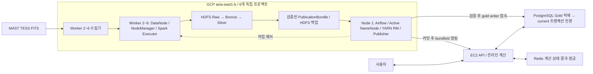

# Planetory GCP 분산 인프라

## 배치와 서비스 경계

GCP 대만 `asia-east1-b`의 독립 프로젝트 6개를 사설 IP 메시 피어링으로 연결한다.

- **GCP**: 원천 수집, 분산 저장과 배치 처리
- **AWS EC2**: 검증된 Gold와 사용자 DB 기반 온라인 서비스
- **금지 사항**: EC2의 실시간 요청에서 GCP HDFS 조회

> 생성 스크립트는 Ubuntu Server 24.04 LTS amd64 VM과 디스크 마운트까지만 준비한다.
>
> `S15P21C206-72`에서 Hadoop 3.5.0·OpenJDK 17 기반 HDFS를 설치·초기화했고, `S15P21C206-73`에서 YARN과 Spark 3.5.5 sample application을 검증했다. Spark와 Airflow 컨테이너 실행은 호스트 Hadoop 서비스와 분리한다.

## 노드와 디스크

| 번호 | VM | 사설 IP | 역할 계획 | 사양 | 디스크 |
|---|---|---|---|---|---|
| 1 | master-1 | 10.20.1.10 | Active NameNode, ResourceManager, Airflow, JournalNode | e2-custom-6-36864 / 6 vCPU / 36GiB | 부팅 30GiB + 제어 데이터 200GiB |
| 2 | worker-2 | 10.20.2.10 | Standby NameNode, DataNode, NodeManager, Spark, JournalNode | 동일 | 부팅 30GiB + HDFS 데이터 2,000GiB + 메타데이터 100GiB `pd-balanced` |
| 3 | worker-3 | 10.20.3.10 | DataNode, NodeManager, Spark, JournalNode | 동일 | 부팅 30GiB + HDFS 데이터 2,000GiB |
| 4 | worker-4 | 10.20.4.10 | DataNode, NodeManager, Spark | 동일 | 동일 |
| 5 | worker-5 | 10.20.5.10 | DataNode, NodeManager, Spark | 동일 | 동일 |
| 6 | worker-6 | 10.20.6.10 | DataNode, NodeManager, Spark | 동일 | 동일 |

### 공통 조건

- 서브넷: `10.20.<노드 번호>.0/24`
- VPC: `planetory-vpc`
- CPU 아키텍처: x86_64
- 컨테이너 이미지: amd64 또는 멀티아키텍처
- Worker당 `pd-standard` 지역 할당량: 2,048GiB
- Worker당 사용량: 부팅 30GiB + HDFS 데이터 2,000GiB
- Worker당 남는 디스크 할당량: 18GiB

### HDFS 수동 HA

Node 1~3의 JournalNode가 QJM edit log를 구성한다.

- Node 1: Active NameNode
- Node 2: Standby NameNode
- JournalNode: Node 1~3
- 자동 장애 전환: 사용하지 않음
- ZooKeeper·ZKFC: 사용하지 않음

장애 전환 전에는 기존 Active VM이 완전히 중지됐는지 확인한다.

자동 fencing이 없으므로 응답 없는 Active를 대상으로 `haadmin -failover`를 실행하지 않는다.

신규 클러스터에서는 `-format`과 `-bootstrapStandby`를 한 번만 실행한다.

`-initializeSharedEdits`는 기존 단일 NameNode를 HA로 전환할 때만 사용한다.

| 노드 | JournalNode·NameNode 저장 위치 |
| --- | --- |
| Node 1 | 200GiB 제어 데이터 디스크 |
| Node 2 | 100GiB 메타데이터 디스크 (`/mnt/metadata`) |
| Node 3 | 30GiB 부팅 디스크 |

> 이 PoC는 HA 메타데이터를 외부에 백업하지 않는다.
>
> 두 NameNode 메타데이터 디스크를 함께 잃으면 복구할 수 없다.

### YARN 자원 배분

| 대상 | YARN | 기타 프로세스와 여유 |
| --- | --- | --- |
| Node 2 | 16GiB / 2 vCore | Standby NameNode 6~8GiB, DataNode 2GiB, JournalNode 0.5~1GiB, OS |
| Node 3~6 | 24GiB / 3 vCore | DataNode 2GiB, Node 3의 JournalNode 0.5~1GiB, OS·Docker 4~5GiB |

실제 파일·블록 수를 측정한 뒤 Active와 Standby NameNode heap을 같은 값으로 조정한다.

2026-09-18 Node 2 실측에서 Standby NameNode RSS는 약 556MiB였다. Spark executor 1개가 배치된 동안 YARN 할당은 1GiB/1 vCore, 호스트 used는 약 2.7GiB, available은 약 32.5GiB, swap은 0이었다. 이 표본에서는 OOM과 NameNode 압박이 없었지만 실제 Sector의 메모리 상한 검증을 대신하지 않는다.

### 저장 용량과 운영 한계

| 항목 | 용량 |
| --- | ---: |
| HDFS 설치 용량 | 10,000GiB, 약 9.77TiB |
| Raw·Bronze·Silver RF2 예상량 | 약 8.10~8.50TiB |
| 한 Worker 장애 후 설치 용량 | 약 7.81TiB |

다음 항목은 8.10~8.50TiB 추정에 포함되지 않는다.

- PublicationBundle HDFS 백업
- 다운로드 임시 파일
- Spark shuffle
- 로그

따라서 초기에는 Sector 범위를 제한한다.

- 운영 목표: HDFS 사용률 70% 이하
- 신규 수집 중단선: HDFS 사용률 75%
- RF2 상태에서 Worker 장애 발생: 남은 블록을 즉시 재복제할 여유 공간 확보

전체 범위를 처리하려면 실측 후 보존 범위를 조정하거나 DataNode를 추가해야 한다.

Gold 전송은 번들 단위로 수행하고 성공한 임시 파일은 바로 정리한다.

## 네트워크

### 내부 연결

- 6개 프로젝트를 모두 직접 연결한다: **15쌍, 양방향 설정 30개**
- Peering은 경유 연결을 제공하지 않는다. 마스터만 연결하는 별 모양 구성으로는 Worker끼리 통신할 수 없다.
- HDFS 복제, Spark shuffle과 YARN 제어는 `10.20.x.10` 사설 IP를 사용한다.
- 내부 통신을 외부 IP로 우회하지 않는다.

### 외부 연결

- Node 1: Standard 고정 외부 IPv4
- Node 2~6: Standard 임시 외부 IPv4
- 각 노드는 MAST 다운로드, 패키지 설치와 이미지 pull을 직접 수행한다.
- Node 1은 NAT 게이트웨이로 사용하지 않는다.
- SSH는 각 담당자의 `AdminCidr /32`만 허용한다.
- Hadoop과 애플리케이션 서비스 포트는 외부에 공개하지 않는다.

Gold는 압축한 변경 번들만 Node 1에서 EC2로 전송한다. EC2가 pull하더라도 GCP 인터넷 송신이라는 점은 같다. 전송 후 checksum을 검증하고 새 릴리스를 원자적으로 공개한다.

### 제한 사항

- 같은 존 구성은 비용에 유리하지만 존 장애를 견디지 못한다.
- Peering은 Hadoop 인증이나 전송 암호화를 대신하지 않는다.
- 30일 PoC에서는 방화벽에 등록된 6개 사설 IP만 내부 신뢰 경계로 사용한다.
- Kerberos와 HDFS wire encryption은 이번 범위에서 제외한다. 피어링에 VM을 추가할 때 보안 결정을 다시 검토한다.
- ResourceManager는 Node 1 단일 인스턴스다. 장애 시 Spark 작업을 실패 처리하고, Node 1 복구 후 Airflow에서 해당 단계만 재시도한다.

### 호스트명 확인

VPC Peering은 상대 프로젝트의 Compute Engine 내부 DNS를 공유하지 않는다.

1. 피어링 스크립트가 짧은 이름과 zonal/global FQDN을 각 VM의 `/etc/hosts`에 등록한다.
2. Compose가 같은 별칭을 컨테이너의 `extra_hosts`에 등록한다.
3. `yarn node -list -all`에 표시된 호스트명을 다른 노드와 작업 컨테이너에서 `getent hosts`로 확인한다.

## 비용 전제

이전 `e2-highmem-4` 기준 비용 추정은 사용하지 않는다.

생성 전 각 계정에서 다음 항목을 대만 리전의 현재 가격으로 다시 계산한다.

- `e2-custom-6-36864`
- 부팅 디스크 30GiB
- 노드별 데이터 디스크
- Node 2 메타데이터 디스크 100GiB

아래 금액은 **2026-09-09 기준, 720시간, 공제 전 계획값**이다. 생성 스크립트가 실시간 가격을 조회한 결과는 아니다.

| 노드 | VM·디스크·외부 IPv4 계획값 | 27일 환산 |
| --- | ---: | ---: |
| Node 1 | $219.36 | $197.42 |
| Node 2 | $300.24 | $270.22 |
| Node 3~6 | 각 $290.38 | 각 $261.34 |

Node 2는 30일 계획값부터 $300을 넘는다. 결과 이전과 자원 정리를 **27일 안에 완료**한다.

비용 계산 시 다음 조건을 함께 확인한다.

- 30일은 720시간, 31일은 744시간이다.
- VM을 중지해도 영속 디스크와 예약 IP 비용은 계속 발생한다.
- 공인 IPv4가 시간당 $0.005라면 30일은 $3.60, 31일은 $3.72다.
- Standard 송신 무료 200GiB는 공식 가격표의 계정별 월간 합산 조건을 따른다.
- 서로 다른 결제 계정의 크레딧은 합산하지 않는다.

Node 1로 전달을 모으는 것은 운영을 단순하게 하는 선택이다. Worker 직접 전송이 기술적으로 금지된 것은 아니며, Node 1의 비용과 임시 저장 공간도 함께 확인한다.

다음 항목은 계획값에 포함되지 않는다.

- 스냅샷과 Cloud Logging
- 추가 디스크와 남겨 둔 예약 IP
- 네트워크 재전송
- 세금, 통화와 크레딧 적용 차이

> 실제 비용은 각 계정의 Billing, 가격 계산기와 크레딧 적용 내역으로 확인한다. 예산 알림은 자동 과금 차단 기능이 아니다.

## 구현 상태와 검증

> **현재 판정**
>
> 이 구성은 제한된 Sector를 처리하는 30일 PoC에 사용할 수 있다.
>
> 전체 TESS 처리와 운영 배포는 아직 검증되지 않았다.

### 현재 준비된 항목

- VM·디스크·VPC·피어링 생성 스크립트
- HDFS·YARN XML 설정
- HDFS 호스트 설치·단계형 초기화 스크립트, Node 1~6 설치, 6대 간 사설망·DNS와 QJM·Active/Standby·DataNode 5개·RF2 런타임 검증
- YARN 호스트 설치·단계형 기동 스크립트, ResourceManager 1개·NodeManager 5개와 Spark 3.5.5 cluster mode HDFS sample 검증
- Node 1과 Worker용 Docker Compose
- 로컬 XML·Compose·PowerShell 정적 검사

파일 위치는 다음과 같다.

- 자원 생성: [GCP 프로비저닝 스크립트](../../infra/provisioning/gcp/scripts/)
- Hadoop/YARN 실행 설정: [분산 시스템 배포](../../infra/distributed-system/README.md)
- CI/CD 배포 경계: [GitLab CI/CD](../operations/cicd.md)

### 구축 전 체크리스트

- [ ] 각 계정의 Trial 적용 여부와 실제 할당량을 확인한다.
- [ ] 프로젝트마다 피어링 5개가 `ACTIVE`인지 확인한다.
- [x] VM과 제출 컨테이너에서 YARN이 광고한 Worker 이름을 사설 IP로 해석한다.
- [x] `S15P21C206-72`에서 Hadoop 3.5.0·OpenJDK 17과 `hdfs` 서비스 계정을 준비한다.
- [x] HDFS 디스크 권한과 systemd 마운트 의존성을 설정한다.
- [x] 신규 HDFS를 한 번만 초기화하고 Standby NameNode를 bootstrap한다.
- [x] `S15P21C206-73`에서 `yarn` 서비스 계정과 ResourceManager·NodeManager를 준비한다.
- [x] 모든 Worker의 Python 3.12.3 실행 환경을 확인한다.
- [x] Node 2에서 1GiB executor 표본이 YARN 16GiB 한도 안에서 실행되고 OOM·swap·NameNode 압박이 없음을 확인한다.
- [ ] CI Runner의 SSH 경로와 Prometheus 메트릭 수집 경로를 구성한다.

Airflow DAG, 원격 수집, Spark 작업과 Publisher 코드는 후속 구현 대상이다.

CI/CD의 이미지 SHA 저장, 배포 직렬화, 상태 검사와 롤백도 실제 배포 전에 보완한다.

### 통합 검증 순서

이 순서는 `S15P21C206-72`의 HDFS RF2 쓰기·읽기·checksum과 `S15P21C206-73`의 YARN·Spark sample application이 통과한 뒤 진행한다.

1. Sector 한 개를 수집한다.
2. `Raw → Spark on YARN → Silver` 흐름을 실행한다.
3. PublicationBundle을 HDFS에 백업한다.
4. EC2로 전송하고 checksum을 검증한 뒤 공개한다.
5. 실패한 작업을 단계 단위로 재시도한다.
6. Worker 한 대를 중지하고 HDFS 복제 상태를 확인한다.
7. Active NameNode를 수동 전환한다.
8. Gold 검증 실패 시 기존 `current`가 유지되는지 확인한다.

> 영속 데이터를 지우는 초기화 작업은 일반 배포에 포함하지 않는다.

## 참고 자료

- [Hadoop 3.5.0과 Java 17](https://hadoop.apache.org/docs/r3.5.0/)
- [HDFS HA with QJM 3.5.0](https://hadoop.apache.org/docs/r3.5.0/hadoop-project-dist/hadoop-hdfs/HDFSHighAvailabilityWithQJM.html)
- [Spark 3.5.5 on YARN](https://archive.apache.org/dist/spark/docs/3.5.5/running-on-yarn.html)
- [VM 생성 옵션](https://docs.cloud.google.com/sdk/gcloud/reference/compute/instances/create)
- [VPC Peering과 DNS 제한](https://docs.cloud.google.com/vpc/docs/vpc-peering#dns_support)
- [Compute Engine 내부 DNS 형식](https://docs.cloud.google.com/compute/docs/internal-dns)
- [VM 가격](https://cloud.google.com/products/compute/pricing/general-purpose)
- [디스크 가격](https://cloud.google.com/compute/disks-image-pricing)
- [네트워크 가격](https://cloud.google.com/vpc/network-pricing)

Hadoop 3.5.0과 OpenJDK 17은 설치 기준으로 고정한다. Apache 배포 파일의 SHA-512, OS 패키지 제공 상태와 비용은 구축 직전에 다시 확인한다.
