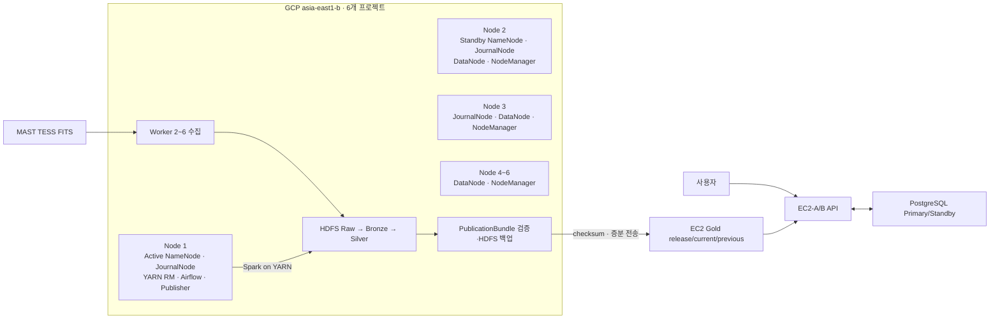

# Planetory 시스템 아키텍처 — AI 핵심 지침

> Planetory 설계·구현·리뷰 시 사용하는 기준 컨텍스트다.  
> 상태: 목표 설계이며 실제 배포 완료를 의미하지 않는다. `확정`은 유지할 결정, `가정`은 계산 기준, `후보`는 대안, `미정`은 사용자 결정이 필요한 값이다.
> 기준 요구사항: [Planetory 요구사항 명세서 v0.12](../requirements/planetory-requirements-spec.md)



## 1. 불변 규칙

1. **AWS EC2는 온라인 서비스, GCP는 저장·배치 처리를 담당한다.**
2. **EC2 API는 GCP HDFS를 실시간 조회하지 않는다.**
3. GCP 결과는 검증된 **Gold 릴리스**로만 EC2에 전달한다.
4. 회원·제출·분석 이력·커뮤니티 데이터는 **PostgreSQL**에 저장한다.
5. 곡선·주기도·Parquet 본문은 **EC2 Gold 파일**, 검색용 메타데이터는 PostgreSQL에 저장한다.
6. 어느 EC2가 요청을 받아도 쓰기는 PostgreSQL Primary에서 처리한다.
7. **EC2-B Backend가 EC2-A Backend로 쓰기 요청을 전달하지 않는다.** 두 Backend가 Primary에 직접 연결한다.
8. 배치나 Gold 배포가 실패하면 현재 서비스 중인 릴리스를 유지한다.
9. 미확정 기술을 이미 결정된 사실처럼 구현하거나 문서화하지 않는다.

충돌 시 우선순위는 `불변 규칙 → 데이터 소유권 → 사용자가 선택한 용량안 → 미확정 사항` 순이다.

## 2. 시스템 경계

```text
온라인: 사용자 → Cloudflare → EC2-A/B → PostgreSQL + EC2 Gold
배치:   외부 원천 → Airflow → YARN/Spark → HDFS Raw → Bronze → Silver → Gold 후보
공개:   GCP Gold 후보 → HDFS 백업·검증·전송 → EC2 Gold current/previous 전환
관측:   EC2-A/B + GCP Node 1~6 → Prometheus → Grafana
```

## 3. 구성과 책임

| 영역 | 구성 | 책임 |
| --- | --- | --- |
| 진입점 | Cloudflare DNS·CDN·Tunnel | HTTPS 진입, 정적 캐시, EC2 요청 분산 |
| EC2-A/B | Docker, Nginx | 실행 환경, 정적 파일, `/api/*` 프록시 |
| Frontend | React, TypeScript, Vite | 사용자 UI |
| Backend | Spring Boot 3 | 회원, 제출, 분석 결과, 커뮤니티, 성과 API |
| 서비스 DB | PostgreSQL | 트랜잭션 및 서비스 메타데이터 |
| 배치 제어 | Airflow | 대상·버전·순서·실패 단계 재처리 |
| 자원 관리 | YARN | Spark 실행 자원 배정 |
| 분산 연산 | Spark | 파싱·정제·결합·BLS·residual·AI 배치 |
| 분산 저장 | Hadoop HDFS | Raw·Bronze·Silver·공개 Bundle 백업 저장 |
| 관측 | Prometheus, Grafana | 메트릭 수집 및 시각화 |

EC2-A/B 애플리케이션은 동일하고 무상태로 운영한다. Redis는 공유 세션이나 캐시가 실제로 필요할 때만 추가한다.

Cloudflare Free는 유료 Load Balancing과 동일하다고 가정하지 않는다. 구현 전 다중 Tunnel connector, 상태 확인 및 장애 전환 범위를 검증한다.

## 4. 서버 자원 및 노드 역할

GCP 디스크·네트워크·비용 가정과 검토 결과는 [GCP 분산 인프라 상세](gcp-distributed-infrastructure.md), 생성 명령은 [GCP 준비 절차](../../infra/provisioning/gcp/README.md)를 따른다.

### 가용 및 가정 서버 스펙

| 환경 | 수량 | 서버 1대당 사양 | 합계 | 상태 |
| --- | ---: | --- | --- | --- |
| AWS EC2 | 2대 | 4 vCPU · 16GB · 320GB | 8 vCPU · 32GB · 640GB | 확정된 가용량 |
| GCP Node 1 | 1대 | 6 vCPU · 36GiB · 제어 데이터 200GiB | 동일 | 생성 계획 |
| GCP Node 2 | 1대 | 6 vCPU · 36GiB · HDFS 데이터 2,000GiB · 메타데이터 100GiB | 동일 | 생성 계획 |
| GCP Node 3~6 | 4대 | 6 vCPU · 36GiB · HDFS 데이터 각 2,000GiB | 24 vCPU · 144GiB · HDFS 데이터 8,000GiB | 생성 계획 |

Storage는 설치 용량이다. OS, Docker, DB, 로그와 복제본을 제외한 실제 가용량은 더 작다.

GCP는 `asia-east1-b` 한 존의 6개 프로젝트를 full-mesh VPC Peering으로 연결한다. 생성 전 각 계정의 결제·할당량·Trial 적용 여부를 확인하며, 위 수치는 실제 생성 완료 상태를 의미하지 않는다.

### AWS

| 노드 | 역할 |
| --- | --- |
| EC2-A | 애플리케이션 노드 + PostgreSQL Primary(Read/Write) |
| EC2-B | 애플리케이션 노드 + PostgreSQL Standby(Read-only) + Prometheus/Grafana |

- Primary → Standby는 WAL streaming으로 복제한다.
- Standby는 복제 지연을 허용할 수 있는 조회만 처리한다.
- 쓰기 직후 조회와 최신성이 필요한 조회는 Primary를 사용한다.
- Primary 장애 시 Standby 자동 승격은 확정되지 않았다.

### GCP

| 노드 | Hadoop/YARN 역할 | YARN 컨테이너 한도 |
| --- | --- | --- |
| 1 | Active NameNode, JournalNode, ResourceManager, Airflow, Publisher | NodeManager 미실행 |
| 2 | Standby NameNode, JournalNode, DataNode, NodeManager | 16GiB / 2 vCore |
| 3 | JournalNode, DataNode, NodeManager | 24GiB / 3 vCore |
| 4~6 | DataNode, NodeManager | 24GiB / 3 vCore |

Node 1~3은 QJM edit log를 구성한다. HDFS 장애 전환은 수동이다.

- 계획된 전환: 기존 Active를 먼저 Standby로 내린다.
- 장애 전환: 기존 Active VM의 완전 중지를 확인한 뒤 Node 2를 승격한다.
- 금지: 자동 fencing이 없으므로 응답 없는 Active에 `haadmin -failover`를 실행하지 않는다.
- 제외: ZooKeeper와 ZKFC는 사용하지 않는다.

ResourceManager는 Node 1 단일 인스턴스다. 장애가 발생하면 실행 중인 작업을 실패 처리하고, Node 1 복구 후 Airflow에서 해당 단계만 재시도한다.

JournalNode 저장 위치는 다음과 같다.

- Node 1: 200GiB 제어 데이터 디스크
- Node 2: 100GiB 메타데이터 디스크
- Node 3: 30GiB 부팅 디스크

HDFS DataNode 설치 용량은 Worker 5대의 2,000GiB를 합한 **10,000GiB(약 9.77TiB)**다. 부팅 디스크 30GiB도 지역 `pd-standard` 2,048GiB 할당량에 포함된다.

> 이 PoC에서는 HA 메타데이터를 외부에 백업하지 않는다.

## 5. 데이터 소유권

| 데이터 | 저장 위치 | 온라인 조회 |
| --- | --- | --- |
| FITS 원본·외부 원응답 | GCP HDFS Raw | 금지 |
| Sector Parquet | GCP HDFS Bronze | 금지 |
| 정제곡선·BLS·residual·AI 내부 결과 | GCP HDFS Silver | 금지 |
| 공개 전 축약 데이터 | GCP PublicationBundle staging | 금지 |
| 공개한 PublicationBundle 백업 | GCP HDFS PublicationBundle backup | 금지 |
| 검증된 곡선·주기도·후보·AI 결과 | EC2 Gold | 허용 |
| 회원·제출·이력·커뮤니티·성과 | PostgreSQL | 허용 |
| Gold 릴리스·검색·정렬 메타데이터 | PostgreSQL | 허용 |

`HDFS → Backend API` 화살표는 실시간 조회가 아니라 **Gold 배치 전달**을 뜻한다.

## 6. 데이터 레이크 및 배치

| 계층 | 내용 | 논리 용량 추정 | 저장 용량 추정 |
| --- | --- | ---: | ---: |
| Raw | 원본 FITS·외부 원응답 | 약 3.031TiB | RF2 약 6.06TiB |
| Bronze | 파싱된 관측 Parquet | 약 0.52TiB | RF2 약 1.04TiB |
| Silver | 정제·BLS·잔차·AI 내부 산출물 | 약 0.50~0.70TiB | RF2 약 1.0~1.4TiB |
| PublicationBundle backup | EC2에 공개한 번들과 manifest·checksum | PoC 후 산정 | RF2, 위 합계와 별도 |
| Gold | 서비스 공개·온라인 계산 입력 | PoC 후 산정 | EC2 저장량 PoC 후 결정 |

Raw·Bronze·Silver의 RF2 저장량은 약 **8.10~8.50TiB**다. 설치 용량의 약 **83~87%**를 차지한다.

이 추정에는 다음 항목이 빠져 있다.

- PublicationBundle 백업
- 다운로드 임시 파일
- Spark shuffle
- 로그

따라서 초기에는 Sector 범위를 제한한다.

- 운영 목표: HDFS 사용률 70% 이하
- 신규 수집 중단선: HDFS 사용률 75%
- Worker 장애 시: 단일 복제본이 된 블록을 즉시 재복제할 여유 확보

전체 범위는 실측 후 보존 범위를 조정하거나 DataNode를 추가해야 한다.

상세 기준은 다음 문서를 따른다.

- 디렉터리·파티션, FITS 묶음과 EC2 Gold: [데이터 관리 및 재현성](../data/data-guidelines.md)
- 외부 원천 수집부터 PublicationBundle 배포: [Hadoop·Spark 개발 규칙](../data/spark-hadoop-guidelines.md)

Gold 후보는 `PublicationBundle`이라는 논리 계층이다. 검증된 결과만 EC2에 전달한다.

배치는 다음 정보를 제공해야 한다.

- 고정된 원천·파이프라인 버전
- 원본 정제곡선의 모든 점과 품질 마스크
- `fold_reference_time_btjd`
- 원본 주기도
- 후보별 통과 모델과 계산 버전
- 단계별 재처리에 필요한 식별자

파일 스키마와 용량은 미니 파이프라인 PoC 후 별도 Task에서 확정한다.

## 7. Gold 공개 규칙

```text
GCP PublicationBundle → HDFS 백업 → EC2 임시 release → 재검증 → previous 갱신 → current 원자적 전환 → API 공개
```

- 전송 중인 디렉터리를 공개하지 않는다.
- 검증 실패 시 `current`를 바꾸지 않는다.
- 기존 릴리스를 덮어쓰지 않는다.
- 실패한 TIC와 단계만 재처리한다.
- 신규 분석 세션은 `current`를 한 번 조회해 `publication_bundle_id`를 고정한다.
- 진행 중 세션·재시도·온라인 계산은 `current`가 아니라 고정된 `releases/<publication_bundle_id>`를 읽는다.
- 새 릴리스 공개 시 직전 릴리스를 `previous`로 유지하고, 더 오래된 릴리스와 캐시는 진행 중 세션·재시도·보존기간 내 히스토리가 참조하지 않을 때 삭제한다. 참조 중이면 보존기간이 끝날 때까지 보호한다.
- 공개한 PublicationBundle은 HDFS에 RF2로 백업하며 EC2 온라인 조회에는 사용하지 않는다.

Gold 릴리스의 파일 구조와 전송 전후 검증 기준은 [데이터 관리 및 재현성](../data/data-guidelines.md)을 따른다.

## 8. 관측·보안·호환성

- Prometheus는 node exporter, Spring Actuator, JMX exporter를 통해 EC2와 GCP 메트릭을 수집한다.
- Grafana는 Prometheus를 조회한다.
- API 오류율·지연, DB 복제 지연, HDFS 사용률, YARN 자원, Spark/Airflow 상태, Gold 버전을 관측한다.
- 온라인 계산은 `QUEUED`, `RESIDUAL_CALCULATING`, `RESIDUAL_READY`, `PERIODOGRAM_CALCULATING`, `COMPLETED`, `FAILED` 상태별 대기·처리 시간과 실패율을 관측한다.
- EC2-B 장애 시 관측성도 중단되는 구조는 현재 비용 제약상 허용한다.
- PostgreSQL, HDFS, YARN, Spark 관리 포트를 인터넷에 공개하지 않는다.
- GCP–AWS 전송과 메트릭 수집은 인증·암호화된 경로만 사용한다.
- EC2와 GCP는 x86_64(`linux/amd64`) 이미지를 사용한다. 이미지 빌드와 실제 실행 검증 기준은 [CI/CD](../operations/cicd.md)를 따른다.
- 30일 PoC의 Hadoop 내부 통신은 방화벽에 등록된 6개 사설 IP만 신뢰하는 경계로 제한한다.
- Kerberos와 HDFS wire encryption은 이번 범위에서 제외한다. 피어링에 다른 VM을 추가할 때 보안 결정을 다시 검토한다.

## 9. 미확정 사항

AI가 임의로 확정하지 말고 구현 티켓 또는 사용자 결정을 요구한다.

- Cloudflare Free 기반 요청 분산과 장애 감지 방식
- Redis 도입 여부와 위치
- PostgreSQL 자동 승격 및 복구 절차
- PublicationBundle 내부 파일 스키마·용량
- 진행 중 세션·재시도·히스토리가 참조하는 이전 Bundle·캐시의 보존기간
- GCP–AWS Gold 전송 프로토콜과 방화벽 규칙
- 서비스 DB·Gold의 백업/복구 목표와 로그 보존 기간(HDFS HA 메타데이터 외부 백업은 제외 확정)

## 10. AI 판단 체크리스트

1. 변경 영역을 온라인, 배치, 저장, 관측 중 하나로 분류한다.
2. 데이터 소유권 표로 저장 위치와 조회 경로를 확인한다.
3. 온라인 HDFS 조회가 생기면 Gold 배포 방식으로 수정한다.
4. EC2별 애플리케이션 차이를 만들지 않는다. DB 역할 차이만 유지한다.
5. 쓰기가 Standby나 다른 Backend가 아니라 Primary로 향하는지 확인한다.
6. 배치 산출물에 버전, checksum, 재처리 단위를 포함한다.
7. GCP의 실제 할당량·Trial·생성 상태를 계획값과 구분한다.
8. 새 기술과 미정 경로는 확정된 요구가 있을 때만 추가한다.
9. 설계, 구현 완료, 검증 완료를 구분해서 보고한다.
