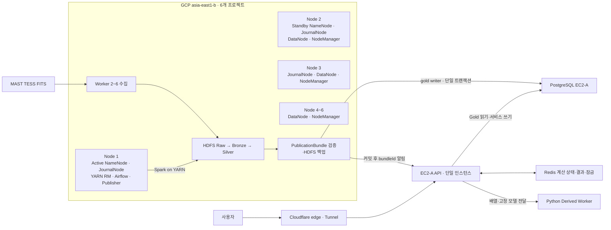

# Planetory 시스템 아키텍처 — AI 핵심 지침

> Planetory 설계·구현·리뷰 시 사용하는 기준 컨텍스트다.  
> 상태: 목표 설계이며 실제 배포 완료를 의미하지 않는다. `확정`은 유지할 결정, `가정`은 계산 기준, `후보`는 대안, `미정`은 사용자 결정이 필요한 값이다.
> 기준 요구사항: [Planetory 요구사항 명세서](../requirements/planetory-requirements-spec.md)




## 1. 불변 규칙

1. **AWS EC2는 온라인 서비스, GCP는 저장·배치 처리를 담당한다.**
2. **EC2 API는 GCP HDFS를 실시간 조회하지 않는다.**
3. GCP 결과는 검증된 **PublicationBundle**로만 PostgreSQL Gold 카탈로그에 적재한다.
4. 회원·제출·분석 이력·커뮤니티 데이터는 **PostgreSQL**에 저장한다.
5. 공개 곡선·주기도·후보 모델과 검색용 메타데이터는 **PostgreSQL**에 저장한다. 온라인 서비스는 HDFS나 별도 Gold 파일을 읽지 않는다.
6. **서비스 앱 인스턴스는 1개다.** 늘리려면 8장의 선행 조건을 먼저 결정한다.
7. 쓰기는 PostgreSQL Primary에서 처리한다.
8. **Backend 인스턴스 간 쓰기 프록시를 두지 않는다.** 각 Backend는 Primary에 직접 연결한다.
9. 배치나 Gold 배포가 실패하면 현재 서비스 중인 릴리스를 유지한다.
10. 미확정 기술을 이미 결정된 사실처럼 구현하거나 문서화하지 않는다.

충돌 시 우선순위는 `불변 규칙 → 데이터 소유권 → 사용자가 선택한 용량안 → 미확정 사항` 순이다.

## 2. 시스템 경계

```text
온라인: 사용자 → Cloudflare edge → Tunnel → EC2-A → PostgreSQL + Redis + Python Derived Worker
배치:   외부 원천 → Airflow → YARN/Spark → HDFS Raw → Bronze → Silver → Gold 후보
공개:   GCP Gold 후보 → HDFS 백업·검증 → PostgreSQL 적재·current 전환 → bundleId 알림
관측:   EC2-A + GCP Node 1~6 → Prometheus → Grafana
```

## 3. 구성과 책임

| 영역 | 구성 | 책임 |
| --- | --- | --- |
| 진입점 | Cloudflare DNS·CDN(proxied)·Tunnel 단일 connector | HTTPS 진입과 사용자 구간 TLS edge 종료, 정적 캐시. connector가 EC2-A에서 밖으로만 연결하므로 외부 인바운드 개방은 0개다(8장) |
| EC2-A | Docker, 프런트 컨테이너 Nginx, cloudflared | 단일 서비스 노드. 실행 환경, 정적 파일, `/api/*` 프록시. 호스트 Nginx를 두지 않는다 |
| Frontend | React, TypeScript, Vite | 사용자 UI |
| Backend | Spring Boot 3 | 회원, 제출, Gold 읽기, Worker 호출, 판 전환 후처리, 커뮤니티, 성과 API |
| Derived Worker | Python, `libs/astro-kernel` | Backend가 전달한 배열과 고정 모델로 잔차·주기도 계산. DB 직접 조회 금지 |
| 서비스 DB | PostgreSQL | 서비스 트랜잭션, Gold 배열·메타데이터, current 판의 정본 |
| 계산 캐시 | Redis (EC2-A loopback) | 온라인 계산 상태·결과·키별 잠금 |
| 배치 제어 | Airflow | 대상·버전·순서·실패 단계 재처리 |
| 자원 관리 | YARN | Spark 실행 자원 배정 |
| 분산 연산 | Spark | 파싱·정제·결합·BLS·residual·AI 배치 |
| 분산 저장 | Hadoop HDFS | Raw·Bronze·Silver·공개 Bundle 백업 저장 |
| 관측 | Prometheus, Grafana | 메트릭 수집 및 시각화 |

애플리케이션은 EC2-A의 단일 인스턴스로 운영한다. 로그인 세션은 같은 노드의 `redis-session`에, 온라인 파생 계산의 상태·결과·키별 잠금은 `redis-cache`에 둔다. 두 인스턴스로 나누는 이유는 `maxmemory`와 eviction이 인스턴스 단위라 한곳에 두면 계산 캐시가 세션을 지우기 때문이다(8장 D1). 세션을 Redis에 두는 목적은 공유가 아니라 재시작 생존이며, 그 대가로 `redis-session`은 인증 경로의 필수 의존이 된다(8장 D10). 요청 간 상태를 프로세스 메모리에 새로 두지 않는다는 제약은 인스턴스 수와 무관하게 유지한다.

이 서술은 개발 정본 [서비스 백엔드 계약과 수용 기준](../development/service-backend/contracts-and-acceptance.md)의 SB-D07(단일 Spring Boot 전제 유지, 필수 공유 세션 전제 폐기)과 정합화한 결과다. 이전 판의 "EC2-A/B 동일·무상태" 서술은 SB-D07 확정 시점부터 이 결정 이전까지 충돌 상태였다.

Cloudflare Free는 유료 Load Balancing과 동일하지 않다. Tunnel replica는 가장 가까운 connector 하나로만 보내고 분산하지 않음을 실측(10/10 단일 노드)·공식 문서로 확인했다(2026-09-16). 단일 인스턴스에서는 문제가 되지 않지만, 인스턴스를 늘리면 두 번째 노드가 트래픽을 받지 못하므로 진입 계층 재구축이 선행 조건이 된다(8장). 경로·포트·장애 시나리오는 8장을 따른다.

## 4. 서버 자원 및 노드 역할

GCP 디스크·네트워크·비용 가정과 검토 결과는 [GCP 분산 인프라 상세](gcp-distributed-infrastructure.md), 생성 명령은 [GCP 준비 절차](../../infra/provisioning/gcp/README.md)를 따른다.

### 가용 및 가정 서버 스펙

| 환경 | 수량 | 서버 1대당 사양 | 합계 | 상태 |
| --- | ---: | --- | --- | --- |
| AWS EC2 | 2대 | 4 vCPU · 16GB · 320GB | 8 vCPU · 32GB · 640GB | 확정된 가용량 |
| GCP Node 1 | 1대 | 6 vCPU · 36GiB · 제어 데이터 200GiB | 동일 | 생성 계획 |
| GCP Node 2 | 1대 | 6 vCPU · 36GiB · HDFS 데이터 2,000GiB · 메타데이터 100GiB | 동일 | 생성 계획 |
| GCP Node 3~6 | 4대 | 6 vCPU · 36GiB · HDFS 데이터 각 2,000GiB | 24 vCPU · 144GiB · HDFS 데이터 8,000GiB | 생성 계획 |

Storage는 설치 용량이다. OS, Docker, DB, 로그와 복제본을 제외한 실제 가용량은 더 작다.

GCP는 `asia-east1-b` 한 존의 6개 프로젝트를 full-mesh VPC Peering으로 연결한다. 생성 전 각 계정의 결제·할당량·Trial 적용 여부를 확인하며, 위 수치는 실제 생성 완료 상태를 의미하지 않는다.

### AWS

| 노드 | 역할 |
| --- | --- |
| EC2-A | 단일 서비스 노드. 애플리케이션 인스턴스 1개 + PostgreSQL Primary(Read/Write) + Redis + Python Derived Worker + Prometheus/Grafana |
| EC2-B | 사용하지 않는다. 앱·복제·백업·관측 어느 역할도 두지 않는다 |

- PostgreSQL Standby를 두지 않는다. 승격 선택지가 없으므로 EC2-A 장애는 서비스 전면 중단이다. Backend에 읽기·쓰기 분리도 없다.
- 백업을 두지 않는다. EBS 스냅샷 도입 여부는 별도 결정으로 남긴다(10장).
- **데이터 손실 경계**: Gold 카탈로그는 GCP HDFS에 PublicationBundle이 RF2로 백업돼 재게시로 복구할 수 있다. 반면 **회원·제출·분석 히스토리·커뮤니티 데이터는 사본이 없어 볼륨 상실이나 논리 오류에서 복구할 수 없다.** PoC 범위에서 수용한 경계다.
- 배포·재시작은 전면 중단을 동반하지만 `redis-session`을 함께 재시작하지 않으면 로그인은 유지된다. 무중단 배포를 목표로 두지 않는다.
- EC2-B를 앱 노드나 콜드 백업으로 쓰는 안, 오사카 CI/CD 노드를 LB·단독 헬스체크로 쓰는 안은 검토 후 기각했다. 사유는 8장이 가리키는 상세 문서에 있다.

### GCP

| 노드 | Hadoop/YARN 역할 | YARN 컨테이너 한도 |
| --- | --- | --- |
| 1 | Active NameNode, JournalNode, ResourceManager, Airflow, Publisher | NodeManager 미실행 |
| 2 | Standby NameNode, JournalNode, DataNode, NodeManager | 16GiB / 2 vCore |
| 3 | JournalNode, DataNode, NodeManager | 24GiB / 3 vCore |
| 4~6 | DataNode, NodeManager | 24GiB / 3 vCore |

Node 1~3은 QJM edit log를 구성한다. HDFS 장애 전환은 수동이다.

- 계획된 전환: 기존 Active를 먼저 Standby로 내린다.
- 장애 전환: 기존 Active VM의 완전 중지를 확인한 뒤 Node 2를 승격한다.
- 금지: 자동 fencing이 없으므로 응답 없는 Active에 `haadmin -failover`를 실행하지 않는다.
- 제외: ZooKeeper와 ZKFC는 사용하지 않는다.

ResourceManager는 Node 1 단일 인스턴스다. 장애가 발생하면 실행 중인 작업을 실패 처리하고, Node 1 복구 후 Airflow에서 해당 단계만 재시도한다.

JournalNode 저장 위치는 다음과 같다.

- Node 1: 200GiB 제어 데이터 디스크
- Node 2: 100GiB 메타데이터 디스크
- Node 3: 30GiB 부팅 디스크

HDFS DataNode 설치 용량은 Worker 5대의 2,000GiB를 합한 **10,000GiB(약 9.77TiB)**다. 부팅 디스크 30GiB도 지역 `pd-standard` 2,048GiB 할당량에 포함된다.

> 이 PoC에서는 HA 메타데이터를 외부에 백업하지 않는다.

## 5. 데이터 소유권

| 데이터 | 저장 위치 | 온라인 조회 |
| --- | --- | --- |
| FITS 원본·외부 원응답 | GCP HDFS Raw | 금지 |
| Sector Parquet | GCP HDFS Bronze | 금지 |
| 정제곡선·BLS·residual·AI 내부 결과 | GCP HDFS Silver | 금지 |
| 공개 전 축약 데이터 | GCP PublicationBundle staging | 금지 |
| 공개한 PublicationBundle 백업 | GCP HDFS PublicationBundle backup | 금지 |
| 검증된 곡선·주기도·후보·AI 결과 | PostgreSQL Gold 카탈로그 | 허용 |
| 회원·제출·이력·커뮤니티·성과 | PostgreSQL | 허용 |
| Gold 릴리스·검색·정렬 메타데이터 | PostgreSQL | 허용 |

Publisher의 `HDFS → PostgreSQL` 흐름은 온라인 조회가 아니라 **검증된 Gold 배치 적재**를 뜻한다.

## 6. 데이터 레이크 및 배치

| 계층 | 내용 | 논리 용량 추정 | 저장 용량 추정 |
| --- | --- | ---: | ---: |
| Raw | 원본 FITS·외부 원응답 | 약 3.031TiB | RF2 약 6.06TiB |
| Bronze | 파싱된 관측 Parquet | 약 0.52TiB | RF2 약 1.04TiB |
| Silver | 정제·BLS·잔차·AI 내부 산출물 | 약 0.50~0.70TiB | RF2 약 1.0~1.4TiB |
| PublicationBundle backup | EC2에 공개한 번들과 manifest·checksum | PoC 후 산정 | RF2, 위 합계와 별도 |
| Gold | 서비스 공개·온라인 계산 입력 | PoC 후 산정 | PostgreSQL(EC2-A) 용량에 포함 |

Raw·Bronze·Silver의 RF2 저장량은 약 **8.10~8.50TiB**다. 설치 용량의 약 **83~87%**를 차지한다.

이 추정에는 다음 항목이 빠져 있다.

- PublicationBundle 백업
- 다운로드 임시 파일
- Spark shuffle
- 로그

따라서 초기에는 Sector 범위를 제한한다.

- 운영 목표: HDFS 사용률 70% 이하
- 신규 수집 중단선: HDFS 사용률 75%
- Worker 장애 시: 단일 복제본이 된 블록을 즉시 재복제할 여유 확보

전체 범위는 실측 후 보존 범위를 조정하거나 DataNode를 추가해야 한다.

상세 기준은 다음 문서를 따른다.

- 디렉터리·파티션, FITS 묶음과 PostgreSQL Gold 적재: [데이터 관리 및 재현성](../data/data-guidelines.md)
- 외부 원천 수집부터 PublicationBundle 배포: [Hadoop·Spark 개발 규칙](../data/spark-hadoop-guidelines.md)

Gold 후보는 `PublicationBundle`이라는 논리 계층이다. 검증된 결과만 PostgreSQL Gold 카탈로그에 적재한다.

배치는 다음 정보를 제공해야 한다.

- 고정된 원천·파이프라인 버전
- 품질 필터와 비닝이 끝난 별·섹터 곡선 세그먼트
- `fold_reference_time_btjd`
- 원본 주기도
- 후보별 통과 모델과 계산 버전
- 단계별 재처리에 필요한 식별자

배열 용량과 비닝 간격은 미니 파이프라인 PoC에서 측정한다.

## 7. Gold 공개 규칙

```text
GCP PublicationBundle → HDFS 백업·검증 → PostgreSQL staging 적재
→ 같은 트랜잭션에서 기존 current를 archived, 새 판을 current로 전환
→ COMMIT → Backend에 bundleId 알림 → Redis 캐시 정리·재개 판정·라벨 표식
```

- Publisher는 `planetory_gold_writer`로 PostgreSQL Primary에 직접 적재한다. 서비스 런타임 역할은 Gold를 읽기만 한다.
- 곡선 세그먼트·주기도·후보·manifest 적재와 판 전환은 하나의 PostgreSQL 트랜잭션으로 처리한다. `current` 부분 유일 인덱스의 즉시 검사를 피하도록 기존 `current`를 먼저 `archived`로 바꾼 뒤 신규 `staging`을 `current`로 올린다.
- staging 적재와 current 전환은 구현 Task가 나뉘어도 Publisher가 연 같은 트랜잭션 안의 단계다. staging 단계는 독립적으로 commit하지 않으며 Publisher가 실패 시 전체 rollback하고 Airflow가 같은 `(tic_id, bundle_version)`으로 전체 게시를 재시도한다.
- `(tic_id, bundle_version)`에는 DB 유일 제약을 두고 같은 TIC 게시를 `pg_advisory_xact_lock(tic_id)`으로 직렬화한다. 버전은 곡선 원천과 외부 참조를 모두 포함한 입력 snapshot·세그먼트 자연 키·계산 버전의 결정적 SHA-256이며 실행 시각·run id를 포함하지 않는다.
- 재시도 동일성은 자연 키·배열/결과 checksum·계산 버전·Bundle 수치 메타데이터로 비교하고 DB 생성 id와 manifest의 `segment_ids`는 제외한다. archived 판의 늦은 재시도는 현재 판을 되돌리지 않는다.
- 검증이나 적재가 실패하면 트랜잭션을 롤백해 기존 `current`를 유지한다. 기존 판 행은 과거 제출 참조를 위해 남기되, archived 판의 주기도는 정리한다.
- 커밋 뒤 Publisher는 전환된 `bundleId`만 Backend에 알린다. 알림은 멱등 재시도할 수 있어야 하며, 실패해도 DB 전환을 되돌리지 않는다.
- 알림은 후처리를 빠르게 시작하기 위한 신호다. 요청 처리 시 Backend가 조회한 DB의 `current`가 최종 정본이다.
- Backend는 알림을 받으면 이전 판 Redis 캐시 정리, 완료 별 재개 판정, 외부 라벨 갱신 표식을 실행한다.
- 진행 중 분석은 판 변경을 감지하면 최신 `current`로 다시 불러온다. 이전 판의 계산 결과를 화면이나 저장 결과로 채택하지 않는다.
- 공개한 PublicationBundle은 HDFS에 RF2로 백업하며 온라인 조회에는 사용하지 않는다.

Gold 적재와 검증 기준은 [데이터 관리 및 재현성](../data/data-guidelines.md)을 따른다.

## 8. 진입·장애 전환 경계

S15P21C206-82에서 확정했다(2026-09-16 초판, 2026-09-17 EC2-A 단일 노드로 개정). 포트·신뢰 경계, 기각 후보와 사유, 장애 시나리오, 계정 분리, 인스턴스 증설 시 선행 조건, 후속 인계는 [EC2 서비스 진입·장애 전환 경계](ec2-service-entry-failover.md)를 따른다. 아래는 요약이며 상세를 이 문서에 복제하지 않는다.

- 진입: Cloudflare Tunnel 단일 connector. 사용자 구간 TLS는 edge에서 종료하고 인터넷 구간 평문은 금지한다. connector가 EC2-A에서 밖으로만 연결하므로 **외부 인바운드 개방은 0개**다.
- 서비스 앱 인스턴스는 1개다. A 레코드 라운드로빈, 노드 상호 감시, 자체 LB 서버, Cloudflare 유료 Load Balancing을 모두 도입하지 않는다.
- Redis는 EC2-A loopback에 둔다. PostgreSQL Standby와 백업이 없어 EC2-A 장애는 서비스 전면 중단이며 데이터 손실 경계는 4장에 있다.
- 로그인 세션은 그 Redis에 둔다(2026-09-17 리뷰 반영). 인스턴스 간 공유가 아니라 재시작 생존이 목적이며 인스턴스는 1개 그대로다. 대가로 Redis 장애가 인증 전면 중단이 되고 인증 요청은 503으로 응답한다. 구현은 `S15P21C206-237`.
- 남용 제어는 현재 Cloudflare edge 기본 차단이 유일한 방어선이다. 저장소에 rate limit·로그인 잠금 구현이 없고 `permitAll` 경로가 미인증 호출마다 세션을 만들므로, 단일 노드에서는 남용 부하가 앱·DB·Redis·Worker를 한꺼번에 멈춘다. 애플리케이션 계층 제한 위치는 84가 정한다.
- 인스턴스를 늘리려면 진입 계층 재구축, 세션 외부화, 로그아웃 CSRF 면제 수정을 먼저 결정한다. 현재 모두 미도입이며 순서와 근거는 상세 문서에 있다.
- 계정 분리는 83, Cloudflare·Tunnel 세팅은 84가 맡는다.

```text
사용자 → Cloudflare edge(TLS 종료) → Tunnel → cloudflared(EC2-A, egress 전용)
       → 프런트 컨테이너 Nginx → app(단일 인스턴스)
app → PostgreSQL Primary · Redis(loopback) · Python Worker  (모두 EC2-A)
외부 인바운드 개방: 없음
```

## 9. 관측·보안·호환성

- Prometheus는 node exporter, Spring Actuator, JMX exporter를 통해 EC2와 GCP 메트릭을 수집한다.
- Grafana는 Prometheus를 조회한다.
- API 오류율·지연, HDFS 사용률, YARN 자원, Spark/Airflow 상태, Gold 버전을 관측한다. DB 복제 지연은 Standby가 없어 관측 대상이 아니다.
- 온라인 계산은 `QUEUED`, `RESIDUAL_CALCULATING`, `RESIDUAL_READY`, `PERIODOGRAM_CALCULATING`, `COMPLETED`, `FAILED` 상태별 대기·처리 시간과 실패율을 관측한다.
- Prometheus·Grafana는 서비스와 같은 EC2-A에 둔다. 따라서 EC2-A가 멈추면 관측도 함께 멈추고 장애 당시 지표를 볼 수 없다. 서비스 생존 여부의 외부 확인은 오사카 CI/CD 노드의 알림 전용 외부 관찰에만 의존한다(해당 노드를 LB나 진입 경로로 쓰지 않는다). 이 구조는 현재 비용 제약상 허용한다.
- PostgreSQL, Redis, HDFS, YARN, Spark 관리 포트를 인터넷에 공개하지 않는다. EC2의 외부 인바운드 개방을 0개로 둔다(적용·확인은 84). 진입은 Cloudflare Tunnel의 egress 연결로만 이뤄진다(8장).
- GCP–AWS 전송과 메트릭 수집은 인증·암호화된 경로만 사용한다.
- EC2와 GCP는 x86_64(`linux/amd64`) 이미지를 사용한다. 이미지 빌드와 실제 실행 검증 기준은 [CI/CD](../operations/cicd.md)를 따른다.
- 30일 PoC의 Hadoop 내부 통신은 방화벽에 등록된 6개 사설 IP만 신뢰하는 경계로 제한한다.
- Kerberos와 HDFS wire encryption은 이번 범위에서 제외한다. 피어링에 다른 VM을 추가할 때 보안 결정을 다시 검토한다.

## 10. 미확정 사항

AI가 임의로 확정하지 말고 구현 티켓 또는 사용자 결정을 요구한다.

- Redis TTL·메모리 상한과 장애 시 재계산 운영값. **세션이 같은 Redis로 들어오면서 eviction 정책이 선택 사항이 아니게 됐다**(84). `allkeys-*`는 세션 키도 지우고 `volatile-*`도 세션이 30분 TTL을 가져 안전하지 않다. 세션·캐시 인스턴스 분리 / `noeviction` / 세션 유실 수용 중 하나를 골라야 한다
- 세션 Redis의 persistence 보장 범위(84). 앱만 재배포하면 persistence 없이도 세션이 유지되고, Redis 컨테이너 재시작·호스트 재부팅에서만 의미가 있다. 보장하지 않기로 정해도 되지만 그 경우 「Redis 재시작 시 전원 재로그인」이 운영 사실로 남아야 한다
- PostgreSQL Gold 배열의 실측 용량과 보존 운영값
- Publisher의 DB 접속 경로(GCP Node 1 → EC2-A 5432의 tailnet 승격 여부, 보류)와 커밋 후 알림 인증·재시도 운영값
- 단일 connector의 지속 처리량·재연결 동작·무료 플랜 제약(84에서 실측. 실패 시 대안은 proxied A 레코드 1개 + 443). **지금까지 실측한 것은 replica 라우팅이 단일 노드로 간다는 사실뿐이며 처리량은 실측하지 않았다.**
- 애플리케이션 계층 남용 제한의 위치·기준과 `CF-Connecting-IP` 전달 여부(84). Tunnel 아래서 `getRemoteAddr()`는 컨테이너 IP가 된다
- EBS 스냅샷 도입 여부와 로그 보존 기간(백업 미도입과 HDFS HA 메타데이터 외부 백업 제외는 확정)

## 11. AI 판단 체크리스트

1. 변경 영역을 온라인, 배치, 저장, 관측 중 하나로 분류한다.
2. 데이터 소유권 표로 저장 위치와 조회 경로를 확인한다.
3. 온라인 HDFS 조회가 생기면 Gold 배포 방식으로 수정한다.
4. 단일 인스턴스 전제를 깨지 않는다. 요청 간 상태를 프로세스 메모리에 새로 두지 않고, DB·Redis 주소와 자기 URL을 코드나 기본 프로필에 박지 않는다. `@Scheduled`를 추가하면 멱등성 또는 DB 잠금 단일 실행 보장을 PR에 한 줄로 적는다.
5. 쓰기가 PostgreSQL Primary로 직접 향하는지 확인한다. Backend 인스턴스 간 쓰기 프록시를 만들지 않는다.
6. 인스턴스를 늘리려면 세션 외부화와 노드 로컬 상태 점검을 먼저 결정한다(현재 미도입, 8장).
7. 배치 산출물에 버전, checksum, 재처리 단위를 포함한다.
8. GCP의 실제 할당량·Trial·생성 상태를 계획값과 구분한다.
9. 새 기술과 미정 경로는 확정된 요구가 있을 때만 추가한다.
10. 설계, 구현 완료, 검증 완료를 구분해서 보고한다.
