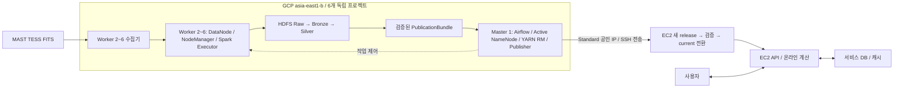

# Planetory GCP 분산 인프라

## 배치와 서비스 경계

GCP 대만 `asia-east1-b`의 독립 프로젝트 6개를 사설 IP 메시 피어링으로 연결한다. GCP는 수집·저장·배치를 수행하고 AWS EC2는 검증된 Gold 및 사용자 DB로 서비스한다. EC2의 실시간 요청은 GCP HDFS를 조회하지 않는다.

위 소프트웨어 역할은 배포 계획이다. 생성 스크립트는 Ubuntu Server 24.04 LTS amd64 VM 및 마운트까지 준비하며 Hadoop/Spark/Airflow를 설치하지 않는다.

## 노드와 디스크

| 번호 | VM | 사설 IP | 역할 계획 | 사양 | pd-standard 디스크 |
|---|---|---|---|---|---|
| 1 | master-1 | 10.20.1.10 | Active NameNode, ResourceManager, Airflow, JournalNode | e2-custom-6-36864 / 6 vCPU / 36GiB | Boot 30GiB + Data 200GiB |
| 2 | worker-2 | 10.20.2.10 | Standby NameNode, DataNode, NodeManager, Spark, JournalNode | 동일 | Boot 30GiB + HDFS 2000GiB + Metadata 100GiB Balanced |
| 3 | worker-3 | 10.20.3.10 | DataNode, NodeManager, Spark, JournalNode | 동일 | Boot 30GiB + Data 2000GiB |
| 4 | worker-4 | 10.20.4.10 | DataNode, NodeManager, Spark | 동일 | 동일 |
| 5 | worker-5 | 10.20.5.10 | DataNode, NodeManager, Spark | 동일 | 동일 |
| 6 | worker-6 | 10.20.6.10 | DataNode, NodeManager, Spark | 동일 | 동일 |

각 프로젝트 서브넷은 `10.20.<번호>.0/24`, VPC 이름은 공통 `planetory-vpc`다. VM은 x86_64이며 이전 OCI ARM64 전용 이미지 대신 amd64 또는 멀티아키텍처 이미지를 사용해야 한다.

마스터의 200GiB는 Active NameNode 메타데이터·JournalNode edits·로그·Gold 전송 임시 공간용이며 HDFS DataNode 용량에 포함하지 않는다. Node 2의 100GiB Balanced 디스크는 Standby NameNode 메타데이터와 JournalNode edits를 `/mnt/metadata`에 저장한다. 워커 5대의 HDFS 설치 용량은 **10,000GiB(약 9.77TiB)**, 워커 VM 합계는 **30 vCPU / 180GiB RAM**이다. 각 프로젝트의 지역 `pd-standard` 2,048GiB 할당량에는 Boot 30GiB도 포함되므로 Worker 데이터 디스크는 2,000GiB로 제한하고 18GiB의 할당량 여유를 남긴다.

Node 1~3의 JournalNode가 QJM edit log를 구성한다. ZooKeeper와 ZKFC는 두지 않고 운영자가 `hdfs haadmin`으로 Node 1·2를 수동 전환한다. 장애 전환 전에는 기존 Active VM의 완전 중지를 확인해 이중 Active를 막는다. 자동 fencing은 없으므로 응답 없는 Active를 대상으로 `haadmin -failover`를 실행하지 않는다. 스크립트는 VM·디스크·역할 라벨과 영속 경로까지만 준비하며 신규 클러스터의 NameNode `-format`과 `-bootstrapStandby`는 별도 배포 과정에서 한 번만 수행한다. `-initializeSharedEdits`는 기존 단일 NameNode를 HA로 전환할 때만 사용한다. 구조는 [HDFS HA with QJM](https://hadoop.apache.org/docs/current/hadoop-project-dist/hadoop-hdfs/HDFSHighAvailabilityWithQJM.html)을 따른다.

Node 2는 Standby NameNode 6~8GiB, YARN 컨테이너 16GiB/2 vCore, DataNode 2GiB, JournalNode 0.5~1GiB와 OS 여유를 둔다. Node 3은 YARN 24GiB, DataNode 2GiB, JournalNode 0.5~1GiB, OS·Docker 4~5GiB를 기준으로 한다. 실제 파일·블록 수를 측정해 Active와 Standby heap을 같은 값으로 조정한다.

JournalNode 경로는 Node 1의 200GiB 데이터 디스크, Node 2의 100GiB 메타데이터 디스크, Node 3의 30GiB 부팅 디스크를 사용한다. Spark shuffle이 몰리는 Worker HDFS 데이터 경로와 분리되므로 HDFS 설치 용량 약 9.77TiB는 줄지 않는다. 이 POC에서는 HA 메타데이터의 외부 백업을 두지 않으며 두 NameNode 디스크의 동시 손실은 복구 불가 위험으로 수용한다.

기존 데이터 추정치를 재사용하면 Raw RF3 9.09TiB + Bronze RF2 1.04TiB + Silver RF2 1.0~1.4TiB = **11.13~11.53TiB**다. 이는 현재 설치 용량 약 9.77TiB를 1.36~1.76TiB 초과하므로 6노드 구성으로 전체 범위를 저장할 수 없다. 워커 데이터 디스크를 HDFS·다운로드 임시 파일·shuffle·로그가 공유하며 별도 shuffle 디스크가 있다고 가정하지 않는다.

2,000GiB Worker 한 대 장애 시 남은 HDFS 설치 용량은 약 7.81TiB다. 초기에는 Sector 범위를 제한하고 HDFS 70%를 운영 목표, 75%를 신규 수집 중단선으로 둔다. 전체 범위는 실측 후 중간 산출물 보존·복제 정책을 줄이거나, 동일 사양 DataNode를 추가해야 한다. 현재 추정치와 75% 중단선을 함께 만족하려면 Worker 8대 이상이 필요하므로 계정·비용·피어링 수를 별도 결정한다. 마스터 200GiB에도 대형 Gold의 신·구 버전과 압축 파일을 무제한 모을 수 없다. 번들 단위 스트리밍/순차 전송과 성공한 임시 파일 정리가 필요하다.

## 네트워크

- 모든 프로젝트 쌍에 양방향 피어링: 15쌍/30개 설정. Peering은 경유 연결을 제공하지 않으므로 마스터와만 연결하는 별 모양으로는 Worker 간 전체 연결이 되지 않는다.
- HDFS 블록 복제·Spark shuffle·YARN 제어는 `10.20.x.10` 사설 IP를 사용한다. 동일 존 사설 IP 통신 조건으로 비용을 계산하며 외부 IP로 연결하지 않는다.
- 마스터: Standard 고정 외부 IPv4. Worker: Standard 임시 외부 IPv4. MAST 다운로드·패키지 설치·이미지 pull을 각자 수행한다. 마스터는 NAT 게이트웨이가 아니다.
- 외부 SSH는 각 노드 담당자의 AdminCidr `/32`만 허용한다. 내부는 6개 노드 사설 IP `/32`를 허용한다. 서비스 포트는 공개하지 않는다.
- Gold를 마스터에서 EC2로 보내도 GCP 인터넷 송신이다. EC2 pull로 바꿔도 과금 방향은 동일하다. 압축·변경 번들만 전송하고 전송 후 checksum 검증과 원자적 공개를 수행한다.
- 같은 존은 실습 비용에 유리하지만 존 장애를 견디는 고가용성 구성이 아니다. Peering 자체도 Hadoop 인증/전송 암호화를 대신하지 않는다. 실제 서비스 설치 단계에서 인증·암호화 정책을 설정한다.
- 30일 POC의 Hadoop 내부 통신은 방화벽에 등록된 6개 사설 IP만 신뢰하는 경계로 제한한다. Kerberos와 HDFS wire encryption은 이번 범위에 넣지 않으므로 피어링에 다른 VM을 추가할 때 보안 결정을 다시 검토한다.
- ResourceManager는 Node 1의 단일 인스턴스로 유지한다. 장애 시 실행 중인 Spark 작업은 실패 처리하고 Node 1 복구 후 Airflow에서 해당 단계만 재시도한다. 30일 POC에서는 YARN RM HA를 추가하지 않는다.

## 비용 전제

이전 `e2-highmem-4` 기준 비용 추정은 사용하지 않는다. 생성 전 각 계정에서 `e2-custom-6-36864`, Boot 30GiB, 노드별 Data 디스크와 Node 2의 Metadata 100GiB를 현재 대만 리전 가격으로 다시 계산한다.

744시간은 31일이다. 30일 연속 실행은 720시간이며 실제 생성/삭제 시각과 월 경계를 기준으로 청구된다. 공인 IPv4의 $0.005/시간 가정은 30일 $3.60, 31일 $3.72다. Standard 송신 무료 200GiB는 VM별 추가 지급이 아니라 공식 가격표의 계정별 월간 합산 조건을 따른다. 다른 송신 사용량을 포함해 계산한다.

크레딧은 서로 다른 결제 계정 사이에 합산하지 않는다. 마스터로 전달을 모으는 것은 담당 계정과 운영을 단순하게 하는 선택이며 Worker 직접 전송이 기술적으로 금지된 것은 아니다. 마스터에 모으는 비용/용량 부담도 고려한다.

할당량, Trial 제한, 최신 대만 VM·디스크 단가, 세금/통화와 크레딧 적용은 실제 각 결제 계정에서 확인한다. 스냅샷·Cloud Logging·추가 디스크·잔여 예약 IP·네트워크 재전송은 기본 추정에 포함되지 않는다. 예산 알림은 자동 과금 차단이 아니다.

## 실행과 검증

VM 생성 코드는 [infra/provisioning/gcp/scripts](../../infra/provisioning/gcp/scripts/), 호스트 Hadoop/YARN 설정과 Docker 실행 파일은 [infra/distributed-system](../../infra/distributed-system/README.md)에 둔다. 운영 설정에는 노드 번호별 빈 폴더를 만들지 않는다. Node 2 자원 차이는 `config/yarn/standby-worker.xml` 하나로 표현한다.

[GCP 생성·접속 절차](../../infra/provisioning/gcp/README.md)의 순서대로 각자 노드 생성 → IP/마운트 확인 → 피어링 생성 → 5개 ACTIVE 확인 → 노드 간 ping 검증을 수행한다. 이후 Hadoop 설치, 호스트명 해석, HDFS 복제 상태, Spark on YARN 샘플 처리, EC2 Gold 전달을 별도 구현·검증한다.

공식 근거: [VM 옵션](https://docs.cloud.google.com/sdk/gcloud/reference/compute/instances/create), [피어링](https://docs.cloud.google.com/sdk/gcloud/reference/compute/networks/peerings/create), [네트워크 가격](https://cloud.google.com/vpc/network-pricing).

## ECC 재검토 — 2026-09-09

판정: 제한된 Sector를 사용하는 30일 POC에 적합하다. 현재 파일은 자원 생성과 런타임 설정이며, 전체 TESS 처리·운영 배포가 검증된 상태는 아니다. 검토는 로컬 파일과 Hadoop QJM·Spark on YARN 공식 문서 기준이며 실제 계정·VM·비용은 조회하지 않았다.

| 구분 | 판단과 필요한 조치 |
| --- | --- |
| 역할·네트워크 | Node 1 제어, Node 2 Standby 겸 Worker, Node 3 JournalNode 겸 Worker, Node 4~6 Worker가 일관된다. 프로젝트당 5개 ACTIVE 피어링과 사설 IP 통신을 실제 확인한다. |
| HDFS 수동 HA | JournalNode 3개 중 2개가 필요하다. Node 1 장애 후 Node 2 승격으로 HDFS는 복구할 수 있지만 RM·Airflow·Publisher는 Node 1 복구를 기다린다. 존 장애 및 두 NameNode 메타데이터 동시 손실은 보호하지 않는다. 외부 메타데이터 백업은 사용자 결정대로 제외한다. |
| 자원·용량 | YARN 합계는 14 vCore/112GiB다. Node 2 승격 시에도 추가 Spark 할당 없이 NameNode 여유를 유지한다. 약 9.77TiB는 예상 저장물보다 작고 shuffle·수집과도 공유하므로 전체 범위가 아닌 제한된 Sector POC만 수행한다. 디스크별 실제 사용률은 75% 중단선에 반영한다. |
| 실행 전 필수 | Hadoop/JDK·서비스 계정·디스크 권한·마운트 의존 서비스 등록, HDFS 초기화, 모든 Worker의 Python 환경을 준비한다. Compose만 실행해서는 클러스터가 완성되지 않는다. |
| Spark 배포 | YARN cluster 모드의 Python 의존성은 Worker 설치 또는 archives 배포가 필요하다. Docker 제출 이미지의 패키지가 Executor에 자동 배포되지 않는다. Executor 메모리와 overhead 합계가 Node 2의 16GiB 안에 들어가게 샘플 작업으로 검증한다. |
| 수집·배치 | Airflow 실제 DAG, Worker 원격 실행, 수집·Spark·Publisher 실행 코드는 후속 구현이다. 다운로드 동시성·임시 파일 상한을 두고 shuffle 집중 시 pd-standard I/O와 처리 시간을 측정한다. |
| CI/CD | 새 Compose·XML 경로를 검증·배포 설정에 반영했다. 이미지 SHA의 서버 지속 저장, 서버별 배포 직렬화, health 검사와 롤백은 실제 배포 전 보완해야 한다. |
| 서비스 경계 | EC2 두 대 모두 필요한 Gold 릴리스를 받아 검증한 뒤 공개해야 한다. 파일과 DB의 bundle_id를 맞추고 요청 도중 current가 바뀌어도 동일 릴리스를 읽도록 한다. 잔차 곡선·주기도의 온라인 계산을 반영한 Gold 크기는 실측하며 기존 20~25GiB를 확정값으로 사용하지 않는다. |
| 접근·관측 | 관리 포트는 공개하지 않는다. CI Runner의 SSH 접속 경로와 EC2 Prometheus의 GCP 메트릭 수집 경로는 아직 연결되지 않았다. 허용 IP·SSH 터널 등 인증된 경로를 배포 전에 구성한다. |

다음 통합 검증은 Sector 한 개의 수집 → Raw → Spark on YARN → Silver → EC2 Gold 검증·공개, 작업 재시도, Worker 한 대 중지 후 복제 상태, Active 수동 전환, Gold 검증 실패 시 기존 current 유지 순서로 수행한다. 영속 데이터를 지우는 초기화는 일반 배포에 포함하지 않는다.

기술 근거: [Hadoop 3.4.1 QJM HA](https://hadoop.apache.org/docs/r3.4.1/hadoop-project-dist/hadoop-hdfs/HDFSHighAvailabilityWithQJM.html), [Spark on YARN의 설정·Python 배포](https://spark.apache.org/docs/3.5.8/running-on-yarn.html). 실제 설치 버전은 별도 고정하며 이 링크는 설치 완료를 뜻하지 않는다.
