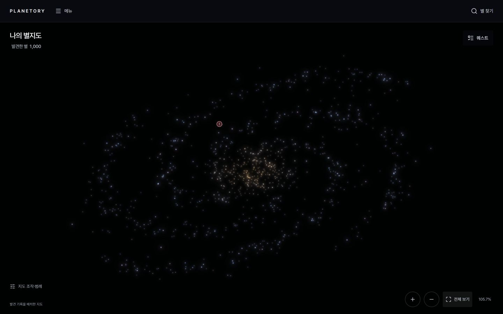
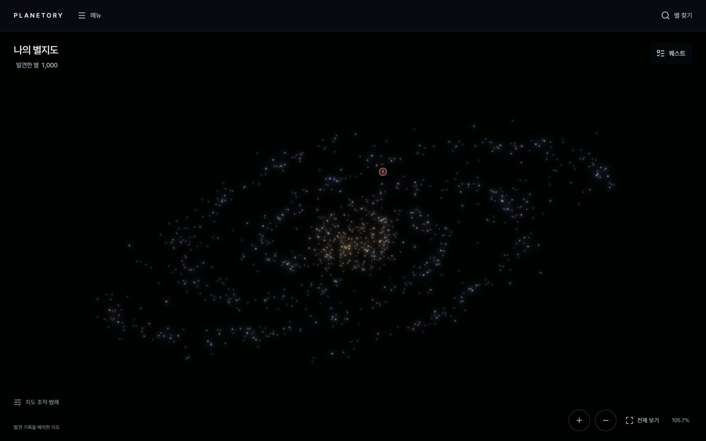
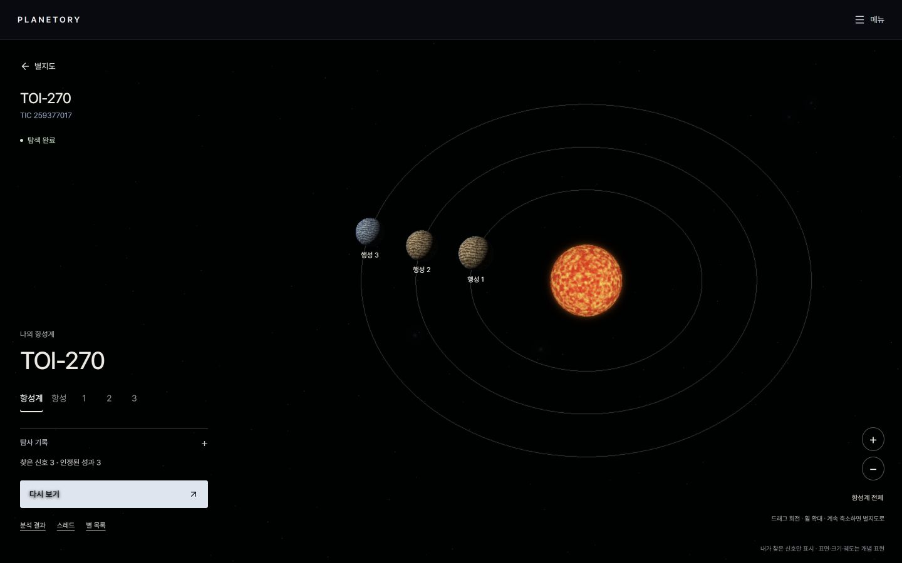
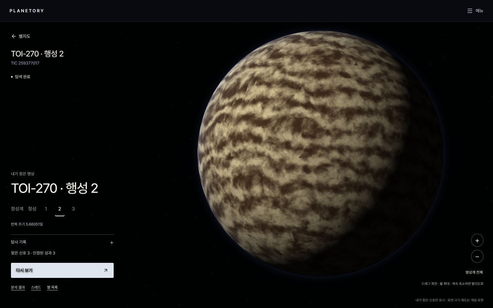

# 개인 은하 시제품 기준 자료

- 대표 작업: S15P21C206-227 · 2026-09-15 사용자 채택, 팀 교차 리뷰 대기
- 정책 정본: [표현 계약](../sky-presentation-contract.md), [SRS](../../requirements/planetory-requirements-spec.md), [탐사 API](../../../apps/backend/docs/exploration-api-spec.md)
- 현재 개인 시제품의 외형을 재현하는 자료다. 실제 서버·DB·10만 별 성능 완료 증거가 아니다.

## 기준 화면

원본 Planetory-Galaxy-Flow/apps/frontend에서 npm run dev:accounts를 실행하고 별 1,000개 예시 계정으로 들어가 전체 보기 → 드래그 회전 → 별 찾기의 TOI-270 → 행성 2 선택 순서로 캡처했다. 화면 1440×900, 은하 캔버스 1440×836, DPR 1이다. [카메라 기록](../../images/sky-reference-20260915/capture.json)과 [원본 파일 해시](source-manifest.json)를 함께 사용한다. localhost 주소만으로 팀 공유를 대신하지 않는다.






## 채택하는 것과 원본의 임시 부분

중앙의 밀도·4개 나선 팔과 제한된 분산·금빛/푸른빛·작은 발광 별·같은 캔버스 왕복·접힌 메뉴를 기준으로 삼는다. 원본의 계정 선택, 전체 배열 HTTP API, knownSignals, 예시 천체 이름/행성 수, 로컬 카메라 저장/테스트 결과를 운영 계약으로 채택하지 않는다. 원본 선택 별의 행성 수 기반 색 변화는 최종 결정에 따라 제거 대상이다. 기존 원본의 좁은 화면 지원은 데스크톱 P0 인수와 구분한다.

## 재현·공동 검증

[reference.mjs](reference.mjs)는 의존성이 없는 배치·연출·투영 비교 코드이며 앱에서 import하지 않는다. 서버는 layout, 프론트는 저장 좌표를 읽는 appearance/project를 이식한다. [vectors.json](vectors.json)의 허용 오차를 사용하며 운영 요청 시 좌표를 다시 계산하지 않는다. 정규화 z만 원본에서 변환하며 1,000개 좌표는 역변환 시 원본과 같다. 원본 순번 대신 타일 배열 인덱스를 연출 시드로 쓰지 않는다.

[contracts.json](contracts.json)은 정상 페이지·중복 범위·버전 변경·오류·선택 행성 사례의 공통 입력/기대 결과다. 개발 전용 합성 TIC/회원이며 실제 카탈로그 데이터로 쓰지 않는다. 계정 1/10/100/1000의 전체 별은 exampleAccount(count)로 재생성한다. 100000 생성은 배치 검사일 뿐 성능 통과가 아니다.

저장소 루트에서 다음을 실행한다.

```powershell
node docs/development/sky-reference/validate.mjs
```

검증은 좌표 벡터, 새 별 추가 시 기존 좌표/외형 유지, 페이지 순서와 상태 변경에 독립된 색/크기, DTO 필드/범위/개수/버전·선택 행성 조건을 확인한다. 원본 1,000개 직접 대조의 별도 실행 결과는 [비교 기록](original-comparison.json)에 보존한다. 실제 권한 집행·DB 동시성·3D 구현·네트워크·브라우저 성능은 검증하지 않는다.

## 인수 책임

| 작업 | 인수할 결과 |
|---|---|
| 33·227 | 이 자료를 포함한 정본/티켓 정합화와 제공자·소비자 교차 리뷰 |
| 135·139·144 | 저장 열/제약·회원별 순번 배정·발견 종류별 멱등/롤백 |
| 138 | 본인 상세 version·좌표·전체 개인 행성 배열/권한 |
| 136 | 안정 순번·배치·초기 준비·메타/타일/locate/상세 좌표 대응 |
| 137 | 공간 인덱스·페이지/버전·대규모 서버 비용 |
| 203 | 같은 fixture의 어댑터·부분 로딩·버전·회원 격리 |
| 204 | 전체 지도 연출·궤도 0개·선택 별 내 행성 렌더 |
| 205·206 | 호버/키보드 정보·선택·행성 확대·이전 카메라 복귀 |
| 215·216 | 화면 비교와 실제 성능·지원 환경·서비스 왕복 |

서진이 시각 비교, 강재민이 좌표/DTO 제공, 백승학이 설정/상태 영향, 백지웅이 분석 왕복 경계를 검토한다. 스크린샷과 JSON 구문 검사만으로 최종 인수하지 않는다. 디자인 핵심을 바꾸는 수정은 본 기준·영향 티켓·변경 기록을 함께 갱신한다.
