# 4. 시연 시나리오

> 기준: `develop` `e2c7c19b`(2026-09-28). 화면 문구·클릭 순서의 정본은 [발표 시연 안내](../apps/frontend/src/cinema/DEMO.md)이고, 실서비스 발표자 계정은 [시연 발표자 계정 준비](../docs/operations/demo-account-runbook.md)를 따른다.<br>
> 스크린샷: 2026-09-29 발표 시연 서버(실제 TESS 표본 10개, 1440×900, Chrome GPU 그리기)에서 찍었다. 실서비스도 같은 화면이며 숫자만 계정에 따라 다르다.

## 0. 시연 환경

| 환경 | 주소 | 로그인 | 쓰는 시나리오 |
| --- | --- | --- | --- |
| 실서비스 | `https://app.planetory.space` | SSAFY 또는 Google 계정 | 2·3 (발표자 계정: 은하에 별 2,000개가 열린 상태, 2026-09-27 준비) |
| 발표 시연 서버 | `http://127.0.0.1:58390` (발표자 노트북) | 화면의 `SSAFY 계정으로 로그인`(합성 로그인) | 1, 그리고 실서비스 장애 시 2·3 대체 |

- 두 환경은 같은 화면(은하 한 장면 위의 시네마 UI, 분석 새 디자인)이다. 발표 시연 서버는 백엔드·DB 없이 노트북 메모리의 합성 세계로 돌고, 튜토리얼·탐사 별 10개만 실제 TESS 관측 자료다.
- 운영 튜토리얼 1~5번은 시연 서버와 같은 실제 별이다: 1 WASP-62(TIC 149603524), 2 L 98-59(307210830), 3 TIC 279569718(식쌍성), 4 TOI-184(300871545, 거짓 양성), 5 TIC 278956474(식쌍성 신호 2개).
- 패널은 별을 TIC 번호로, 행성을 "행성 N"으로 부른다(서비스 규칙). 실제 이름은 `NASA 행성 자료 보기`에 나온다.

### 0.1 준비물

- Chrome, 그래픽 가속 켬(설정 → 시스템 → "가능한 경우 그래픽 가속 사용", `chrome://gpu`에서 WebGL이 Hardware accelerated)
- 화면 폭 1024px 이상(권장 1920×1080 또는 1440×900), 브라우저 확대 100%
- 발표 시연 서버: Node 22.12 이상, `apps/frontend/.real-sample/`(실제 별 10개). 없으면 발표 전에 `tools/real-sample/README.md`로 만든다(MAST에서 FITS 24개·약 48MB 다운로드, 처리 약 50초)

### 0.2 발표 시연 서버 띄우기

```powershell
cd apps/frontend
npm ci
npm run dev:cinema          # http://127.0.0.1:58390
```

- 시작 줄에 `real TESS sample 10 stars`와 `analysis new`가 보여야 한다. `합성`만 보이면 `.real-sample/`이 없는 것이다.
- 포트가 겹치면 `$env:CINEMA_PORT=58391; npm run dev:cinema` 후 아래 주소의 포트도 바꾼다.
- 리허설 확인(선택): 다른 터미널에서 `$env:CINEMA_PORT=58390; node scripts/cinema-smoke.mjs` → `5/5 passed`.
- 화면 위 가운데의 `DEMO` 탭은 평소 숨어 있다. 마우스를 올리거나 `Alt+Shift+D`로 열면 계정·은하 크기·다른 탐사자의 은하를 고를 수 있다.

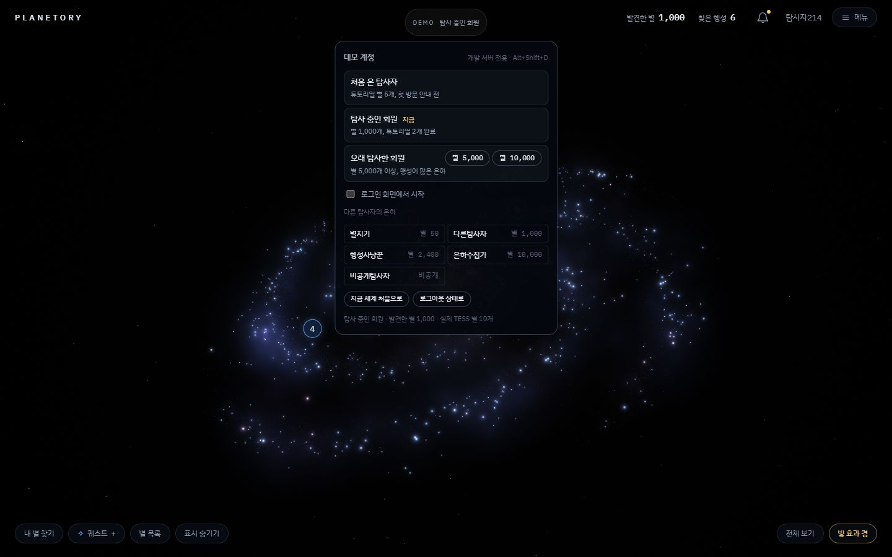

## 1. 시나리오 1 — 처음 온 탐사자가 실제 행성 WASP-62 b를 찾는다

시작 주소: `http://127.0.0.1:58390/api/dev-cinema/session?as=newcomer&start=login`<br>
(또는 `DEMO` 탭 → `로그인 화면에서 시작` 체크 → `처음 온 탐사자`. 실서비스에서는 처음 가입하는 계정이면 같은 흐름이다.)

### 1-1. 로그인

- 동작: 가운데 아래 `SSAFY 계정으로 로그인`
- 확인: 멀리 있는 은하 위로 네 줄의 이야기가 하나씩 나온다(약 10초, 회원마다 한 번)

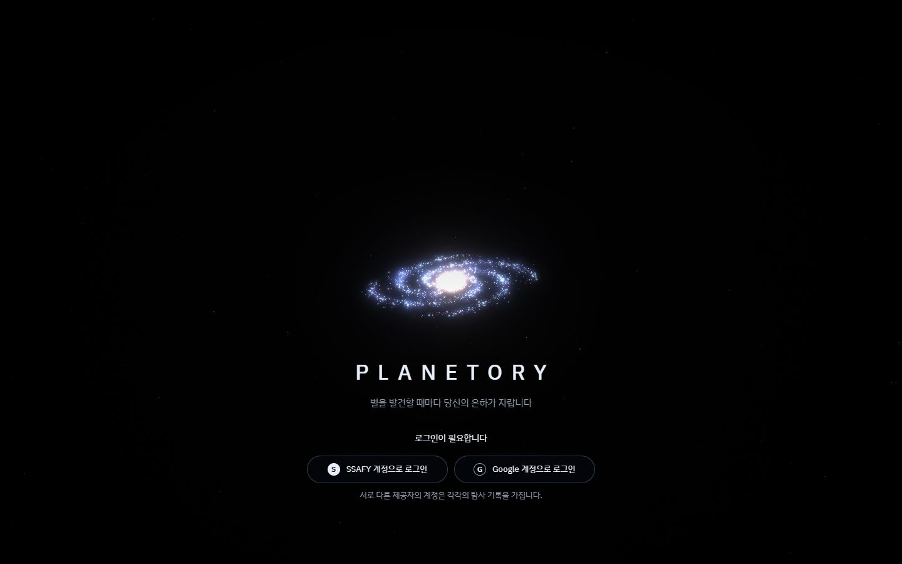

### 1-2. 소개 → 튜토리얼 1로 비행

- 동작: 마지막 문장 아래 `시작하기` (바로 넘기려면 오른쪽 아래 `건너뛰기` 또는 `Esc`)
- 확인: 은하로 날아든 뒤 튜토리얼 1(TIC 149603524 = WASP-62)로 스스로 날아가고, 오른쪽에 별 패널(`미탐사`, 튜토리얼 1 풀이, `분석 시작`)이 열린다

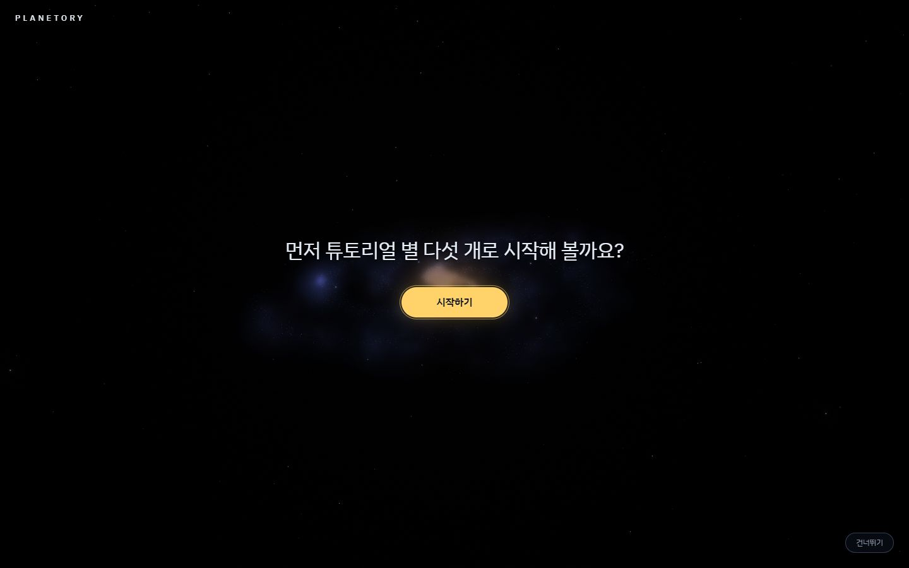

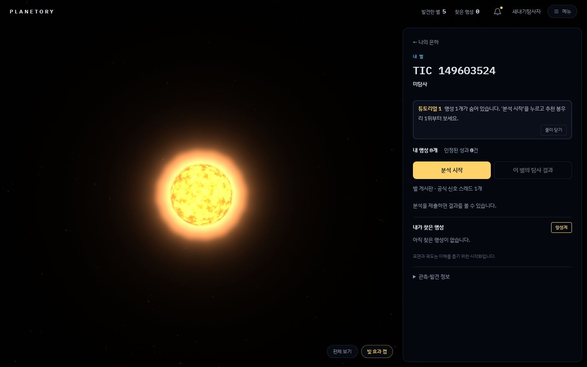

### 1-3. 나의 은하 (선택)

- 동작: 별 패널 왼쪽 위 `← 나의 은하`
- 확인: 파란 1–5 튜토리얼 마커와 아래 안내 "파란 1번 별을 눌러 시작하세요." 파란 `1` 마커를 누르면 다시 1번 별로 간다

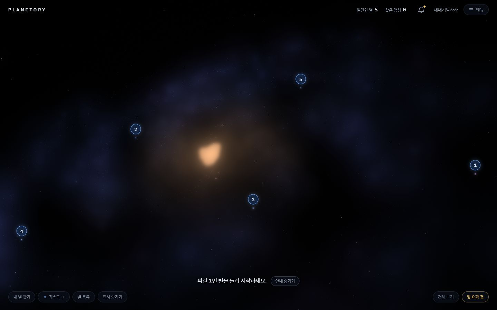

### 1-4. 분석 시작

- 동작: 별 패널의 노란 `분석 시작`
- 확인: 분석 화면. 위 띠에 튜토리얼 1 풀이, 왼쪽에 `밝기 변화`·`주기`(봉우리 1–10위 칩과 주기도), 오른쪽에 비어 있는 `구간`, 아래에 `판단` 줄


### 1-5. 주기 고르기

- 동작: 왼쪽 `주기` 칸의 `1위 4.412` 칩
- 확인: 오른쪽 `구간` 칸에 접힌 곡선이 나오고 밝기가 움푹 꺼진 골이 두 번(위상 약 0.71과 왼쪽 복제 약 -0.29) 보인다

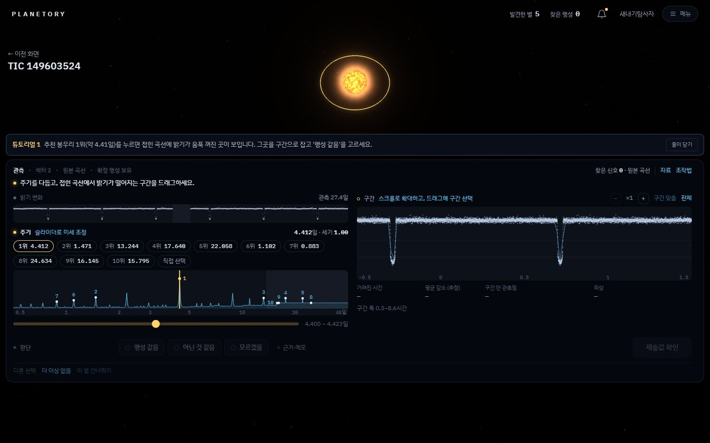

### 1-6. 통과 구간 잡기

- 동작: 오른쪽 `구간` 칸에서 깊은 골 위에 휠을 몇 번 굴려 확대하고, 골 폭보다 조금 넓게 왼쪽 → 오른쪽으로 드래그
- 확인: 노란 구간과 양 끝 핸들, 아래 수치 `가려진 시간 3.4시간 · 평균 감소 1.26% · 위상 0.698–0.730`. 판단 줄이 "행성 같은지 골라주세요"로 바뀐다

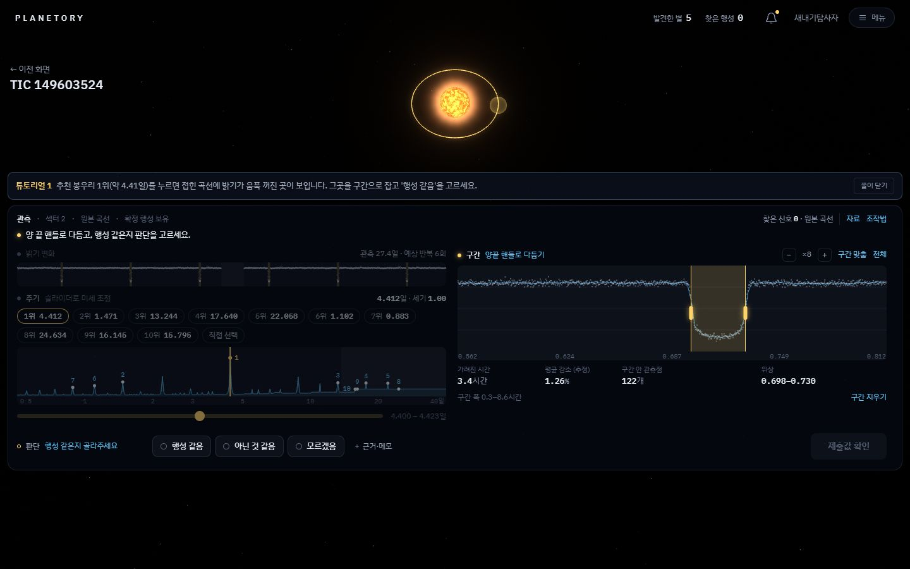

### 1-7. 판단·제출

- 동작: 아래 `판단` 줄의 `행성 같음` → 오른쪽 아래 `제출값 확인` → 제출값을 확인한 뒤 `제출하기`
- 확인: 제출 전 요약(주기 4.412일, 판단 행성 같음, 선택 위상 0.698–0.730)과 `판단·메모 수정`·`제출하기` 버튼

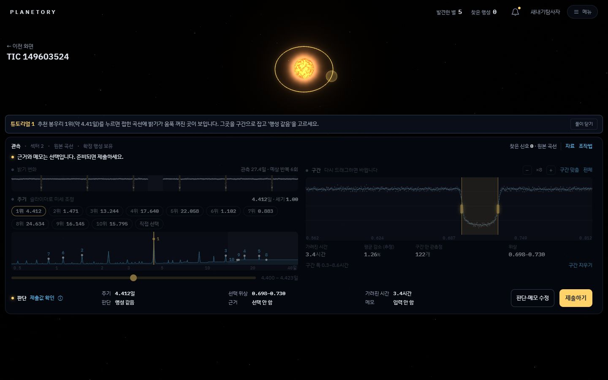

### 1-8. 통과 장면 → 발견 카드

- 동작: 통과 장면이 1초쯤 흐른 뒤 오른쪽 아래 `건너뛰기` 또는 `Esc`
- 확인: "당신이 본 밝기 감소는 바로 이 순간입니다" 장면 뒤 카드 "알려진 행성 WASP-62 b를 직접 찾아냈습니다 · 행성 1 · 주기 4.412일 · 지속 3.0시간 · 깊이 1.32%"와 `판단 일치`·`성과 인정`·`새 별 1개`·`탐사 완료` 표시. 상단 `찾은 행성` 0 → 1

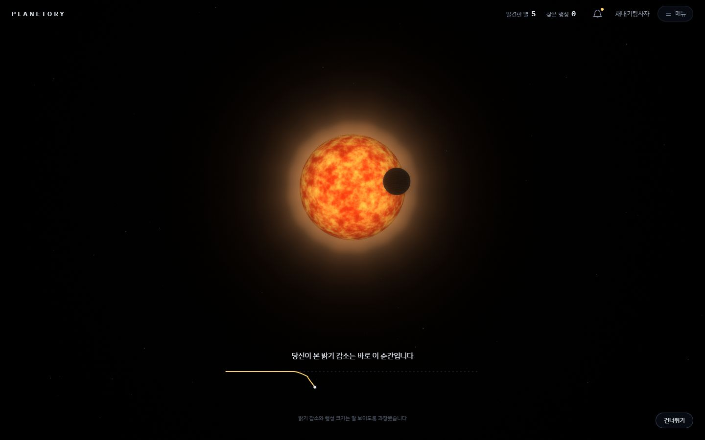

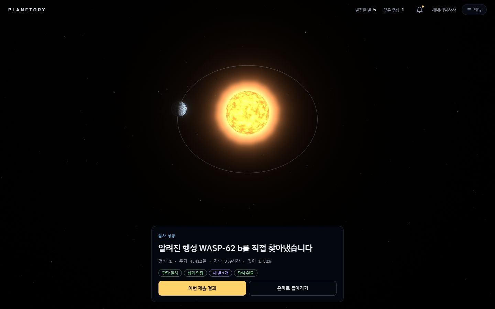

### 1-9. 은하로 돌아가기 → 새 별

- 동작: 카드의 `은하로 돌아가기`
- 확인: 은하로 돌아와 새 별(TOI-270)이 켜진다. 위 가운데 `새 별이 열렸습니다`, 아래 `새 별 1개`, 상단 `발견한 별` 5 → 6. 왼쪽 아래에 새 챌린지 안내가 함께 나온다

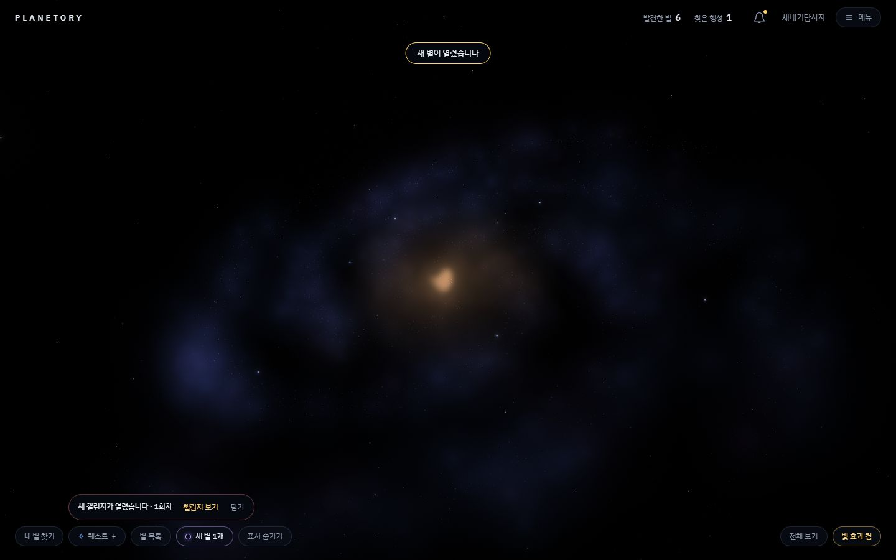

### 1-10. 새 별 패널 (선택)

- 동작: 아래 `새 별 1개` 또는 새로 켜진 별
- 확인: TIC 259377017(TOI-270) 별 패널, `미탐사`

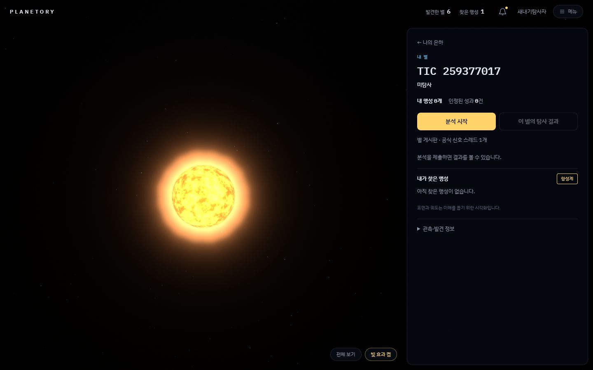

참고:

- 1440×900과 1024×768에서 주기도·접힌 곡선·판단 줄 버튼이 스크롤 없이 보인다. 위 띠의 튜토리얼 풀이는 오른쪽 `풀이 닫기`로 닫는다.
- 구간이 골을 비켜 가면 "이번 구간에서는 신호를 찾지 못했습니다"와 함께 `구간 다시 잡기`·`주기 다시 고르기`가 나온다. 골을 다시 잡아 제출한다.
- `아닌 것 같음`을 고르면 "구간은 맞았고, 판단은 달랐습니다" 카드가 나온다(성과 미인정, 점화 없음).
- 발견 카드의 `이번 제출 결과`가 이번 제출의 결과 화면을 연다. 행성이 여럿인 별(튜토리얼 2·5)은 결과에서 `다음 곡선 단계로` 이어 간다.

## 2. 시나리오 2 — 오래 탐사한 회원의 큰 은하

- 실서비스: `https://app.planetory.space`에 발표자 계정으로 로그인한다(로그인 후 `/sky`, 별 약 2,000개).
- 대체(아래 사진): `http://127.0.0.1:58390/api/dev-cinema/session?as=veteran&stars=10000` (가볍게는 `stars=5000`)

### 2-1. 나의 은하

- 확인: 상단 `발견한 별 10,000 · 찾은 행성 1,531`, 은하에 빨간 `!` 챌린지 별 표시

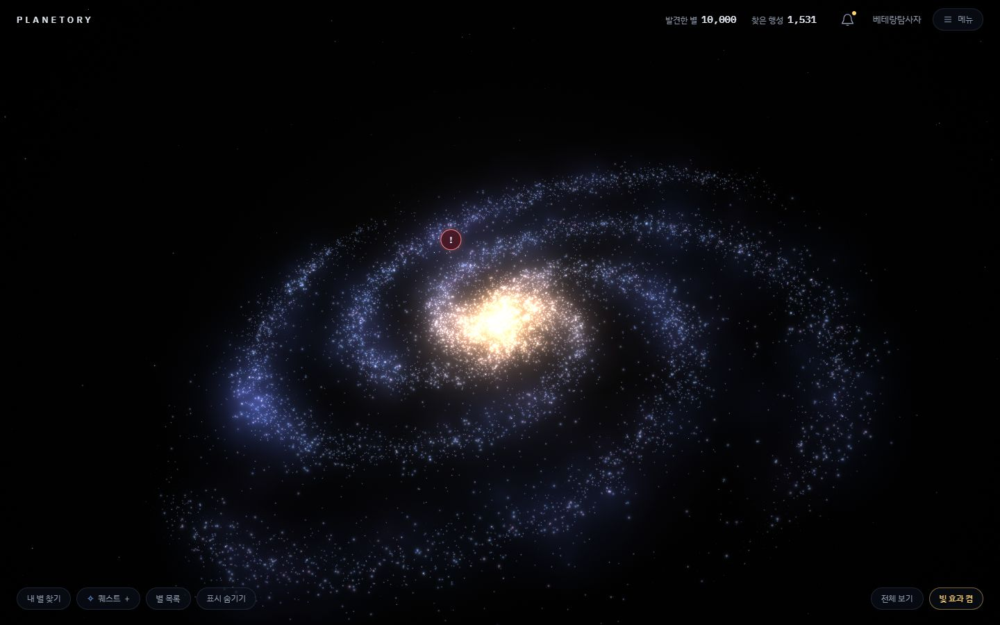

### 2-2. 전체 보기

- 동작: 오른쪽 아래 `전체 보기`
- 확인: 은하 전체가 화면에 들어오는 구도

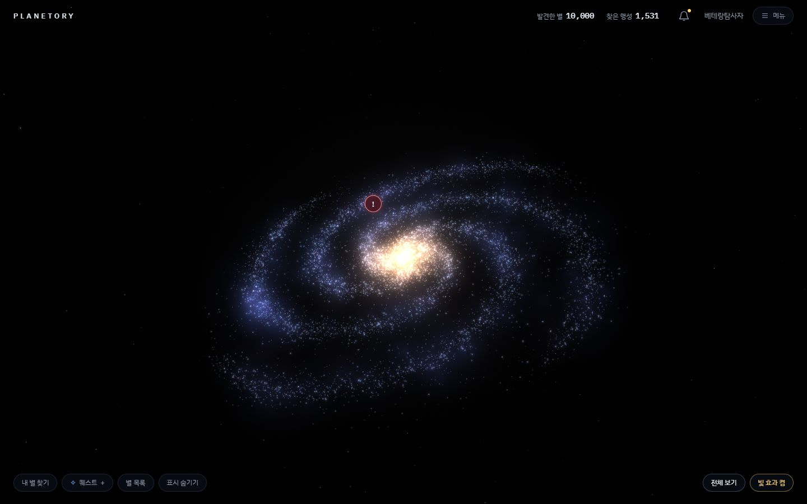

### 2-3. 별 하나 → 항성계

- 동작: 은하의 별 하나(사진은 탐사를 마친 튜토리얼 1)
- 확인: 항성계와 궤도, 오른쪽 별 패널(`탐사 완료`, `내 행성 1개`, `다시 분석`·`이 별의 탐사 결과`)

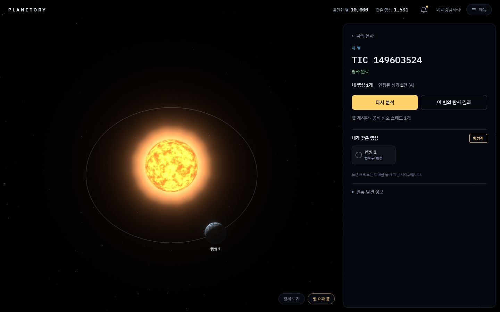

### 2-4. 실제 별 L 98-59

- 동작: 주소창에 `/sky?star=307210830`
- 확인: 행성 3개의 궤도, 별 패널 `내가 찾은 행성`에 `행성 1`·`행성 2`·`행성 3`(모두 확인된 행성)

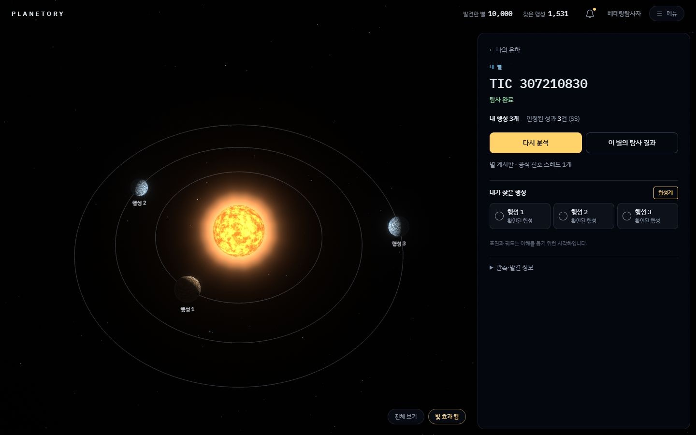

### 2-5. NASA 행성 자료

- 동작: 별 패널의 `행성 1` → `NASA 행성 자료 보기`
- 확인: NASA Exoplanet Archive 수치(L 98-59 c: 공전 주기 3.6909일, 반지름 1.33 지구 반지름, 발견 방법 Transit, 2019년)와 한국어 `쉬운 설명`. 출처 링크가 함께 나온다

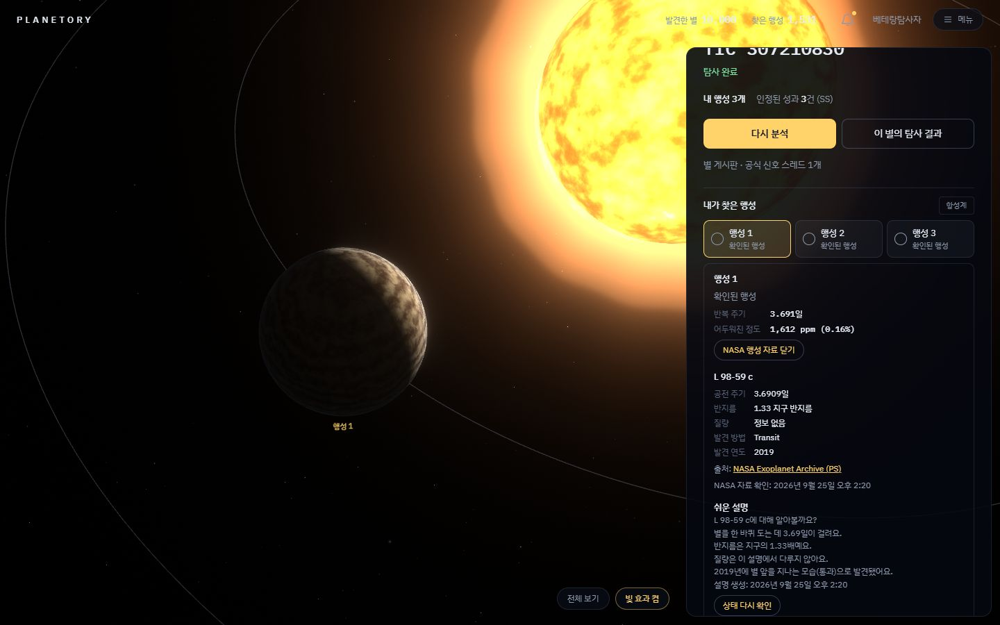

### 2-6. 이 별의 탐사 결과

- 동작: 별 패널 위쪽 `이 별의 탐사 결과`
- 확인: 탐사 요약(찾은 신호 3개, 인정된 성과 3건·등급 SS, 제출 3번)과 찾은 신호별 판단·성과 기록


### 2-7. 마이페이지

- 동작: 오른쪽 위 `메뉴` → `마이페이지`
- 확인: 탐사 요약(발견한 별·찾은 행성·성과 등급별 별 수), `내 별`·`내 분석 기록`·`통계` 탭

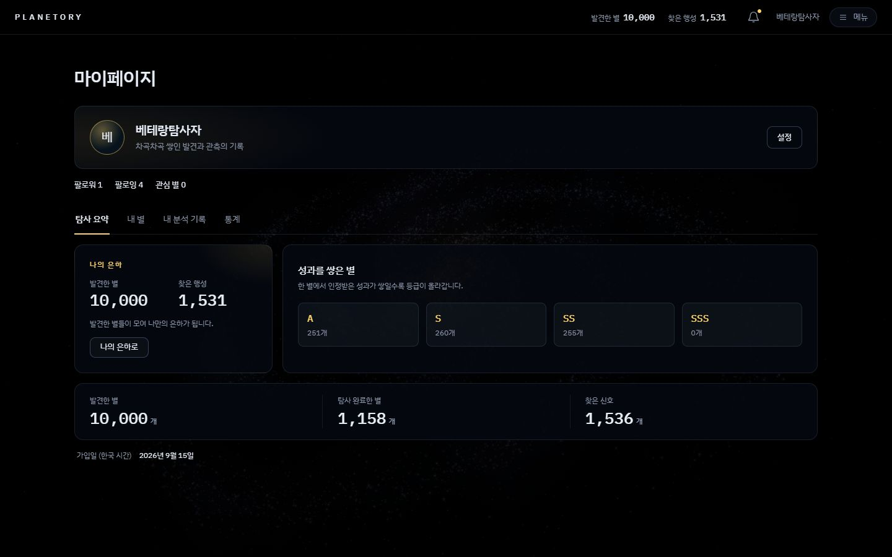

- 합성 별의 행성은 "NASA 자료에서 연결된 행성을 찾지 못했습니다"로 나오므로 NASA 설명은 실제 별에서 보인다.

## 3. 시나리오 3 — 다른 탐사자의 은하와 커뮤니티

사진은 시연 서버의 `?as=member` 세계(별 1,000개)다.

### 3-1. 커뮤니티

- 동작: 오른쪽 위 `메뉴` → `커뮤니티`
- 확인: 전체·자유 게시판·별 게시판·공식 스레드·핫 토픽·팔로잉 탭, 글 목록과 오른쪽 핫 토픽


### 3-2. 탐사자 프로필

- 동작: 글쓴이 이름(사진은 `Orbit`)
- 확인: 탐사자 프로필(팔로워·팔로잉, 성과 등급별 별 수, 찾은 신호)과 `팔로우`·`은하 방문하기 →`

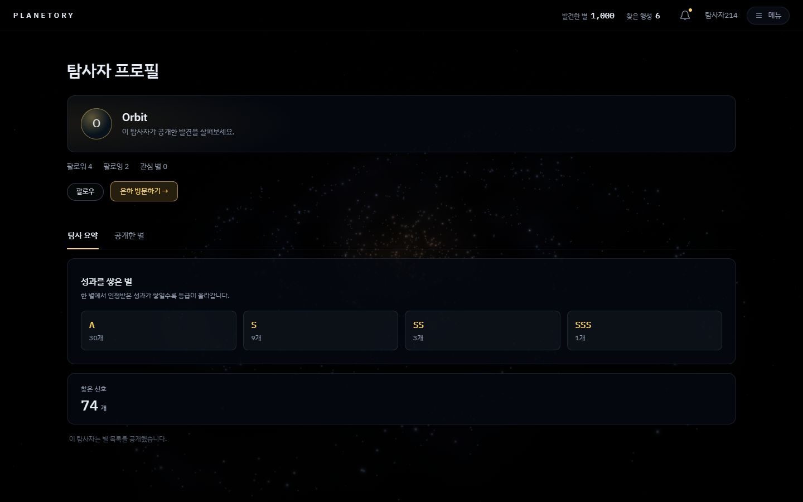

### 3-3. 다른 탐사자의 은하

- 동작: `은하 방문하기 →`
- 확인: 왼쪽 위 "다른 탐사자의 은하 · 읽기 전용" 카드(공개한 별·찾은 행성). 별을 누르면 그 사람이 찾은 행성을 본다

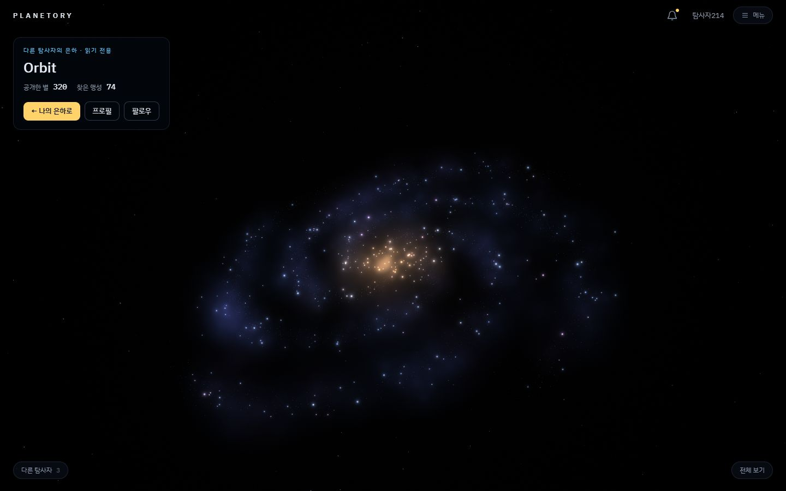

### 3-4. 다른 탐사자 목록

- 동작: 왼쪽 아래 `다른 탐사자`
- 확인: 팔로우한 탐사자 목록과 각자의 `은하 보기`

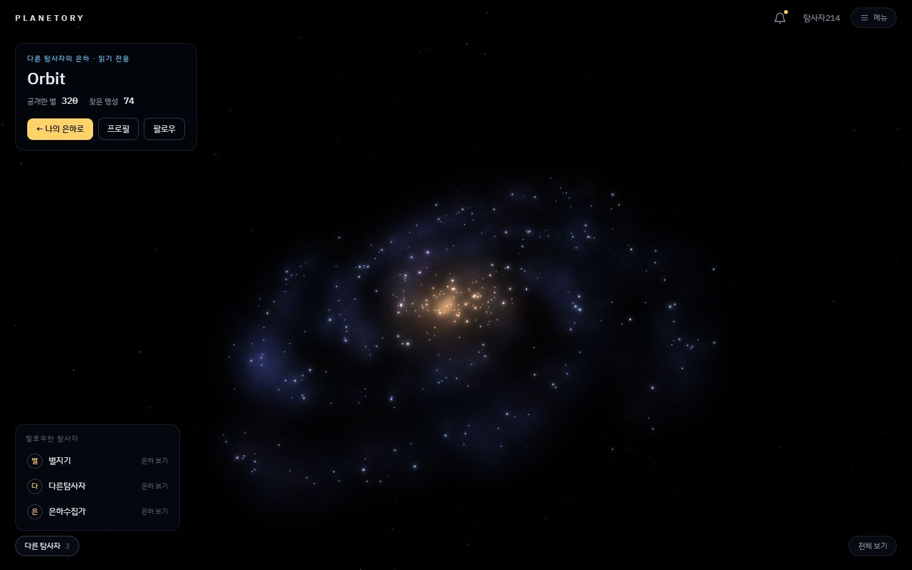

### 3-5. 나의 은하로 복귀

- 동작: 왼쪽 위 카드의 `← 나의 은하로`
- 확인: 내 은하와 상단 내 숫자로 돌아온다

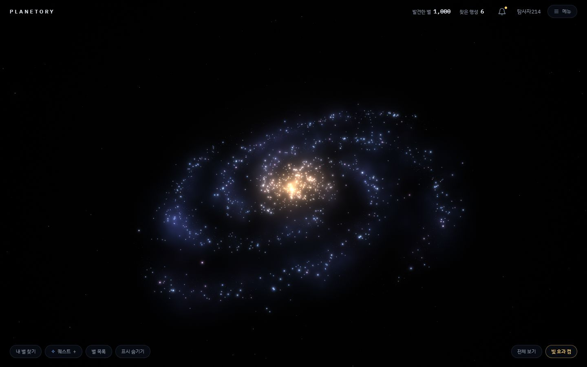

시연 서버 바로 가기: `/members/u-302/sky`(별 2,400개), `/members/u-303/sky`(10,000개), `/members/u-301/sky`(50개), `/members/u-210/sky`(비공개 안내).

## 4. 처음으로 되돌리기 (시연 서버)

- 같은 시나리오를 새로: 시나리오 주소를 다시 열거나 `DEMO` 탭 `지금 세계 처음으로`, 또는 `curl.exe -X POST http://127.0.0.1:58390/api/dev-cinema/reset`
- 새 세계마다 제출 번호가 새로 시작하므로 통과·점화 장면은 리허설 뒤에도 다시 나온다.
- 서버 재시작: `Ctrl+C` 후 `npm run dev:cinema`

## 5. 그래픽이 느릴 때

1. 오른쪽 아래 `빛 효과 켬` → `끔`
2. 같은 탭에서 `…/login?power=reduced`(더 낮게 `low`)를 한 번 연 뒤 진행한다. 되돌리기는 `?power=auto`
3. 마지막 수단 `?power=list`: 3D 대신 별 목록

원격 데스크톱처럼 소프트웨어 그래픽이면 저절로 낮은 단계로 그린다. 느려지면 "화면이 느려 그래픽을 낮췄습니다"가 잠깐 보인다.
