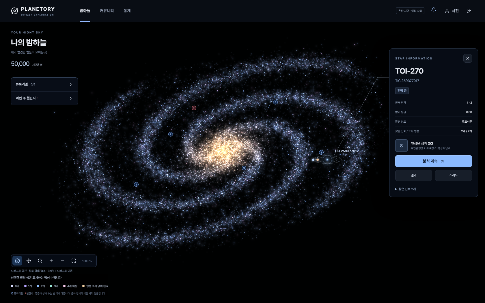

# Planetory 은하형 별지도 PoC

별 50,000개가 선명하게 보이는 은하형 화면을 팀이 직접 조작하고 검토하기 위한 독립 시제품입니다. Jira: **S15P21C206-45**.



나선형 별 배치, 회전·이동, 0.001~10,000배 확대·축소, 별 선택과 상세·분석·결과·스레드 연결을 시연합니다. 별구름형 후속 시제품은 포함하지 않았습니다. 이미지 배경이 아니라 WebGL로 별 입자를 그립니다.

## 실행

Node.js 22.12 이상과 npm이 필요합니다. 검증 환경은 [검증 기록](docs/validation.md)을 참고하세요. 아래 명령은 저장소 루트에서 시작합니다.

```sh
cd experiments/galaxy-map-prototype
npm ci
npm run api
```

두 번째 터미널에서도 같은 폴더로 이동해 실행합니다.

```sh
npm run dev:local
```

[시제품 열기](http://127.0.0.1:58241/sky) → **SSAFY로 시작하기**를 누릅니다. 실제 인증 정보를 입력하지 않는 로컬 시연 로그인입니다. 서버는 처음 실행할 때 합성 별과 예시 진행을 생성합니다. 기본 설정은 `.env` 없이 동작하며 `.env.example`을 복사해도 동일합니다.

| 항목 | 값 |
| --- | --- |
| 프론트 / 로컬 API | `127.0.0.1:58241` / `127.0.0.1:58242` |
| 시연 계정 | SSAFY 버튼으로 들어가는 로컬 `seojin` 계정 |
| 실행 상태 | `.local/galaxy-state.json`, 자동 생성·Git 제외 |
| 로그인 쿠키 | `planetory_galaxy_fixture`, 로컬 시연용 |
| 브라우저 | WebGL 사용 가능 브라우저, 최소 시연 폭 1024px |

Google 버튼은 별도의 초기 사용자 흐름이므로 5만 개 은하 시연에는 SSAFY 버튼을 사용합니다. 서버를 다시 시작하면 로그인은 다시 해야 합니다. 저장된 진행은 유지됩니다. 초기화하려면 두 서버를 종료한 뒤 이 실험 폴더의 `.local/galaxy-state.json`을 다른 이름으로 옮기고 API를 다시 시작합니다. 지도 구도는 **전체 보기**로 되돌립니다.

이 주소는 실행한 PC에서만 열립니다. 팀원은 저장소를 받아 직접 실행해야 합니다. `index.html`을 더블클릭하거나 정적 파일 서버만 띄우는 방식은 지원하지 않습니다. 운영 서버 배포는 이 PoC의 범위 밖입니다.

## 5분 시연

1. 로그인하고 별 50,000개와 TOI-270 상세 패널을 확인합니다. 표시 행성 2개와 등급은 합성 진행 예시입니다.
2. 빈 하늘을 드래그해 회전합니다. **이동 모드** 또는 Shift+드래그로 위치를 옮깁니다.
3. 별 위에서 휠을 움직여 가까이 봅니다. 반대로 멀어져 은하 전체를 본 후 **전체 보기**를 누릅니다.
4. 임의의 별에 마우스를 대고 클릭합니다. 별 이름, 상세 패널과 선택 위치가 함께 바뀌는지 봅니다.
5. **별 검색과 목록**에서 `910000777`을 검색합니다. 분석 화면으로 들어간 후 브라우저 뒤로 가기를 눌러 구도 복원을 확인합니다.
6. 선택한 별의 **스레드**, TOI-270의 **결과** 연결도 확인합니다. 분석·커뮤니티는 연결 시연을 위한 로컬 구현입니다.

| 조작 | 동작 |
| --- | --- |
| 기본 드래그 | 회전·기울이기 |
| 휠, +, − | 확대·축소 |
| 이동 모드, Shift+드래그, 오른쪽 드래그 | 이동 |
| 전체 보기, Home | 기본 구도 |
| 별 클릭 / 빈 공간 클릭, Escape | 선택 / 해제 |
| 방향키 | 지도 이동 |

0.12배 미만에서는 겹치는 이름·선택 표시·궤도를 숨깁니다. 확대 범위는 유한하며 별 표면이나 행성 지형은 없습니다. 화면을 잃었다면 전체 보기를 사용하세요.

## 검증 실행

```sh
npx playwright install chromium
npm run check
```

`check`는 타입 검사·프로덕션 빌드, 공유 로직 테스트 38개, 은하형 브라우저 테스트 6개를 실행합니다. 브라우저 테스트가 프론트 58245/API 58246을 자동 시작·종료하며 `.local/galaxy-test/state.json`에 새 데이터를 생성합니다. 기존 시연 서버나 개인 상태를 재사용하지 않습니다. 두 테스트 포트는 비어 있어야 합니다.

테스트 결과는 `test-results/galaxy/`에 저장됩니다. Linux에서 브라우저 의존성이 없다면 `npx playwright install --with-deps chromium`이 필요할 수 있습니다. 선택적으로 환경 변수 `TEST_BROWSER=chrome` 또는 `msedge`로 설치된 브라우저를 사용할 수 있습니다.

## 공유 범위와 자료

- [명세와의 차이](docs/spec-differences.md): 원래 명세의 별 배치·표시 예산·색상·데이터 전달과 달라지는 부분.
- [데이터·구현 안내](docs/implementation.md): 합성 자료 재현 방식, 코드 위치와 설정.
- [이번 공유본 검증](docs/validation.md): 실행 환경, 확인 결과와 미검증 범위.

명세 기반 시제품에서 연결 화면을 함께 복제했으며 `apps/frontend`의 구현을 교체하지 않습니다. 실제 관측 자료, 실제 OAuth·운영 API·과학 분석 엔진을 통합한 결과도 아닙니다. 상세의 알려진 TIC 이름을 포함해 **좌표·신호·관측 정보·성과는 시연 자료**로 보아야 합니다. NASA/Sketchfab 모델·텍스처를 다운로드하거나 임베드하지 않았습니다.

React 19.2.6, TypeScript 5.9.3, Vite 8.2.2, React Router 7.18.3을 사용하며 의존성은 `package-lock.json`에 고정되어 있습니다. Pretendard 글꼴 라이선스는 `public/fonts/Pretendard-LICENSE.txt`에 포함했습니다.
